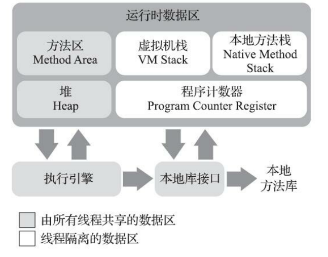

# 深入理解java虚拟机

## **java内存区域**

java虚拟机所管理的内存 将会包括以下几个运行时数据区域

1. 方法区
2. 虚拟机栈
3. 本地方法栈
4. 堆heap
5. 程序计数器

#### 程序计数器

**程序计数器：指定当前指令执行行数，不断为解释器寻找下一个要执行的程序。**字节码解释器**工作时就是通过改变这个计数器 的值来选取下一条需要执行的字节码指令。**

java虚拟机的多线程轮流切换，**分配处理器执行时间的方式来实现的**在**任何一 个确定的时刻，一个处理器（对于多核处理器来说是一个内核）都只会执行一条线程中的指令**

为了**线程切换后能恢复到正确的执行位置，每条线程都需要有一个独立的程序计数器，各条线程之间计数器互不影响，独立存储，我们称这类内存区域为“线程私有”的内存**

**为什么程序计数器被设计成线程私有的？**

假如现在有一本书，有好几个同学都想看，我们采取这样的策略让所有同学都能看到：每个人看一天，不管看没看完都要交给下一个人看，不断循环，直到所有人看完。每个同学都有一个小卡片记录自己看到了哪里，这样下次轮到自己看的时候就能快速的接着上次看到的地方继续看。

Java虚拟机中多线程采用时间片轮转的方式实现，一个处理器（如果是多核处理器就是一个内核）同一时间只能被一个线程使用，同一时间只能执行一个线程的指令，当时间片用完，处理器就要交给别的线程使用，**为了下一次轮到自己使用处理器是能够接着执行现在的指令，使用一个计数器来记录**。

> 为了多线程执行时不相互干扰，各自处理自己工作

线程正在执行的是一个Java方法，这个**计数器记录的是正在执行的虚拟机字节码指令的地 址；**正在执行的是本地（Native）方法，这个计数器值则应为空（Undefined）。

> 程序计数器是没有内存限制

#### **Java虚拟机栈**

每个方法被执行的时候，Java虚拟机都 会同步创建一个栈帧（Stack Frame）用于存**储局部变量表、操作数栈、动态连接、方法出口等信 息。每一个方法被调用直至执行完毕的过程，就对应着一个栈帧在虚拟机栈中从入栈到出栈的过程**

**局部变量表**

局部变量表存放三种变量

1. 编译期可知的各种Java虚拟机基本数据类型（boolean、byte、char、short、int、float、long、double）、
2. 对象引用（reference类型，它并不等同于对象本身，可能是一个指向对象起始 地址的引用指针，也可能是指向一个代表对象的句柄或者其他与此对象相关的位置）
3. returnAddress类型（指向了一条字节码指令的地址）。

这些数据类型在局部变量表中的存储空间以局部变量槽（Slot）来表示，其中64位长度的long和double类型的数据会占用两个变量槽，其余的数据类型只占用一个

局部变量表**所需的内存空间在编 译期间完成分配**，当进入一个方法时，这个方法**需要在栈帧中分配多大的局部变量空间是完全确定的**，在方法运行期间**不会改变局部变量表的大小**。

> 帧中分配多大的局部变量空间是完全确定的 这里局部变量大小指代使用多少个变量槽的空间

线程请求的栈深度大于虚拟机所允许的深度（函数调用栈太深了，每次调用函数时，虚拟机栈都会出栈和压栈，线程请求的栈深度大于虚拟机所允许的深度，就是调用的方法过多，栈被压得太深，无法出栈），将抛出StackOverflowError异常，Java虚拟机栈容量可以动态扩展，当栈扩 展时无法申请到足够的内存会抛出OutOfMemoryError异常。

#### 本地方法栈

本地方法栈（Native Method Stacks）与虚拟机栈所发挥的作用是非常相似的，其区别**只是虚拟机 栈为虚拟机执行Java方法（也就是字节码）服务**，而**本地方法栈则是为虚拟机使用到的本地（Native） 方法服务**。

#### java堆

Java堆（Java Heap）是**虚拟机所管理的内存中最大的一块**。Java堆是被所有线程**共享的一块内存区域，在虚拟机启动时创建**。此内存区域的**唯一目的就是存放对象实例，Java世界里“几乎”所有的对象实例都在这里分配内存**。

Java堆是垃圾收集器管理的内存区域，java堆**垃圾收集器都是基于分 代收集理论设计的**

1. 新生代
2. 老年代
3. 永久代
4. Eden空间
5. FromSurvivor空间
6. To Survivor空间

所有**线程共享的Java堆中可以划分出多个线程私有的分配缓冲区 （Thread Local Allocation Buffer，TLAB），以提升对象分配时的效率。**

Java堆既可以被**实现成固定大小的，也可以是可扩展的**

#### 方法区

方法区（Method Area）与Java堆一样，**是各个线程共享的内存区域，它用于存储已被虚拟机加载 的类型信息、常量、静态变量、即时编译器编译后的代码缓存等数据**

这区域的内存回收目标主要是**针对常量池的回收和对类型的卸载**一般来说**这个区域的回收效果比较难令人满意，尤 其是类型的卸载，条件相当苛刻，但是这部分区域的回收有时又确实是必要的**

#### 运行时常量池

运行时常量池（Runtime Constant Pool）是**方法区的一部分。Class文件中除了有类的版本、字 段、方法、接口等描述信息外，还有一项信息是常量池表（Constant Pool Table），用于存放编译期生 成的各种字面量与符号引用**，这部分内容**将在类加载后存放到方法区的运行时常量池中**Java语言并**不要求常量 一定只有编译期才能产生，也就是说，并非预置入Class文件中常量池的内容才能进入方法区运行时常 量池，运行期间也可以将新的常量放入池中**，这种特性被开发人员利用得比较多的便是**String类的intern()方法**。

#### 直接内存

直接内存（Direct Memory）并不是虚拟机运行时数据区的一部分，也不是《Java虚拟机规范》中 定义的内存区域。

在JDK 1.4中新加入了NIO（New Input/Output）类，引入了**一种基于通道（Channel）与缓冲区 （Buffer）**的I/O方式，它可以使用**Native函数库直接分配堆外内存，然后通过一个存储在Java堆里面的**

**DirectByteBuffer对象作为这块内存的引用进行操作**。这样能**在一些场景中显著提高性能，因为避免了 在Java堆和Native堆中来回复制数据。**

> NIO在堆外操作原因：https://cloud.tencent.com/developer/article/1586341

