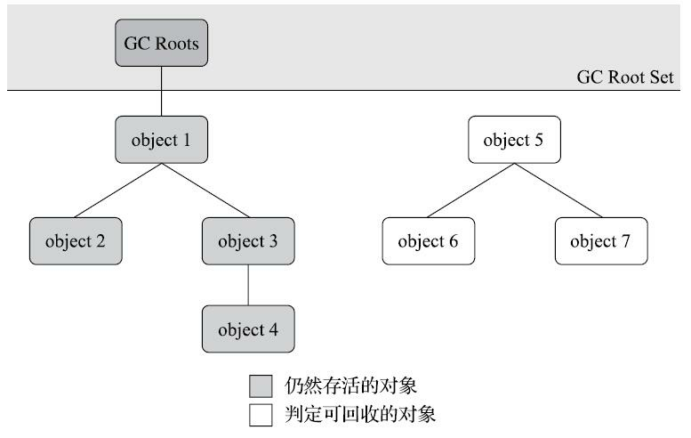

### 垃圾回收GC

思考三个问题

- 哪些内存需要回收？
- ·什么时候回收？
- ·如何回收？

#### **哪些内存需要回收❓**

> java堆和方法区这两个区域则有着很显著的不确定性,**这部分内存的分配和回收是动态的**

#### **如何回收❓**

##### **引用计数算法**

引用计数算法在对象中添加一个引用计数器，每当有一个地方 引用它时，计数器值就加一；当引用失效时，计数器值就减一；

**引用计数算法的问题**

> **对象相互依赖无法**但是它们因为互相引用着对方，**导致它们的引用计数都不为零，引用计数算法也 就无法回收它们**

java虚拟机不使用**引用计数算法**来回收对象

##### 可达性分析算法

通过 一系列称为“GC Roots”的根对象作为起始节点集，从这些节点开始，根据引用关系向下搜索，搜索过 程所走过的路径称为“引用链”（Reference Chain），**如果某个对象到GC Roots间没有任何引用链相连， 或者用图论的话来说就是从GC Roots到这个对象不可达时，则证明此对象是不可能再被使用的。**

> 对象object 5、object 6、object 7虽然互有关联，但是它们到GC Roots是不可达的， 因此它们将会被判定为可回收的对象。

**可以被回收对象**（固定的GC Roots集合）

1. 在方法区中类**静态属性引用的对象**，譬如Java类的引用类型静态变量
2. 在方法区中**常量引用的对象**，譬如字符串常量池（String Table）里的引用。
3. 在**本地方法栈中JNI（即通常所说的Native方法）引用的对象**
4. Java虚拟机内部的引用，如**基本数据类型对应的Class对象，一些常驻的异常对象**（比如NullPointExcepiton、OutOfMemoryError）等，还有系统类加载器。
5. **所有被同步锁（synchronized关键字）持有的对象。**
6. ·反映Java虚拟机内部情况的JMXBean、JVMTI中注册的回调、本地代码缓存等。

除了**这些固定的GC Roots集合以外**，根据用户所选用的垃圾收集器以及当前回收的内存区域不 同，还可以**有其他对象“临时性”地加入，共同构成完整GC Roots集合。（局部回收）**

#### 对象引用

通常来说：**reference类型的数据中存储的数值代表的是另外一块内存的起始地址**，就称**该reference数据是代表 某块内存、某个对象的引用。**

在jvm世界中：java对引用的概念引用分为

1. **强引用（Strongly Re-ference）**、
2. **软 引用（Soft Reference）、**
3. **弱引用（Weak Reference）**
4. **虚引用（Phantom Reference）**

**强引用:是指在程序代码之中普遍存在的引用赋值**，即类似`“Object obj=new Object()”`这种引用关系。无论任何情况下，`只要强引用关系还存在，垃圾收集器就永远不会回 收掉被引用的对象。`

**软引用是用来描述一些还有用，但非必须的对象。只被软引用关联着的对象，**在系统将要发生内 存溢出异常前，会把这些对象列进回收范围之中进行第二次回收，如果这次回收还没有足够的内存， 才会抛出内存溢出异常。在JDK 1.2版之后提供了SoftReference类来实现软引用

**弱引用也是用来描述那些非必须对象，但是它的强度比软引用更弱一些，**被弱引用关联的对象只 能生存到下一次垃圾收集发生为止。当垃圾收集器开始工作，无论当前内存是否足够，都会回收掉只 被弱引用关联的对象。在JDK 1.2版之后提供了WeakReference类来实现弱引用

**虚引用也称为“幽灵引用”或者“幻影引用”，它是最弱的一种引用关系。**一个对象是否有虚引用的 存在，完全不会对其生存时间构成影响，也无法通过虚引用来取得一个对象实例。为一个对象设置虚 引用关联的唯一目的只是为了能在这个对象被收集器回收时收到一个系统通知。在JDK 1.2版之后提供 了PhantomReference类来实现虚引用。

#### **对象回收**

在**可达性分析算法中判定为不可达的对象，至少要经历两次标记过程，对象才会回收**

> 第一次标记，查找对象没有引用链标记

如果对象在进行可达性分析后发现**没有与GC Roots相连接的引用链，那它将会被第一次标记，随后进行一次筛选，筛选的条件是此对象是 否有必要执行finalize()方法。假如对象没有覆盖finalize()方法，或者finalize()方法已经被虚拟机调用 过，那么虚拟机将这两种情况都视为“没有必要执行（即意味着直接回收）”。**

**如果这个对象被判定为确有必要执行finalize()方法**，那么该对象将会被**放置在一个名为F-Queue的 队列之中，并在稍后由一条由虚拟机自动建立的、低调度优先级的Finalizer线程去执行它们的finalize()方法**。这里所说的“**执行”是指虚拟机会触发这个方法开始运行，但并不承诺一定会等待它运行结束**。

**为什么Finalizer线程不执行完对象finalize()方法❓**

> 如果某个对象的finalize()方法执行缓慢，或者更极端地发生了死循环，将很可能导 致F-Queue队列中的其他对象永久处于等待，甚至导致整个内存回收子系统的崩溃

**收集器将对F-Queue中的对象进行第二次小规模的标记**

> 第二次标记对F-Queue中的对象进行标记

**对象如何逃离回收？**

对 象要在finalize()中成功拯救自己——**只要重新与引用链上的任何一个对象建立关联即可，把自己 （this关键字）赋值给某个类变量或者对象的成员变量**，那在第二次标记时它将被移出“即将回收”的集 合；如果对象这时候还没有逃脱，那基本上它就真的要被回收了

> 任何一个对象的finalize()方法都只会被系统自动调用一次，如果对象面临 下一次回收，它的finalize()方法不会被再次执行

#### 回收方法区

方法区的垃圾收集主要回收两部分内容：**废弃的常量和不再使用的类型**

> 回收废弃常量与回收Java堆中的对象非常类似

当一个常量没有被其他地方引用，当发生内存回收这个常量会被清出常量池

常量是否废弃的三个条件：

1. **该类所有的实例都已经被回收，也就是Java堆中不存在该类及其任何派生子类的实例。**
2. ·**加载该类的类加载器已经被回收**
3. **该类对应的java.lang.Class对象没有在任何地方被引用，无法在任何地方通过反射访问该类的方法**

> 并不是 和对象一样，没有引用了就必然会回收

在大量使用反射、动态代理、CGLib等字节码框架，动态生成JSP以及OSGi这类频繁自定义类加载 器的场景中，通常都需要Java虚拟机具备类型卸载的能力，以保证不会对**方法区造成过大的内存压 力**。