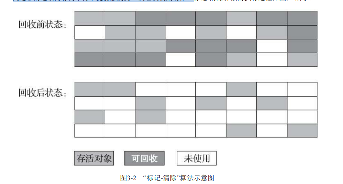
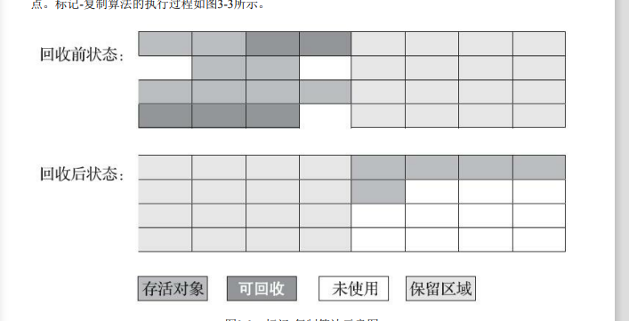
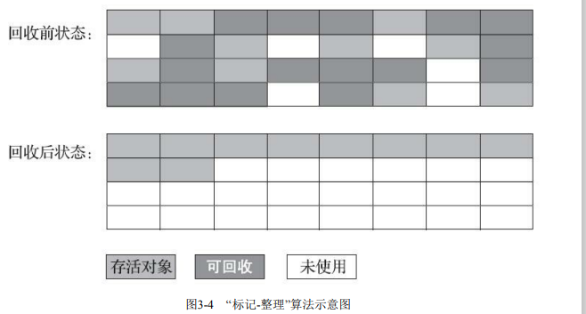

### 垃圾收集算法

垃圾收集算法可以划分为“引用计数式垃圾收集”（Reference Counting GC）和追踪式垃圾收集”（Tracing GC）两大类，这两类也常被称作直接垃圾收集和间接 垃圾收集”

> 主流Java虚拟机中均未涉及引用计数式垃圾收集算法

**下面介绍都是追踪式垃圾收集**

#### 分代收集理论

1）弱分代假说（Weak Generational Hypothesis）：绝大多数对象都是朝生夕灭的。

2）强分代假说（Strong Generational Hypothesis）：**熬过越多次垃圾收集过程的对象就越难以消 亡**。

> 收集器应该将Java堆划分 出不同的区域，然后将回收对象依据其年龄（**年龄即对象熬过垃圾收集过程的次数**）分配到不同的区 域之中存储

**分代收集理论发展**

“标记-复制算法”“标记-清除算 法”“标记-整理算法”等针对性的垃圾收集算法

**垃圾回收难点**

要现在进行一次**只局限于新生代区域内的收集（Minor GC），但新生代中的对象是完全有可 能被老年代所引用的，为了找出该区域中的存活对象，不得不在固定的GC Roots之外，**再额外遍历整 个老年代中所有对象来确保可达性分析结果的正确性，反过来也是一样

> 遍历整个老年代所有对象 的方案虽然理论上可行，但无疑会为内存回收带来很大的性能负担

**如何解决这个难点❓**

> 跨代引用假说（Intergenerational Reference Hypothesis）：**跨代引用相对于同代引用来说仅占极少数**

存在互相引用关系的两个对象，是应该倾 向于**同时生存或者同时消亡的**。

某个新生代对象存在跨代引用，由于**老年代对象难以消亡，该引用会使得新生代对象在收集时同样得以存活**

每一个**对象是否存在及存在哪些跨代引用**，只需在新生代上建立一个全局的数据结构（该结构被称为“记忆集”，Remembered Set），这个结构把**老年代划分成若干小块，标识出老年代的哪一块内存会 存在跨代引用**。

> 只有包含了跨代引用的小块内存里的对象才会被加入到GC Roots进行扫描。

**垃圾回收术语**

- 新生代收集（Minor GC/Young GC）：指目标只是新生代的垃圾收集。
- 老年代收集（Major GC/Old GC）：指目标只是老年代的垃圾收集。目前只有CMS收集器会有单 独收集老年代的行为。另外请注意“Major GC”这个说法现在有点混淆，在不同资料上常有不同所指， 读者需按上下文区分到底是指老年代的收集还是整堆收集。
- 混合收集（Mixed GC）：指目标是收集整个新生代以及部分老年代的垃圾收集。目前只有G1收 集器会有这种行为
- 整堆收集（Full GC）：收集整个Java堆和方法区的垃圾收集

#### 标记-清除算法

首先标记出所有需要回 收的对象，在标记完成后，统一回收掉所有被标记的对象，也可以反过来，标记存活的对象，统一回 收所有未被标记的对象。

> 标记使用可达性分析判断对象是否有引用

**缺点**

1. 第一个是**执行效率不稳定**，java中对象需要被大量标记和清除，**导致标记和清除两个过程的执行效率都随对象数量增长而降低**；
2. 第二个是**内存空间的碎片化问题**，标记、清除之后会产生大 量不连续的内存碎片，空间碎片太多可能会导致当以后在程序运行过程中需要**分配较大对象时无法找 到足够的连续内存而不得不提前触发另一次垃圾收集动作。**

#### 标记-复制算法

它将**可用内存按容量划分为大小相等的两块**，每次只使用其中的一块，就将**还存活着 的对象复制到另外一块上面，然后再把已使用过的内存空间一次清理掉**

**优点：**

每次都是针对整个半区进行内存回收，分配内存时也就不用考虑有 空间碎片的复杂情况，只要移动堆顶指针，按顺序分配，这样实现简单，运行高效。

**缺点：**

可用内存缩小为了原来的一半，空间浪费未免太多

#### 标记-复制改进

**Appel式回收**

Appel式回收的具体做法是**把新生代分为一块较大的Eden空间和两块较小的Survivor空间比例是8∶1，每次分配内存只使用Eden和其中一块Survivor**。发生垃圾搜集时，将Eden和Survivor中仍 然存活的对象一次性复制到另外一块Survivor空间上，然后**直接清理掉Eden和已用过的那块Survivor空间**

**Survivor空间没有足够空间存放上一次新生代收集下来的存活对象**，这些对象**便将通过分配担保机制直 接进入老年代，这对虚拟机来说就是安全的**

#### 标记-整理算法

标记-复制算法**在对象存活率较高时就要进行较多的复制操作**，效率将会降低。**如果 不想浪费50%的空间，就需要有额外的空间进行分配担保，以应对被使用的内存中所有对象都100%存 活的极端情况，所以在老年代一般不能直接选用这种算法。**

标记-整理让**所有存活的对象都向内存空间一端移动，然后直接清理掉边界以外的内存**

如果移动存活对象，**尤其是在老年代这种每次回收都有大量对象存活区域，移动存活对象并更新 所有引用这些对象的地方将会是一种极为负重的操作**，而且这种对象移动操作**必须全程暂停用户应用 程序才能进行**

`标记-整理与标记-清除算法区别：`

前者是一种非移动式的回收算法，而后者是移动式的。

移动则内存回收时会更复杂，不移动则内存分配时会 更复杂。

> 不移动对象会比移动总吞吐量低的

还有一种“和稀泥式”解决方案**可以不在内存分配和访问上增加太大额外负担，做法是让虚 拟机平时多数时间都采用标记-清除算法，暂时容忍内存碎片的存在，直到内存空间的碎片化程度已经 大到影响对象分配时，再采用标记-整理算法收集一次，以获得规整的内存空间**