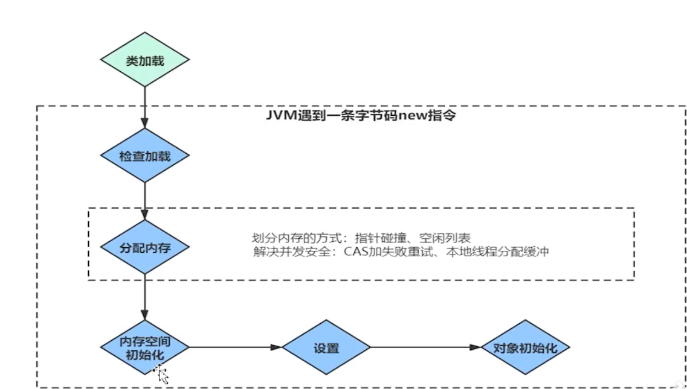
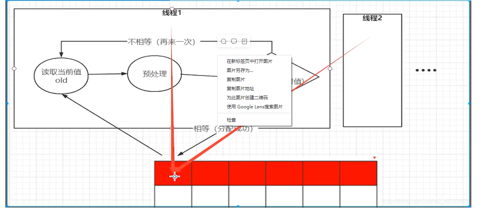
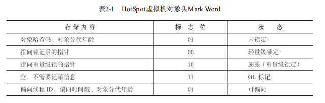
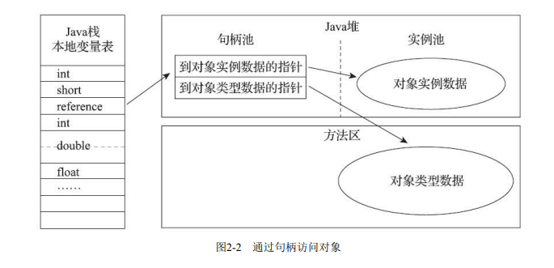
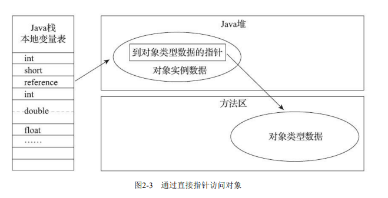

## 虚拟机对象创建

#### 对象创建过程

我们在java都是直接new对象，而在虚拟机中，**对象的创建又是怎样一个过程**

当**Java虚拟机遇到一条字节码new指令时，首先将去检查这个指令的参数是否能在常量池中定位到 一个类的符号引用**，并且**检查这个符号引用代表的类是否已被加载、解析和初始化过**。如果没有，那 必须先执行相应的类加载过程，

在**类加载检查通过后，接下来虚拟机将为新生对象分配内存**。对象所需内存的大小**在类加载完成 后便可完全确定**

为对象分配空间的任务实际上便等同于把一块确定 大小的内存块从Java堆中划分出来

设Java堆中内存是绝对规整的，所有被使用过的内存都被放在一 边，空闲的内存被放在另一边，**中间放着一个指针作为分界点的指示器，那所分配内存就仅仅是把那 个指针向空闲空间方向挪动一段与对象大小相等的距离，这种分配方式称为“指针碰撞”（Bump The Pointer）。**

如果Java堆中的内存并不是**规整的虚拟机就必须维护一个列表，记录上哪些内存块是可用的，**在**分配的时候从列表中找到一块足够大的空间划分给对象实例**，并**更新列表上的记录，这种分配方式称 为“空闲列表”（Free List）。**

> 选择哪种分配方式由Java堆是否规整决定，而Java堆是否规整又由所采用 的垃圾收集器是否带有空间压缩整理（Compact）的能力决定

当使用**Serial、ParNew等带压缩 整理过程的收集器时，系统采用的分配算法是指针碰撞，既简单又高效**；而**当使用CMS这种基于清除 （Sweep）算法的收集器时，理论上就只能采用较为复杂的空闲列表来分配内存。**

#### 对象创建并发情况

##### 对象创建的并发问题

并发情况下也并不是线程安全的，可能出现正在给对象A分配内存，指针还没来得及修改，对象B又同时使用了原来的指针来分配内存的情况。

> **问题：为对象分配空间的时候，出现了两个线程抢占同一块内存空间**

两种解决方案：

一种是对分配内存空间的动作进行同步处理——**实际上虚拟机是采用CAS配上失败 重试的方式保证更新操作的原子性**；

当线程1读取内存空间时候，此时还没有分配对象，所以读取到当前内存值为null,然后线程1去做预处理，在线程1预处理时，线程2把内存空间抢占，并分配内存对象，此时线程1完成预处理后会再次读取内存空间的值，如果读到值不为null，即不相等，就再读取一次，如果这时候有值说明空间已被抢占了，就寻找下一块空间，否则，分配此块空间给线程创建的对象。

另外一种是**把内存分配的动作按照线程划分在不同的空间之中进行，即每个线程在Java堆中预先分配一小块内存**，称为本地线程分配缓冲（Thread Local Allocation Buffer，TLAB），哪个线程要分配内存，就在哪个线程的本地缓冲区中分配，**只有本地缓冲区用完 了，分配新的缓存区时才需要同步锁定**。

##### **对象初始化**

内存分配完成之后，虚拟机必须将分配到的内存空间（但不包括对象头）都初始化为零值，**如果 使用了TLAB的话，这一项工作也可以提前至TLAB分配时顺便进行**。这步操作保证了对象的实例字段 在**Java代码中可以不赋初始值就直接使用，使程序能访问到这些字段的数据类型所对应的零值**。

##### **对象信息**

Java虚拟机还要对对象进行必要的设置，例如这个对象是哪个类的实例、如何才能找到 类的元数据信息、对象的哈希码（实际上对象的哈希码会延后到真正调用Object::hashCode()方法时才 计算）、对象的GC分代年龄等信息。这些信息存放在**对象的对象头（Object Header）之中**

**对象初始化完成new指令之后会接着执行 init()方法，按照程序员的意愿对对象进行初始化，这样一个真正可用的对象才算完全被构造出来。**

#### 对象的内存布局

**对象在堆内存分为三部分**

1. 对象头（Header)
2. 实例数据（InstanceData)
3. 对齐填充（Padding)

##### **对象头信息有两类信息**

1. 第一类是用于存储对象自身的运行时数据，如哈 希码（HashCode）、GC分代年龄、锁状态标志、线程持有的锁、偏向线程ID、偏向时间戳等称它 为“Mark Word”

> 虚拟机的空间效 率，Mark Word被设计成一个有着动态定义的数据结构，以便在极小的空间内存储尽量多的数据，根 据对象的状态复用自己的存储空间

Mark Word的32个比特存储空间中的**25个比特用于存储对象哈希码，4个比特用于存储对象分代年 龄，2个比特用于存储锁标志位，1个比特固定为0，在其他状态（轻量级锁定、重量级锁定、GC标 记、可偏向）**

对象头的另外一部分是类型指针，**即对象指向它的类型元数据的指针，Java虚拟机通过这个指针 来确定该对象是哪个类的实例**

> 查找对象的元数据信息并不一定要经过对象本身

##### 实例数据

对象真正存储的有效信息，即**我们在程序代码里面所定义的各种类型的字 段内容**，无论是从父类继承下来的，还是**在子类中定义的字段都必须记录起来**

这部分的存储顺序会 受到虚拟机分配策略参数（-XX：FieldsAllocationStyle参数）和字段在Java源码中定义顺序的影响。HotSpot虚拟机默认的分配顺序为longs/doubles、ints、shorts/chars、bytes/booleans、oops（Ordinary Object Pointers，OOPs），**从以上默认的分配策略中可以看到，相同宽度的字段总是被分配到一起存 放，在满足这个前提条件的情况下，在父类中定义的变量会出现在子类之前。**

##### 对齐填充

对象的第三部分是对齐填充，这并不是必然存在的，也没有特别的含义，它仅仅起着占位符的作 用。

#### 对象的访问定位

创建对象自然是为了后续使用该对象，我们的**Java程序会通过栈上的reference数据**来操作堆上的具 体对象。

主流的访问方式主要有使用**句柄和直接指针两种**

**使用句柄访问的话**，Java堆中**将可能会划分出一块内存来作为句柄池，reference中存储的就 是对象的句柄地址，而句柄中包含了对象实例数据与类型数据各自具体的地址信息**，

使用直接指针访问的话，Java**堆中对象的内存布局就必须考虑如何放置访问类型数据的相关 信息，reference中存储的直接就是对象地址**

这两种对象访问方式各有优势，

使用句柄来访问的最大好处就是reference中存储的是稳定句柄地 址，在**对象被移动（垃圾收集时移动对象是非常普遍的行为）时只会改变句柄中的实例数据指针**，而reference本身不需要被修改。

使用直接指针来访问**最大的好处就是速度更快，它节省了一次指针定位的时间开销，由于对象访 问在Java中非常频繁**，因此这类开销积少成多也是一项极为可观的执行成本