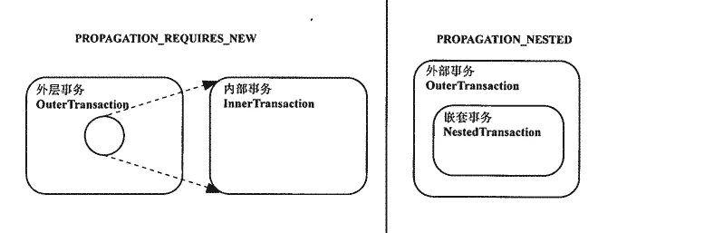

### 嵌套事务

现在有ServiceA 与ServiceB两个方法

#### 开始对事务嵌套👌

第一种情况，ServiceA使用事务，调用ServiceB ,B出现异常，A，B回滚，因为A，B是一体，A和B共用一个事务

```java
    /**
     * 第一种情况，ServiceA使用事务，调用ServiceB ,B出现异常，A，B回滚，因为A，B是一体
     */
    @Transactional
    public  void ServiceA()
    {
        User user = new User();
        user.setAge(18);
        user.setUsername("qrxxxx");
        userMapper.insert(user);
        SerViceB();
    }
    public  void SerViceB()
    {

        User user = new User();

        user.setAge(20);
        user.setUsername("qrxxxx");
        userMapper.insert(user);
        throw  new RuntimeException("异常");
    }
```

第二种情况，ServiceA，B使用事务，**但是B事务实际上没有交给Spring管理，具体看SpringAop原理**，所以A和B还是一体，调用ServiceB ,B出现异常，A，B回滚，因为A，B还是是一体

```java
    /**
      * 第二种情况，ServiceA，B使用事务，但是B事务实际上没有交给Spring管理，具体看SpringAop原理，所以A和B还是一体，调用ServiceB ,B出现异常，A，B回滚，因为A，B还是是一体
      */

    @Transactional
    public  void ServiceA()
    {
        User user = new User();
        user.setAge(18);
        user.setUsername("qrxxxx");
        userMapper.insert(user);
        SerViceB();

    }
    @Transactional
    public  void SerViceB()
    {

        User user = new User();

        user.setAge(20);
        user.setUsername("qrxxxx");
        userMapper.insert(user);
        throw new RuntimeException("异常");
    }
```

第三种情况，ServiceA，B使用事务，B事务交给Spring管理，A，B还是会回滚**,因为B的出现异常，B回滚，B异常向外抛出给A接收，导致A出现异常回滚**

> 注意**这里A，B事务并不是独立,它的事务级别是REQUIRED**

```java

    /**
      * 第三种情况，ServiceA，B使用事务，B事务交给Spring管理，A，B还是会回滚,因为B的出现异常，B回滚，B异常向外抛出给A接收，导致A出现异常回滚
      */

    @Transactional
    public  void ServiceA()
    {
        User user = new User();
        user.setAge(18);
        user.setUsername("qrxxxx");
        userMapper.insert(user);
        //获取UserService代理对象
        UserService proxy = (UserService) AopContext.currentProxy();
        proxy.SerViceB();

    }
    @Transactional
    public  void SerViceB()
    {

        User user = new User();

        user.setAge(20);
        user.setUsername("qrxxxx");
        userMapper.insert(user);
        throw new RuntimeException("异常");
    }

```

第四种情况，ServiceA，B使用事务，B事务交给Spring管理，**既然上面B异常抛出给A，那么我们不要把异常抛出给A，直接try catch,但是还是A,B回滚了**

其原因是：内层方法抛异常返回时，**但是当前事务状态被设置为rollback-only了，但是外层方法将异常消化掉，没有继续向外抛，那么外层方法正常结束时，**

当前事务会执行commit操作，这是会**判断事务状态已经是回滚或者提交状态。若已经为提交状态或者回滚状态，这时就会出现出现“Transaction rolled back because it has been marked as rollback-only”错误。所以导致事务A，B回滚**

```java
/**
  * 第四种情况，ServiceA，B使用事务，B事务交给Spring管理，既然上面B异常抛出给A，那么我们不要把异常抛出给A，直接try catch,但是还是A,B回滚了
 * 其原因是：内层方法抛异常返回时，但是当前事务状态被设置为rollback-only了，但是外层方法将异常消化掉，没有继续向外抛，那么外层方法正常结束时，
 * 当前事务会执行commit操作，这是会判断事务状态已经是回滚或者提交状态。若已经为提交状态或者回滚状态，这时就会出现出现“Transaction rolled back because it has been marked as rollback-only”错误。
 * 所以导致事务A，B回滚
 */

@Transactional
public  void ServiceA()
{
    User user = new User();
    user.setAge(18);
    user.setUsername("qrxxxx");
    userMapper.insert(user);

    System.out.println(TransactionAspectSupport.currentTransactionStatus().isCompleted());
    //获取UserService代理对象
    try {
        UserService proxy = (UserService) AopContext.currentProxy();
        proxy.SerViceB();
    } catch (Exception e) {
        System.out.println(TransactionAspectSupport.currentTransactionStatus().isRollbackOnly());
    }


}
@Transactional
public  void SerViceB()
{

    User user = new User();
    user.setAge(20);
    user.setUsername("qrxxxx");
    userMapper.insert(user);
    throw new RuntimeException("异常");
}
```

第五种情况，ServiceA，B使用事务，**A，B事务级别是NESTED**，B事务交给Spring管理，B执行后抛出异常，但是try catch捕获，A不接收异常，这时神奇事情发送，只有B回滚，A执行成功

ServiceB#methodB 如果 rollback, 那么内部事务(即 ServiceB#methodB) 将回滚到它执行前的 SavePoint，代**表出现异常跳过ServiceB继续执行**,这种方式也是嵌套事务最有价值的地方, 它起到了**分支执行的效果**

```java
/**
      * 第五种情况，ServiceA，B使用事务，A，B事务级别是NESTED，B事务交给Spring管理，B执行后抛出异常，但是try catch捕获，A不接收异常，这时神奇事情发送，只有B回滚，A执行成功
     *  ServiceB#methodB 如果 rollback, 那么内部事务(即 ServiceB#methodB) 将回滚到它执行前的 SavePoint，代表出现异常跳过ServiceB继续执行,
     *  这种方式也是嵌套事务最有价值的地方, 它起到了分支执行的效果,
     */

    @Transactional(propagation = Propagation.NESTED)
    public  void ServiceA()
    {
        User user = new User();
        user.setAge(18);
        user.setUsername("qrxxxx");
        userMapper.insert(user);

        try {
            UserService proxy = (UserService) AopContext.currentProxy();
            proxy.SerViceB();
        } catch (Exception e) {
        }


    }
    @Transactional(propagation = Propagation.NESTED)
    public  void SerViceB()
    {
        User user = new User();
        user.setAge(20);
        user.setUsername("qrxxxx");
        userMapper.insert(user);
        throw new RuntimeException("异常");

    }
```

第六种情况，ServiceA，B使用事务，B事务交给Spring管理，**A在B执行后抛出异常，还是一起回滚了，因为事务传播行为是REQUIRED，公用一个事务状态**

```java
/**
  * 第五种情况，ServiceA，B使用事务，B事务交给Spring管理，A在B执行后抛出异常，还是一起回滚了，因为事务传播行为是REQUIRED，公用一个事务状态
 */

@Transactional
public  void ServiceA()
{
    User user = new User();
    user.setAge(18);
    user.setUsername("qrxxxx");
    userMapper.insert(user);


    UserService proxy = (UserService) AopContext.currentProxy();
    proxy.SerViceB();
    throw new RuntimeException("异常");


}
@Transactional
public  void SerViceB()
{
    User user = new User();
    user.setAge(20);
    user.setUsername("qrxxxx");
    userMapper.insert(user);

}
```

第七种情况，ServiceA，B使用事务，**事务级别是REQUIRES_NEW**，B事务交给Spring管理，A在B执行后抛出异常，还是只有A回滚了，**因为事务传播行为是REQUIRES_NEW，A，B是两个独立事务**

```java
/**
  * 第六种情况，ServiceA，B使用事务，事务级别是REQUIRES_NEW，B事务交给Spring管理，A在B执行后抛出异常，还是只有A回滚了，因为事务传播行为是REQUIRES_NEW，A，B是两个独立事务
 */

@Transactional
public  void ServiceA()
{
    User user = new User();
    user.setAge(18);
    user.setUsername("qrxxxx");
    userMapper.insert(user);


    UserService proxy = (UserService) AopContext.currentProxy();
    proxy.SerViceB();
    throw new RuntimeException("异常");


}
@Transactional(propagation = Propagation.REQUIRES_NEW)
public  void SerViceB()
{
    User user = new User();
    user.setAge(20);
    user.setUsername("qrxxxx");
    userMapper.insert(user);


}
```

第八种情况，ServiceA，B使用事务，事务级别是REQUIRES_NEW，**B事务交给Spring管理，B执行后抛出异常，还是只有A，B回滚了，因为事务传播行为是REQUIRES_NEW，A，B但是是两个不是独立事务吗？**
 * 严格来**说A和B是内外层事务层关系 内部子事务的 处理内容属于当前外层事务的一部分，不能独立于外层事务而存在，并且与外层事务共有事务状态。**也就是B事务是A一部分，即B事务属于A事务，但是A事务不属于B事务 所以B事务出现异常还是A，B回滚

```java
/**
  * 第七种情况，ServiceA，B使用事务，事务级别是REQUIRES_NEW，B事务交给Spring管理，B执行后抛出异常，还是只有A，B回滚了，因为事务传播行为是REQUIRES_NEW，A，B但是是两个不是独立事务吗》
 * 严格来说A和B是内外层事务层关系 内部子事务的 处理内容属于当前外层事务的一部分，不能独立于外层事务而存在，并且与外层事务共有事务状态。也就是B事务是A一部分，即B事务属于A事务，但是A事务不属于B事务
 * 所以B事务出现异常还是A，B回滚
 */

@Transactional
public  void ServiceA()
{
    User user = new User();
    user.setAge(18);
    user.setUsername("qrxxxx");
    userMapper.insert(user);


    UserService proxy = (UserService) AopContext.currentProxy();
    proxy.SerViceB();
    throw new RuntimeException("异常");

}
@Transactional(propagation = Propagation.NESTED)
public  void SerViceB()
{
    User user = new User();
    user.setAge(20);
    user.setUsername("qrxxxx");
    userMapper.insert(user);
```

#### 事务总结

1. 在声明事务时，我们要注意要把事务方法交给Spring管理，不然是无效，因为Spring底层使用代理对象的调用方法，控制方法事务。这些不懂可以看看SpringAop模式❓

2. 注意Spring的默认事务传播行为是REQUIRED，所以当嵌套事务出异常时，在此会回滚

3. 巧用Spring的事务传播行为NESTED，它可以控制部分代码回滚，不影响总体方法实现，实现一种分支执行效果

4. 注意在事务传播行为：**REQUIRES_NEW**下，外层事务与内层事务的关系，内层事务会影响外层事务，但是外层事务影响不了内层事务

   