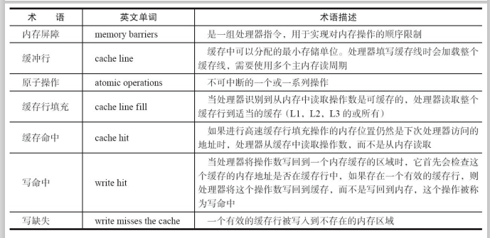
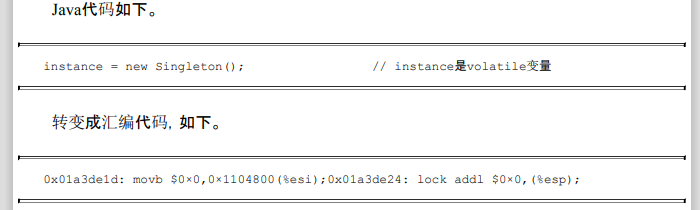
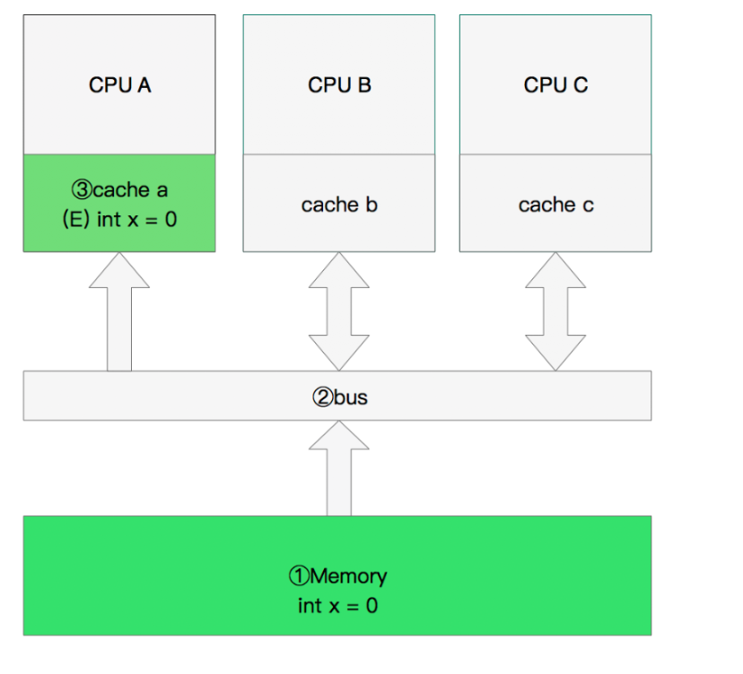

### volatile的原理

可见性的意思:是**当一个线程 修改一个共享变量时，另外一个线程能读到这个修改的值**

> **volatile它不会引起线程上下文的切换和调度。**

允许线程访问共享变量，为了 确保共享变量能被准确和一致地更新，线程应该确保**通过排他锁**单独获得这个变量。

**volatile是如何来保证可见性**

有volatile变量修饰的共享变量进行写操作的时候会多出第二行汇编代码，Lock前缀的指令在多核处理器下会引发了两件事情。

1）将**当前处理器缓存行的数据写回到系统内存**。

2）这个写回内存的操作会使在**其他CPU里缓存了该内存地址的数据无效。**

在多处理器下，**为了保证各个处理器的缓存是一致的，就会实现缓存一 致性协议，**每个处理器通过**嗅探在总线上传播的数据来检查自己缓存的值是不是过期了**，当处理器发现自己缓存行对应的内存地址被修改，就会将当前处理器的缓存行设置成无效状态，**当处理器对这个数据进行修改操作的时候，会重新从系统内存中把数据读到处理器缓存 里**。

`这里处理器的嗅探是如何实现呢❓`

- **处理器无论是想要加载数据或者写回数据，都需要通过总线（图中的②bus）来传播，**
- **那么我们也就可以将 “处理器通过嗅探在总线上传播的数据” 这样的操作形象的理解为处理器监听 总线 上的所有修改操作，**
- **当处理器发现自己的缓存中的某个数据在总线上被其他的处理器修改了，那么就将自己缓存中的这个数据的状态变成无效状态，**
- **然后当处理器在处理这个无效状态的数据时，会重新去主内存中加载这个数据，然后在进行相应的操作。**