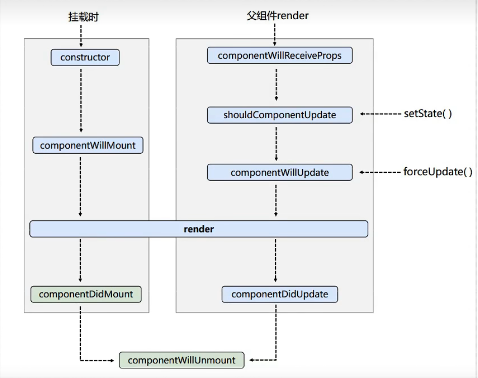
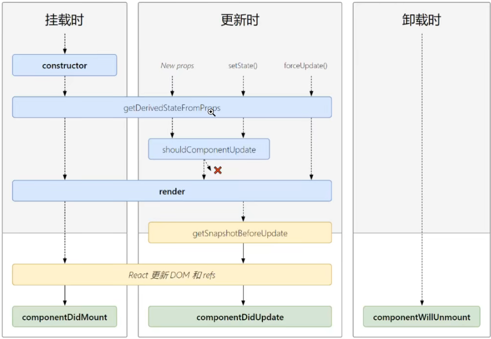
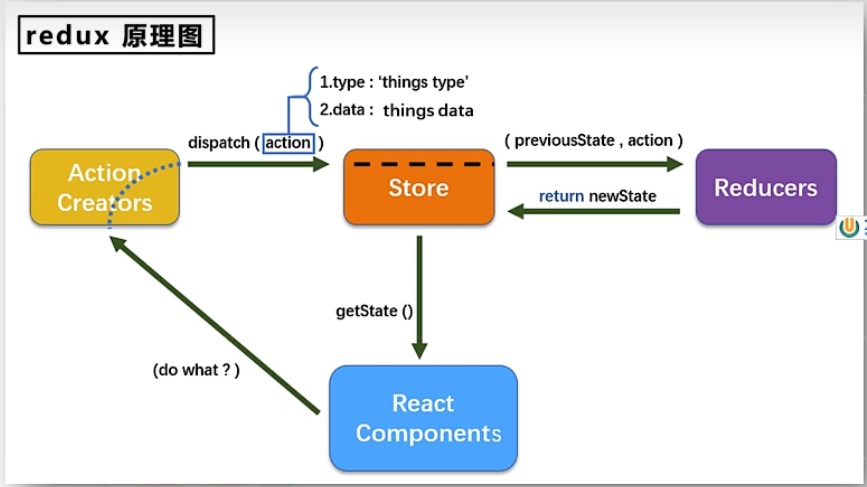
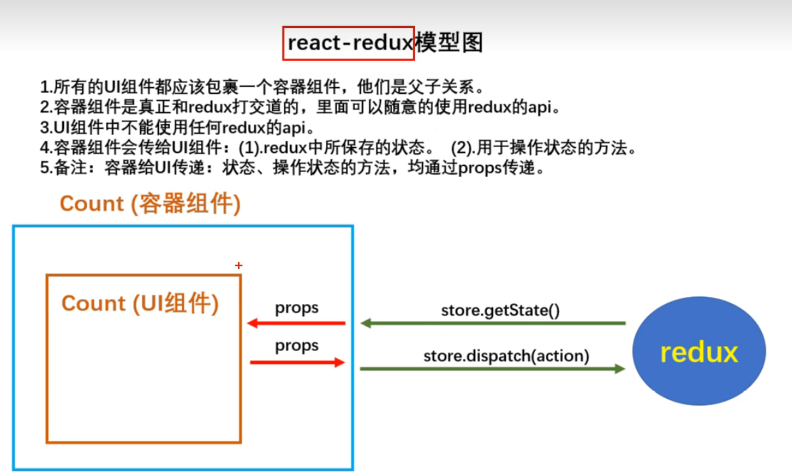
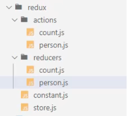
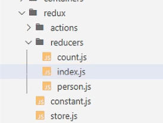

# 一、React简介

**1、React的特点**

- 采用组件化模式、声明式编码，提高开发效率及组件复用率。
- 在 React Native中可以使用React语法进行移动端开发。
- 使用虚拟DOM+优秀的Diffing算法，尽量减少与真实DOM的交互。

# 二、虚拟DOM和真实DOM 

```js
<!DOCTYPE html>
<html lang="en">
<head>
  <meta charset="UTF-8">
  <meta http-equiv="X-UA-Compatible" content="IE=edge">
  <meta name="viewport" content="width=device-width, initial-scale=1.0">
  <title>1、使用jsx创建虚拟dom</title>
</head>
<body>
  <!-- 准备好一个"容器" -->
  <div id="test"></div>
  <div id="demo"></div>

  <!-- 引入react核心库 -->
  <script type="text/javascript" src="../js/react.development.js"></script>
  <!-- 引入react-dom， 用于支持react操作dom -->
  <script type="text/javascript" src="../js/react-dom.development.js"></script>
  <!-- 引入babel， 用于将jsx转为js -->
  <script type="text/javascript" src="../js/babel.min.js"></script>

  <script type="text/babel"> /* 此处一定要写babel */
    //1.创建虚拟DOM
    const VDOM = (
      <h1 id="title">
        <span>Hello, React</span>
      </h1>
    )
    //2. 渲染虚拟Dom到页面
    ReactDOM.render(VDOM, document.getElementById('test'))

    const TDOM = document.getElementById('demo')
    console.log('真实DOM', TDOM)
    console.log('虚拟dom', VDOM)

    /*
     *  关于虚拟DOM 
     *    1、本质是object类型的对象(一般对象)
     *    2、虚拟DOM比较"轻"，真实DOM比较"重"，因为虚拟DOM是React内部在用，无需真实DOM上那么多的属性。
     *    3、虚拟DOM最终会被React转化为真实DOM，呈现在页面上。
    */
  </script>
</body>
</html>

```

# 三、reac中定义组件

## 1、函数式组件

```js
<!DOCTYPE html>
<html lang="en">
<head>
  <meta charset="UTF-8">
  <meta http-equiv="X-UA-Compatible" content="IE=edge">
  <meta name="viewport" content="width=device-width, initial-scale=1.0">
  <title>1、使用jsx创建虚拟dom</title>
</head>
<body>
  <!-- 准备好一个"容器" -->
  <div id="test"></div>

  <!-- 引入react核心库 -->
  <script type="text/javascript" src="../js/react.development.js"></script>
  <!-- 引入react-dom， 用于支持react操作dom -->
  <script type="text/javascript" src="../js/react-dom.development.js"></script>
  <!-- 引入babel， 用于将jsx转为js -->
  <script type="text/javascript" src="../js/babel.min.js"></script>

  <script type="text/babel"> /* 此处一定要写babel */
    // 1.创建函数式组件
    function MyComponent() {
      console.log(this); // 此处的this是undefined,因为babel编译后开启了严格模式
      return <h2>我是函数定义的组件(适用于【简单组件】的定义)</h2>
    }
    //2.渲染组件到页面
    ReactDOM.render(<MyComponent/>, document.getElementById('test'))
    /*
      执行了ReactDOM.render(<MyComponent/>....之后，发生了什么?)
          1、React解析组件标签，找到了MyComponent组件
          2、发现组件是使用函数定义的，随后调用该函数，将返回的虚拟DOM转为真实DOM，随后呈现在页面中

    */
  </script>
</body>
</html>

```

## 2、类式组件

```js
<!DOCTYPE html>
<html lang="en">
<head>
  <meta charset="UTF-8">
  <meta http-equiv="X-UA-Compatible" content="IE=edge">
  <meta name="viewport" content="width=device-width, initial-scale=1.0">
  <title>1、使用jsx创建虚拟dom</title>
</head>
<body>
  <!-- 准备好一个"容器" -->
  <div id="test"></div>

  <!-- 引入react核心库 -->
  <script type="text/javascript" src="../js/react.development.js"></script>
  <!-- 引入react-dom， 用于支持react操作dom -->
  <script type="text/javascript" src="../js/react-dom.development.js"></script>
  <!-- 引入babel， 用于将jsx转为js -->
  <script type="text/javascript" src="../js/babel.min.js"></script>

  <script type="text/babel"> /* 此处一定要写babel */
   // 1. 创建类式组件
   class MyComponent extends React.Component{
    render() {
      // render是放在哪里的？ --MyComponent的原型对象上，供实例使用。
      // render 中的this是谁？ --- MyComponent的实例对象  <=> MyComponent组件实例对象。
      console.log('render中的this:', this)
      return <h2>我是用类定义的组件(适用于【复杂组件】的定义)</h2>
    }
   }
   // 2.渲染组件到页面
   ReactDom.render(<MyComponent/>, document.getElementById('test'))
   /*
    执行了ReactDOM.render(<MyComponent/>..... 之后，发生了什么)
        1、React解析组件标签，找到了MyComponent组件。
        2、发现组件是使用类定义的，随后new出来该类的实例，并通过该实例调用到原型上的render方法。
        3、将render返回的虚拟DOM转为真实DOM，随后呈现在页面中。

   */
  </script>
</body>
</html>

```

# 四、组件实例的三个核心属性（类定义的组件）

##  1、state

- state是组件对象最重要的属性，值是对象(可以包含多个key-value的组合)
- 组件被称为"状态机"， 通过更新组件的state来更新对应的页面显示（重新渲染组件）

**注意：**

① 组件中render方法中this为组件实例对象

② 组件自定义的方法中this为undefined， 如何解决?

​		a. 强制绑定this: 通过函数对象的bind()

​		b: 箭头函数

③ 状态数据，不能直接修改或更新，需要通过**setState**

**例子：**

````js
<!DOCTYPE html>
<html lang="en">
<head>
  <meta charset="UTF-8">
  <meta http-equiv="X-UA-Compatible" content="IE=edge">
  <meta name="viewport" content="width=device-width, initial-scale=1.0">
  <title>组件实例三个属性</title>
</head>
<body>
  <!-- 准备好一个"容器" -->
  <div id="test"></div>

  <!-- 引入react核心库 -->
  <script type="text/javascript" src="../js/react.development.js"></script>
  <!-- 引入react-dom， 用于支持react操作dom -->
  <script type="text/javascript" src="../js/react-dom.development.js"></script>
  <!-- 引入babel， 用于将jsx转为js -->
  <script type="text/javascript" src="../js/babel.min.js"></script>

  <script type="text/babel"> /* 此处一定要写babel */
    // 1.创建组件
    class Weather extends React.Component {
      // 构造器调用几次？ ———— 1次
      constructor(props) {
        super(props)
        // 初始化状态 
        this.state = {isHot: false}
        // 解决changeWeather中的this指向问题
        this.changeWeather = this.changeWeather.bind(this)
      }
      // render调用几次？ —— 1+n次  1是初始化的那次 n是状态更新的次数
      render() {
        // 读取状态
        const {isHot} = this.state
        return <h1 onClick={this.changeWeather}>今天天气很{isHot ? '炎热' : '凉爽'}</h1>
      }
      // changeWeather 调用几次？  —— 点几次调几次
      changeWeather() {
        // changeWeather放在哪里？ ----Weather的原型对象上，供实例使用
        // 由于changeWeather是作为onClick的回调，所以不是通过实例调用的，是直接调用
        // 类中的方法默认开启了局部的严格模式，所以changeWeather中的this为undefined

        // 获取原来的isHot值
        const isHot = this.state.isHot
        // 严重注意：状态必须通过setState进行更新
        this.setState({isHot: !isHot})

        // 严重注意： 状态(state)不可直接更改，下面这行就是直接更改！！
        // this.state.isHot = !isHot // 这是错误的写法 
      }
    }
    // 2.渲染组件到页面
    ReactDOM.render(<Weather/>, document.getElementById('test'));
  </script>
</body>
</html>

````

**state简写：**

```js
<!DOCTYPE html>
<html lang="en">
<head>
  <meta charset="UTF-8">
  <meta http-equiv="X-UA-Compatible" content="IE=edge">
  <meta name="viewport" content="width=device-width, initial-scale=1.0">
  <title>组件实例三个属性</title>
</head>
<body>
  <!-- 准备好一个"容器" -->
  <div id="test"></div>

  <!-- 引入react核心库 -->
  <script type="text/javascript" src="../js/react.development.js"></script>
  <!-- 引入react-dom， 用于支持react操作dom -->
  <script type="text/javascript" src="../js/react-dom.development.js"></script>
  <!-- 引入babel， 用于将jsx转为js -->
  <script type="text/javascript" src="../js/babel.min.js"></script>

  <script type="text/babel"> /* 此处一定要写babel */
    // 1.创建组件
    class Weather extends React.Component {
      // 初始化状态
      state = {isHot: false}
      render() {
        const {isHot} = this.state
        return <h1 onClick={this.changeWeather}>今天天气很{isHot ? '炎热' : '凉爽'}</h1>
      }
      // 自定义方法 —— 要用赋值语句的形式 + 箭头函数
      changeWeather = () => { 
        const isHot = this.state.isHot
        this.setState({isHot: !isHot})
      }
    }
    // 2.渲染组件到页面
    ReactDOM.render(<Weather/>, document.getElementById('test'));
  </script>
</body>
</html>

```


## 2、prop

**作用：**

- 通过标签属性从组件外向组件内传递变化的数据
- 注意： 组件内部不要修改props数据（即props是只读的）

例子： 

```js
<!DOCTYPE html>
<html lang="en">
<head>
  <meta charset="UTF-8">
  <meta http-equiv="X-UA-Compatible" content="IE=edge">
  <meta name="viewport" content="width=device-width, initial-scale=1.0">
  <title>组件实例三个属性</title>
</head>
<body>

  <div id="test1"></div>
  <div id="test2"></div>
  <div id="test3"></div>

  <!-- 引入react核心库 -->
  <script type="text/javascript" src="../js/react.development.js"></script>
  <!-- 引入react-dom， 用于支持react操作dom -->
  <script type="text/javascript" src="../js/react-dom.development.js"></script>
  <!-- 引入babel， 用于将jsx转为js -->
  <script type="text/javascript" src="../js/babel.min.js"></script>
  <!-- 引入prop-types， 用于对组件标签属性进行限制 -->
  <script type="text/javascript" src="../js/prop-types.js"></script>

  <script type="text/babel"> /* 此处一定要写babel */
    // 创建组件
    class Person extends React.Component {
      render() {
        console.log(this)
        const {name, age, sex} = this.props
        return (
          <ul>
            <li>姓名: {name}</li>
            <li>性别: {age}</li>
            <li>年龄: {sex + 1}</li>
          </ul>
        )
      }
    }
    // 对标签属性进行类型、必要性的限制
    Person.propTypes = {
      name: PropTypes.string.isRequired, // 限制name必传，且为字符串
      sex: PropTypes.string, // 限制sex为字符串
      age: PropTypes.number, // 限制age为数值
      speak: PropTypes.func, // 限制speak为函数
    }
    // 指定默认标签属性值
    Person.defaultProps = {
      sex: '男', // sex 性别默认值为男
      age: 18 // age 默认值为18
    }

    // 渲染组件到页面
    ReactDOM.render(<Person name="jerry" speak={speak} />, document.getElementById('test1'))
    ReactDOM.render(<Person name="tom" age={18} sex="女" />, document.getElementById('test2'))

    const p = {name: '老刘', age: 18, sex: '女'}
    ReactDOM.render(<Person {...p}/>, document.getElementById('test3'))

    function speak() {
      console.log('我是讲话者')
    }
  </script>
</body>
</html>
```

**prop 简写形式：**

```js
<!DOCTYPE html>
<html lang="en">
<head>
  <meta charset="UTF-8">
  <meta http-equiv="X-UA-Compatible" content="IE=edge">
  <meta name="viewport" content="width=device-width, initial-scale=1.0">
  <title>组件实例三个属性</title>
</head>
<body>

  <div id="test1"></div>
  <div id="test2"></div>
  <div id="test3"></div>

  <!-- 引入react核心库 -->
  <script type="text/javascript" src="../js/react.development.js"></script>
  <!-- 引入react-dom， 用于支持react操作dom -->
  <script type="text/javascript" src="../js/react-dom.development.js"></script>
  <!-- 引入babel， 用于将jsx转为js -->
  <script type="text/javascript" src="../js/babel.min.js"></script>
  <!-- 引入prop-types， 用于对组件标签属性进行限制 -->
  <script type="text/javascript" src="../js/prop-types.js"></script>

  <script type="text/babel"> /* 此处一定要写babel */
    // 创建组件
    class Person extends React.Component {
        
      // 对标签属性进行类型、必要性的限制
      static propTypes = {
        name: PropTypes.string.isRequired, // 限制name必传，且为字符串
        sex: PropTypes.string, // 限制sex为字符串
        age: PropTypes.number, // 限制age为数值
      }
      // 指定默认标签属性值
      static defaultProps = {
        sex: '男', // sex 性别默认值为男
        age: 18 // age默认值为18
      }

      render() {
        const {name, age, sex} = this.props
        return (
          <ul>
            <li>姓名: {name}</li>
            <li>性别: {age}</li>
            <li>年龄: {sex + 1}</li>
          </ul>
        )
      }
    }

    // 渲染组件到页面
    ReactDOM.render(<Person name="jerry" />, document.getElementById('test1'))
  </script>
</body>
</html>

```

**函数式组件使用props：**

```js
<!DOCTYPE html>
<html lang="en">
<head>
  <meta charset="UTF-8">
  <meta http-equiv="X-UA-Compatible" content="IE=edge">
  <meta name="viewport" content="width=device-width, initial-scale=1.0">
  <title>组件实例三个属性</title>
</head>
<body>

  <div id="test1"></div>
  <div id="test2"></div>
  <div id="test3"></div>

  <!-- 引入react核心库 -->
  <script type="text/javascript" src="../js/react.development.js"></script>
  <!-- 引入react-dom， 用于支持react操作dom -->
  <script type="text/javascript" src="../js/react-dom.development.js"></script>
  <!-- 引入babel， 用于将jsx转为js -->
  <script type="text/javascript" src="../js/babel.min.js"></script>
  <!-- 引入prop-types， 用于对组件标签属性进行限制 -->
  <script type="text/javascript" src="../js/prop-types.js"></script>

  <script type="text/babel"> /* 此处一定要写babel */

    // 函数式组件使用props
    function Person(props) {
      console.log(props)
      const {name, age, sex} = props
      return (
        <ul>
          <li>姓名: {name}</li>
          <li>性别: {sex}</li>
          <li>年龄: {age}</li>
        </ul>
      )
    }

    // 对标签属性进行类型、必要性的限制
    Person.propTypes = {
      name: PropTypes.string.isRequired, // 限制name必传，且为字符串
      sex: PropTypes.string, // 限制sex为字符串
      age: PropTypes.number, // 限制age为数值
    }
    // 指定默认标签属性值
    Person.defaultProps = {
      sex: '男', // sex 性别默认值为男
      age: 18 // age默认值为18
    }

    // 渲染组件到页面
    ReactDOM.render(<Person name="jerry"  />, document.getElementById('test1'))
  </script>
</body>
</html>

```

## 3、ref

### 3.1、字符串形式ref

```js
<!DOCTYPE html>
<html lang="en">
<head>
  <meta charset="UTF-8">
  <meta http-equiv="X-UA-Compatible" content="IE=edge">
  <meta name="viewport" content="width=device-width, initial-scale=1.0">
  <title>组件实例三个属性</title>
</head>
<body>

  <div id="test"></div>

  <!-- 引入react核心库 -->
  <script type="text/javascript" src="../js/react.development.js"></script>
  <!-- 引入react-dom， 用于支持react操作dom -->
  <script type="text/javascript" src="../js/react-dom.development.js"></script>
  <!-- 引入babel， 用于将jsx转为js -->
  <script type="text/javascript" src="../js/babel.min.js"></script>
  <!-- 引入prop-types， 用于对组件标签属性进行限制 -->
  <script type="text/javascript" src="../js/prop-types.js"></script>

  <script type="text/babel"> /* 此处一定要写babel */
    class Demo extends React.Component {
      // 展示左侧输入框数据
      showData = () => {
        const {input1} = this.refs
        alert(input1.value)
      }
      // 展示右侧输入框数据
      showData2 = () => {
        const {input2} = this.refs
        alert(input2.value)
      }

      render() {
        return (
          <div>
            {/*字符串形式ref 即ref="字符串" */}
            <input ref="input1" type="text" placeholder="点击按钮提示数据" />&nbsp;
            <button ref="button100" onClick={this.showData} >点我提示左侧的数据</button>&nbsp;
            <input onBlur={this.showData2} ref="input2" type="text" placeholder="失去焦点提示数据" />
          </div>
        )
      }
    }
    // 渲染组件到页面
    ReactDOM.render(<Demo a="1" b="2" />, document.getElementById('test'))
  </script>
</body>
</html>

```

### 3.2、回调函数形式ref

```js
<!DOCTYPE html>
<html lang="en">
<head>
  <meta charset="UTF-8">
  <meta http-equiv="X-UA-Compatible" content="IE=edge">
  <meta name="viewport" content="width=device-width, initial-scale=1.0">
  <title>组件实例三个属性</title>
</head>
<body>

  <div id="test"></div>

  <!-- 引入react核心库 -->
  <script type="text/javascript" src="../js/react.development.js"></script>
  <!-- 引入react-dom， 用于支持react操作dom -->
  <script type="text/javascript" src="../js/react-dom.development.js"></script>
  <!-- 引入babel， 用于将jsx转为js -->
  <script type="text/javascript" src="../js/babel.min.js"></script>
  <!-- 引入prop-types， 用于对组件标签属性进行限制 -->
  <script type="text/javascript" src="../js/prop-types.js"></script>

  <script type="text/babel"> /* 此处一定要写babel */

    class Demo extends React.Component {
      // 展示左侧输入框数据
      showData = () => {
        const {input1} = this
        alert(input1.value)
      }

      // 展示右侧输入框数据
      showData2 = () => {
        const {input2} = this
        alert(input2.value)
      }
      // 通过定义成class的绑定函数创建 ref
      saveInput = c => {
        this.input2 = c
      }

      render() {
        return (
          <div>
            {/* 通过内联回调函数 创建ref */}
            <input ref={c => this.input1 = c} type="text" placeholder="点击按钮提示数据" />&nbsp;
            <button ref="button100" onClick={this.showData} >点我提示左侧的数据</button>&nbsp;
			{/* 通过定义成class的绑定函数创建 ref */}
            <input onBlur={this.showData2} ref={this.saveInput} type="text" placeholder="点击按钮提示数据" />
          </div>
        )
      }
    }
    // 渲染组件到页面
    ReactDOM.render(<Demo a="1" b="2" />, document.getElementById('test'))
  </script>
</body>
</html>

```

### 3.3、createRef 创建ref

```js
<!DOCTYPE html>
<html lang="en">
<head>
  <meta charset="UTF-8">
  <meta http-equiv="X-UA-Compatible" content="IE=edge">
  <meta name="viewport" content="width=device-width, initial-scale=1.0">
  <title>组件实例三个属性</title>
</head>
<body>

  <div id="test"></div>

  <!-- 引入react核心库 -->
  <script type="text/javascript" src="../js/react.development.js"></script>
  <!-- 引入react-dom， 用于支持react操作dom -->
  <script type="text/javascript" src="../js/react-dom.development.js"></script>
  <!-- 引入babel， 用于将jsx转为js -->
  <script type="text/javascript" src="../js/babel.min.js"></script>
  <!-- 引入prop-types， 用于对组件标签属性进行限制 -->
  <script type="text/javascript" src="../js/prop-types.js"></script>

  <script type="text/babel"> /* 此处一定要写babel */

    class Demo extends React.Component {
      /*
        React.createRef 调用后可以返回一个容器，该容器可以存储被ref所标识的节点
      */
      myRef = React.createRef()
      myRef2 = React.createRef()
      // 展示左侧输入框数据
      showData = () => {
        alert(this.myRef.current.value)
      }

      // 展示右侧输入框数据
      showData2 = () => {
        alert(this.myRef2.current.value)
      }

      render() {
        return (
          <div>
            <input ref={this.myRef} type="text" placeholder="点击按钮提示数据" />&nbsp;
            <button ref="button100" onClick={this.showData} >点我提示左侧的数据</button>&nbsp;
            <input ref={this.myRef2} onBlur={this.showData2} type="text" placeholder="点击按钮提示数据" />
          </div>
        )
      }
    }
    // 渲染组件到页面
    ReactDOM.render(<Demo a="1" b="2" />, document.getElementById('test'))
  </script>
</body>
</html>

```


# 五、事件处理

- 通过onXxx属性指定事件处理函数（注意大小写）
  - a. React使用的是自定义（合成）事件，而不是使用的原生DOM事件 ———— 为了更好的兼容性
  -  b. React中的事件是通过事件委托方式处理的（委托给组件最外层的元素） ———— 为了高效
- 通过event.target得到发生事件的DOM元素对象 ———— 不要过度使用ref

```js
<!DOCTYPE html>
<html lang="en">
<head>
  <meta charset="UTF-8">
  <meta http-equiv="X-UA-Compatible" content="IE=edge">
  <meta name="viewport" content="width=device-width, initial-scale=1.0">
  <title>事件处理</title>
</head>
<body>

  <div id="test"></div>

  <!-- 引入react核心库 -->
  <script type="text/javascript" src="../js/react.development.js"></script>
  <!-- 引入react-dom， 用于支持react操作dom -->
  <script type="text/javascript" src="../js/react-dom.development.js"></script>
  <!-- 引入babel， 用于将jsx转为js -->
  <script type="text/javascript" src="../js/babel.min.js"></script>
  <!-- 引入prop-types， 用于对组件标签属性进行限制 -->
  <script type="text/javascript" src="../js/prop-types.js"></script>

  <script type="text/babel"> /* 此处一定要写babel */

    class Demo extends React.Component {
      /*
        (1). 通过onXxx属性指定事件处理函数（注意大小写）
            a. React使用的是自定义（合成）事件，而不是使用的原生DOM事件 ———— 为了更好的兼容性
            b. React中的事件是通过事件委托方式处理的（委托给组件最外层的元素） ———— 为了高效
        （2）. 通过event.target得到发生事件的DOM元素对象 ———— 不要过度使用ref
      */
      // 创建ref容器
      myRef = React.createRef()
      myRef2 = React.createRef()

      // 展示左侧输入框数据
      showData = () => {
        alert(this.myRef.current.value)
      }

      // 展示右侧输入框数据
      showData2 = (event) => {
        alert(event.target.value)
      }

      render() {
        return (
          <div>
            <input ref={this.myRef} type="text" placeholder="点击按钮提示数据" />&nbsp;
            <button ref="button100" onClick={this.showData} >点我提示左侧的数据</button>&nbsp;
            <input onBlur={this.showData2} type="text" placeholder="点击按钮提示数据" />
          </div>
        )
      }
    }
    // 渲染组件到页面
    ReactDOM.render(<Demo a="1" b="2" />, document.getElementById('test'))
  </script>
</body>
</html>

```

# 六、表单收集数据

## 6.1、非受控组件

**注： 需要声明多个ref（不推荐）**

```js
 <script type="text/babel"> /* 此处一定要写babel */
    // 创建组件
    class Login extends React.Component{
      // 提交form表单时触发
      handleSubmit = (event) => {
        event.preventDefault() // 阻止表单提交
        const {username, password} = this
        alert(`你输入的用户名是: ${username.value}, 你输入的密码是: ${password.value}`)
      }
	
      render() {
        return (
          <form onSubmit={this.handleSubmit}>
            用户名: <input ref={c => this.username = c} type="text" name="username" />
            密码: <input ref={c => this.password = c} type="password" name="password" />
            <button>登录</button>
          </form>
        )
      }
    }
    
    // 渲染组件
    ReactDOM.render(<Login/>, document.getElementById('text'))
  </script>
```

## 6.2、受控组件

```js
  <script type="text/babel"> /* 此处一定要写babel */
    // 创建组件
    class Login extends React.Component{
      // 初始化状态
      state = {
        username: '', // 用户名
        password: '' // 密码
      }
	  // 保存用户名到状态中
      saveUsername = (event) => {
        this.setState({username: event.target.value})
      }
      // 保存密码到状态中
      savePassword = (event) => {
        this.setState({password: event.target.value})
      }

      // 提交时触发的方法
      handleSubmit = (event) => {
        event.preventDefault() // 阻止表单提交
        const {username, password} = this.state
        alert(`你输入的用户名是: ${username}, 你输入的密码是: ${password}`)
      }

      render() {
        return (
          <form onSubmit={this.handleSubmit}>
            用户名: <input onChange={this.saveUsername} type="text" name="username" />
            密码: <input onChange={this.savePassword} type="password" name="password" />
            <button>登录</button>
          </form>
        )
      }
    }
    
    // 渲染组件
    ReactDOM.render(<Login/>, document.getElementById('text'))
  </script>
```

## 6.3、高阶函数--函数的柯里化

```js
 <script type="text/babel"> /* 此处一定要写babel */
    /*
      高阶函数： 如果一个函数符合下面2个规范中的任何一个，那该函数就是高阶函数
        1. 若A函数， 接收的参数是一个函数，那么A就可以称之为高阶函数
        2. 若A函数， 调用的返回值依然是一个函数，那么A就可以称之为高阶函数
        常见的高阶函数有： Promise、 setTimeout、 arr.map()等

      函数的柯里化： 通过函数调用继续返回函数的方式，实现多次接收参数最后统一处理的函数编码形式。
    */
    // 创建组件
    class Login extends React.Component{
      // 初始化状态
      state = {
        username: '', // 用户名
        password: '' // 密码
      }

      // 保存表单数据到状态中
      saveFormData = (dataType) => {
        return (event) => {
          this.setState({[dataType]: event.target.value})
        }
      }

      // 提交时触发的方法
      handleSubmit = (event) => {
        event.preventDefault() // 阻止表单提交
        const {username, password} = this.state
        alert(`你输入的用户名是: ${username}, 你输入的密码是: ${password}`)
      }
      render() {
        return (
          <form onSubmit={this.handleSubmit}>
            用户名: <input onChange={this.saveFormData('username')} type="text" name="username" />
            密码: <input onChange={this.saveFormData('password')} type="password" name="password" />
            <button>登录</button>
          </form>
        )
      }
    }
    
    // 渲染组件
    ReactDOM.render(<Login/>, document.getElementById('text'))
  </script>
```

## 6.4、不用柯里化

```js
<script type="text/babel"> /* 此处一定要写babel */
    /*
      高阶函数： 如果一个函数符合下面2个规范中的任何一个，那该函数就是高阶函数
        1. 若A函数， 接收的参数是一个函数，那么A就可以称之为高阶函数
        2. 若A函数， 调用的返回值依然是一个函数，那么A就可以称之为高阶函数
        常见的高阶函数有： Promise、 setTimeout、 arr.map()等

      函数的柯里化： 通过函数调用继续返回函数的方式，实现多次接收参数最后统一处理的函数编码形式。
    */
    // 创建组件
    class Login extends React.Component{
      // 初始化状态
      state = {
        username: '', // 用户名
        password: '' // 密码
      }

      // 保存表单数据到状态中（不用柯里化实现）
      saveFormData = (dataType, event) => {
        this.setState({[dataType]: event.target.value})
      }

      // 提交时触发的方法
      handleSubmit = (event) => {
        event.preventDefault() // 阻止表单提交
        const {username, password} = this.state
        alert(`你输入的用户名是: ${username}, 你输入的密码是: ${password}`)
      }
      render() {
        return (
          <form onSubmit={this.handleSubmit}>
            用户名: <input onChange={(event => {this.saveFormData('username', event)})} type="text" name="username" />
            密码: <input onChange={(event => {this.saveFormData('password', event)})} type="password" name="password" />
            <button>登录</button>
          </form>
        )
      }
    }
    
    // 渲染组件
    ReactDOM.render(<Login/>, document.getElementById('text'))
  </script>
```


# 七、组件生命周期

## 7.1、旧版本



1. 初始化阶段： 由ReactDOM.render() 触发 ---- 初次渲染

   1. **constructor()**   
   2. **componentWillMount()**   //  组件将要挂载时触发的函数
   3. **render()**   
   4. **componentDidMount()**  // 组件挂载完成时触发的函数    ===> 常用（一般在这个钩子中做一些初始化的事，例如：开启定时器、发送网络请求、订阅消息）

2. 更新阶段：由组件内部this.setSate() 或 父组件重新render触发

   1. **shouldComponentUpdate()**   // 是否要更新数据时触发的函数
   2. **componentWillUpdate()**    // 更新数据前触发的函数
   3. **render()**  
   4. **componentDidUpdate()**  // 数据更新完成时触发的函数

3. 卸载组件：由ReactDOM.unmountComponentAtNode()触发

   1. **componentWillUnmount()**  // 组件将要销毁时触发的函数

      ​	一般在这个钩子中做一些收尾的事，例如： 关闭定时器、取消订阅消息

4. 父组件中改变了props传值时触发

   1. componentWillReceiveProps()

```js
<script type="text/babel">
    // 创建组件
    class Count extends React.Component {
      
      // 构造器
      constructor(props) {
        console.log('构造器调用')
        super(props)
        //初始化状态
        this.state = {count: 0}
      }

      // 加1按钮的回调
      add = () => {
        // 获取原状态
        const {count} = this.state
        // 更新状态
        this.setState({count: count + 1})
      }
      // 卸载组件按钮的回调
      death = () => {
        ReactDOM.unmountComponentAtNode(document.getElementById('test'))
      }
      // 强制更新按钮的回调
      force = () => {
        this.forceUpdate()
      }


      // 组件将要挂载的钩子
      componentWillMount() {
        console.log('组件挂载前钩子')
      }
      // 组件挂载完毕的钩子
      componentDidMount() {
        console.log('组件挂载完毕后')
      }


      // 组件将要卸载的钩子
      componentWillUnmount() {
        console.log('组件将要卸载的钩子')
      }

      // 控制组件更新的“阀门”
      shouldComponentUpdate() {
        console.log('控制组件的更新')
        return true
      }
      //组件将要更新的钩子
      componentWillUpdate() {
        console.log('组件将要更新的钩子')
      }
      // 组件更新完毕钩子
      componentDidUpdate() {
        console.log('组件更新完毕钩子')
      }

      render() {
        console.log('触发render函数，挂载中')
        const {count} = this.state
        return (
          <div>
            <h2>当前求和为 {count}</h2>
            <button onClick={this.add}>点我+1</button>
            <button onClick={this.death}>卸载组件</button>
            <button onClick={this.force}>不更改任何状态中的数据，强制更新一下</button>
          </div>
        )
      }
    }
    
    // 父组件A
    class A extends React.Component{
      // 初始化状态
      state = {carName: '奔驰'}

      changeCar = () => {
        this.setState({carName: '奥迪'})
      }

      render() {
        return(
          <div>
            <div>我是A组件</div>
            <button onClick={this.changeCar}>换车</button>
            <B carName={this.state.carName} />
          </div>
        )
      }
    }
    
    // 子组件B
    class B extends React.Component{
      // 组件将要接收新的props的钩子
      componentWillReceiveProps(props) {
        console.log('B组件将要接收props', props)
      }

      // 控制组件更新的“阀门”
      shouldComponentUpdate() {
        console.log('B---控制组件更新的阀门')
        return true
      }

      //组件将要更新的钩子
      componentWillUpdate() {
        console.log('B--组件将要更新的钩子')
      }

      //组件更新完毕的钩子
      componentDidUpdate() {
        console.log('B---组件更新完毕的钩子')
      }

      render() {
        console.log('B---render')
        return (
          <div>我是B组件，接收到的车是： {this.props.carName }</div>
        )
      }
    }
    
    // 渲染组件
    ReactDOM.render(<Count />, document.getElementById('test'))
  </script>
```


## 7.2、新版本



1. 初始化阶段: 由ReactDOM.render() 触发 ---- 初次渲染
   1. constructor()
   2. getDerivedStateFromProps
   3. render()
   4. componentDidMount()  ===>  常用
      一般在这个钩子中做一些初始化的事，例如： 开启定时器、发送网络请求、订阅消息
2. 更新阶段： 由组件内部this.setState() 或 父组件重新render触发
   1. getDerivedStateFromProps
   2. shouldComponentUpdate()
   3. render()
   4. getSnapshotBeforeUpdate
   5. componentDidUpdate()
3. 卸载组件： 由ReactDOM.unmountComponentAtNode()触发
   1. componentWillUnmount()   ===> 常用
      一般在这个钩子中做一些收尾的事，例如： 关闭定时器、取消订阅消息

```js
<!DOCTYPE html>
<html>
<head>
  <meta charset='utf-8'>
  <title>生命周期（新）</title></title>
</head>
<body>
  
  <div id="test"></div>

  <!-- 引入react核心库 -->
  <script type="text/javascript" src="../js/17.0.1/react.development.js"></script>
  <!-- 引入react-dom， 用于支持react操作dom -->
  <script type="text/javascript" src="../js/17.0.1/react-dom.development.js"></script>
  <!-- 引入babel， 用于将jsx转为js -->
  <script type="text/javascript" src="../js/17.0.1/babel.min.js"></script>
  <!-- 引入prop-types， 用于对组件标签属性进行限制 -->
  <!-- <script type="text/javascript" src="../js/prop-types.js"></script> -->

  <script type="text/babel">
    // 创建组件
    class Count extends React.Component {
      
      // 构造器
      constructor(props) {
        console.log('构造器调用')
        super(props)
        //初始化状态
        this.state = {count: 0}
      }

      // 加1按钮的回调
      add = () => {
        // 获取原状态
        const {count} = this.state
        // 更新状态
        this.setState({count: count + 1})
      }
      // 卸载组件按钮的回调
      death = () => {
        ReactDOM.unmountComponentAtNode(document.getElementById('test'))
      }
      // 强制更新按钮的回调
      force = () => {
        this.forceUpdate()
      }

      // 若state的值在任何时候都取决于props， 那么可以使用getDerivedStateFromProps
      static getDerivedStateFromProps(props, state) {
        console.log('getDerivedStateFromProps', props, state)
        return null
      }

      getSnapshotBeforeUpdate() {
        console.log('getSnapshotBeforeUpdate')
        return 'dskdj'
      }

      // 组件挂载完毕的钩子
      componentDidMount() {
        console.log('组件挂载完毕后')
      }

      // 组件将要卸载的钩子
      componentWillUnmount() {
        console.log('组件将要卸载的钩子')
      }

      // 控制组件更新的“阀门”
      shouldComponentUpdate() {
        console.log('控制组件的更新')
        return true
      }
      // 组件更新完毕钩子
      componentDidUpdate(preProps, preState, snapshotValue) {
        console.log('组件更新完毕钩子',preProps, preState, snapshotValue)
      }

      render() {
        console.log('触发render函数，挂载中')
        const {count} = this.state
        return (
          <div>
            <h2>当前求和为 {count}</h2>
            <button onClick={this.add}>点我+1</button>
            <button onClick={this.death}>卸载组件</button>
            <button onClick={this.force}>不更改任何状态中的数据，强制更新一下</button>
          </div>
        )
      }
    }
    
    // 父组件A
    class A extends React.Component{
      // 初始化状态
      state = {carName: '奔驰'}

      changeCar = () => {
        this.setState({carName: '奥迪'})
      }

      render() {
        return(
          <div>
            <div>我是A组件</div>
            <button onClick={this.changeCar}>换车</button>
            <B carName={this.state.carName} />
          </div>
        )
      }
    }
    
    // 子组件B
    class B extends React.Component{
      // 组件将要接收新的props的钩子
      componentWillReceiveProps(props) {
        console.log('B组件将要接收props', props)
      }

      // 控制组件更新的“阀门”
      shouldComponentUpdate() {
        console.log('B---控制组件更新的阀门')
        return true
      }

      //组件将要更新的钩子
      componentWillUpdate() {
        console.log('B--组件将要更新的钩子')
      }

      //组件更新完毕的钩子
      componentDidUpdate() {
        console.log('B---组件更新完毕的钩子')
      }

      render() {
        console.log('B---render')
        return (
          <div>我是B组件，接收到的车是： {this.props.carName }</div>
        )
      }
    }
    
    // 渲染组件
    ReactDOM.render(<Count count={199} />, document.getElementById('test'))
  </script>
</body>
</html>

```

# 八、React应用（基于react脚手架）

## 8.1、创建项目并启动

**第一步**： 全局安装： 

```
npm i -g create-react-app
```

**第二步**： 切换到想创项目的目录，使用命令： 

```
create-react-app 项目名称
```

**第三步**： 进入项目文件夹： 

```
cd 项目名称
```

**第四步**：启动项目

```
npm start
```

## 8.2、react脚手架项目结构

```
public ---  静态资源文件夹
	favicon.icon ------ 网站页签图标
	index.html 	 ------ 主页面
	logo192.png  ------ logo图
	logo512.png  ------ logo图
	manifest.json  ------ 应用加壳的配置文件
	robots.txt  ------ 爬虫协议文件
src --- 源码文件夹
	App.css  ------ App组件的样式
	App.js  ------ App 组件
	App.test.js  ------ 用于给 App 做测试
	index.css  ------ 样式
	index.js  ------ 入口文件
	logo.svg  ------ logo图
	reportWebVitals.js  ------ 页面性能分析文件（需要web-vitals库的支持）
	setupTests.js  ------ 组件单元测试的文件（需要jest-dom库的支持）
```


# 九、解决跨域

## 9.1、方法一：配置package.json

**在package.json中追加如下配置，对应后端的ip和端口号即可。**

```json
"proxy":"http://localhost:5000"
```

- 优点： 配置简单前端请求资源时不需要加任何前缀。
- 缺点： 不能配置多个代理。

## 9.2、方法二

1. 第一步： 创建代理配置文件

   ```
   在src下创建配置文件： src/setupProxy.js
   ```

2. 编写setupProxy.js配置具体代理规则：

   ```js
   const proxy = require('http-proxy-middleware')
   
   module.exports = function(app) {
     app.use(
       proxy('/api1', {  //api1是需要转发的请求(所有带有/api1前缀的请求都会转发给5000)
         target: 'http://localhost:5000', //配置转发目标地址(能返回数据的服务器地址)
         changeOrigin: true, //控制服务器接收到的请求头中host字段的值
         /*
            changeOrigin设置为true时，服务器收到的请求头中的host为：localhost:5000
            changeOrigin设置为false时，服务器收到的请求头中的host为：localhost:3000
            changeOrigin默认值为false，但我们一般将changeOrigin值设为true
         */
         pathRewrite: {'^/api1': ''} //去除请求前缀，保证交给后台服务器的是正常请求地址(必须配置)
       }),
       proxy('/api2', { 
         target: 'http://localhost:5001',
         changeOrigin: true,
         pathRewrite: {'^/api2': ''}
       })
     )
   }
   ```

   **优点：** 可以配置多个代理，可以灵活的控制请求是否走代理。

   **缺点：** 配置繁琐，前端请求资源时必须加前缀

   **注：** 如果默认没有 `http-proxy-middleware` 模块，则手动 `cnpm i http-proxy-middleware` 下载。可能因为版本问题导致报错。如报错，则改用一下方法引入：

   ```js
   const { createProxyMiddleware } = require('http-proxy-middleware');
   ```


# 十、消息的发布与订阅

## 1、安装

```
npm install pubsub-js
yarn add pubsub-js
```

## 2、引入

```
import PubSub from 'pubsub-js'
```

## 3、实现

```js
// 发布消息  第一个参数为：消息名    第二个参数为： 发送的值
PubSub.publish('delete', data); 

// 订阅消息 消息名： delete  第二个参数是一个函数
// 此函数又有两个参数： 消息名和消息数据
PubSub.subscribe('delete', function(name, data) {});
```

## 4、定义token和取消订阅

**定义token**

```js
componentDidMount(){
    this.token = PubSub.subscribe('publish_one',(msg,data)=>{
       this.setState({publishData:data})
    })
}

```

**取消订阅**

```js
componentWillUnmount(){
     PubSub.unsubscribe(this.token)
 }
```


# 十一、路由（5）

**导入依赖**：

**注：** react-router 中有多个类型给多种平台用（web， native， any），网页开发使用web

```
npm i react-router-dom
```


## 1、SPA 的理解

- 单页Web应用
- 整个应用只有一个完整的页面
- 点击页面中的连接不会刷新页面，只会做页面的局部更新
- 数据都需要通过ajax 请求获取，并在前端异步展现

## 2、路由的基本使用

### 2.1、在index.js 中引入路由

**在<App/> 最外层包裹一个<BrowserRouter> 或  <HashRouter>**

```js
// 引入react核心库
import React from "react";
// 引入ReactDOM
import ReactDOM from 'react-dom'
// 引入Router
import {BrowserRouter} from 'react-router-dom'
//引入App
import App from './App'

ReactDOM.render(
   // 包裹App 组件，使得 整个应用只创建一个router实例
  <BrowserRouter>
     <App/>
  </BrowserRouter>,
  document.getElementById('root'))

```

### 2.2、 组件中使用

通过 <Link to="/xxx">Demo</Link>  实现路由切换

通过 <Route path="/xxxx" component={Demo}/>  展示对应组件

```js
/*导入相关依赖*/
import {Link, Reoute} from 'react-router-dom'
import Home from './pages/Home'
import About from './pages/About'

/* 在React中考路由链接实现切换组件 -- 编写路由链接 */
<Link to="/about">About</Link>
<Link to="/home">Home</Likn>


/*  注册路由（展示路由） */
<Route path="/about" component={About} />
<Route path="/home" component={Home} />
```

## 3、路由组件与一般组件

- 写法不同
  - 一般组件： <Demo/>
  - 路由组件： <Route path="/demo" component={Demo} />
- 存放的位置不同：
  - 一般组件： components
  - 路由组件： pages
- 接收到的props不同：
  - 一般组件： 写组件标签时传递了什么，就能收到什么
  - 路由组件： 接收到三个固定的属性  **history**   **location**   **match**
    - history： 
      - go: f go(n)
      - goBack: f goBack()
      - goForward: f goForward()
      - push: f push(path, state)
      - replace: f replace(path,  state)
    - location：
      - pathname: "/about"
      - search: ""
      - stete: undefined
    - match: 
      - params: {}
      - path: "/about"
      - url: "/about"

## 4、封装NavLink组件

### 4.1、 NavLink作用

```js
import {NavLink} from 'react-router-dom'

/* NavLink 可以实现路由链接的高亮，通过activeClassName指定样式名 */
<NavLink activeClassName="自定义样式名" to="/about">About</NavLink>
<NavLink activeClassName="自定义样式名" to="/Home">Home</NavLink>
```

### 4.2、封装NavLink

- 创建MyNavLink 组件

  ```js
  import React, {Component} from 'react'
  import {NavLink} from 'react-router-dom'
  
  export default class MyNavLink extends Component {
      render() {
          // 可以通过this.props.children获取标签体内容
          return (
          	<NavLink activeClassName="自定义样式名" classsName="list-grout-item" {...this.props} />
          )
      }
  }
  ```

- 使用

  ```js
  import MyNavLink from './components/MyNavLink'
  
  <MyNavLink to="/about">About</MyNavLink>
  <MyNavLink to="/home">Home</MyNavLink>
  ```

  

## 5、Switch的使用

- 通常情况下，path和component是一一对应的关系。
- Switch可以提高路由匹配效率（单一匹配）(即匹配到同一个path时，只取第一个)

```js
import {Switch} from 'react-router-dom'

<Switch>
    <Route path="/about" component={About}/>
    <Route path="/home" component={Home}/>
    <Route path="/home" component={Test}/>
</Switch>
```

## 6、Redirect的使用

**一般写在所有路由注册的最下方，当所有路由都无法匹配时，跳转到Redirect指定的路由**

```js
import {Route, Switch, Redirect} from 'react-router-dom'

<Switch>
    <Route path="/about" component={About} />
    <Route path="/home" component={Home} />
    <Redirect to="/about"/>
</Switch>
```

## 7、路由传参

### 1、params传参

```jsx
// 向路由组件传递params参数
<Link to={`/home/message/detail/${msgObj.id}/${msgObj.title}`}>{msgObj.title]</Link>
                                                                
// 注册路由（声明接收params参数）
<Route path="/home/message/detail/:id/:title" component={Detail}/>
    
// 接收参数(在props中的match中的params接收)
const {id, title} = this.props.match.params
```

### 2、search传参

```jsx
// 路由链接(携带参数)
<Link to={`/demo/test?id=${id}&title=${title}`}>{title}</Link>

// 注册路由（无需声明，正常注册即可）
<Route path="/home/message/detail" component={Detail}/>

// 接收参数
const {search} = this.props.location
//备注： 获取到的search 是 urlencoded 编码字符串，需要借助querystring解析

```

### 3、state传参

```jsx
// 路由链接(携带参数)
<Link to={{path: '/demo/test', state: {name: 'tom', age: 18}}}>详情</Link>

// 注册路由(无需声明，正常注册即可)
<Route path="/demo/test" component={Test} />

// 接收参数
this.props.location.state
// 备注： 地址栏不显示地址，刷新也可以保留住参数

```

## 8、编程式路由导航

```jsx
replaceShow = (id, title) => {
	// replace 跳转 + 携带params参数
    this.props.histoty.replace(`/home/message/detail/${id}/${title}`)
    
    // replace 跳转+携带search参数
    this.props.history.replace(`/home/message/detail?id=${id}&title=${title}`)
    
    // replace 跳转+携带state参数
    this.props.history.replace(`/home/message/detail`, {id, title})
}

pushShow = (id, title) => {
    // push跳转+携带params参数
    this.props.history.push(`/home/message/detail/${id}/${title}`)
    
    // push 跳转+携带search参数
    this.props.history.push(`/home/message/detail?id=${id}&title=${titile}`)
    
    // push 跳转+携带state参数
    this.props.history.push(`/home/message/detail`, {id, title})
}


back = () => {
    this.porps.history.goBack()
}

forward = () => {
    this.props.history.goForward()
}

go = () => {
    this.props.history.go(-1)
}
```

**withRouter的使用** （一般组件中不能调用`this.props.history` 中的方法，因为不是路由组件，所以需要借助withRouter）

```jsx
import React, {Component} from 'react'
import {withRouter} from 'react-router-dom'

class Header extends Component {
    back = () => {
        this.props.history.goBack()
    }
    forward = () => {
        this.props.history.goForward()
    }
    go = () => {
		this.props.history.go(-2)
    }
    
    render() {
        return (
        	<div className="page-header">
            	<h2>React Router Demo</h2>
                <button onClick={this.back}>回退</button>
                <button onClick={this.forward}>前进</button>
                <button onClick={this.go}>go</button>
            </div>
        )
    }
}

export default withRouter(Header)
// withRouter 可以加工一般组件，让一般组件具备路由组件所特有的API
// withRouter 的返回值是一个新组件

```

## 9、BrowserRouter与HashRouter的区别

1. 底层原理不一样：
   1. BrowserRouter使用的是H5的 history API，不兼容IE9及以下版本
   2. HashRouter使用的是URL的哈希值
2. path表现形式不一样
   1. BrowserRouter的路径中没有#，例如： localhost: 3000/demo/test
   2. HashRouter 的路径包含#，例如：localhost：3000/#/demo/test
3. 刷新后对路由state参数的影响
   1. BrowserRouter没有任何影响，因为state保存在history对象中。
   2. HashRouter刷新后会导致路由state参数的丢失
4. 备注：HashRouter可以用于解决一些路径错误相关的问题


# 十二、antd

## 1、安装：

```
npm install antd --save

yarn add antd
```

**具体使用参考文档**

# 十三、redux

## 1、redux理解

### 1.1、redux是什么？

- redux是一个专门用于做**状态管理**的JS库（不是react插件库）
- 它可以用在react，angular， vue等项目中，但基本与react配合使用
- 作用： 集中式管理react应用中多个组件**共享**的状态

### 1.2、什么情况下需要使用redux

- 某个组件的状态，需要让其他组件可以随时拿到（共享）
- 一个组件需要改变另一个组件的状态（通信）
- 总体原则： 能不用就不用，如果不用比较吃力才考虑使用

### 1.3、redux工作流程




## 2、redux的三个核心概念

- action
  - 动作的对象
  - 包含2个属性
    - type：标识属性，值为字符串，唯一，必要属性
    - data：数据属性，值类型任意，可选属性
  - 例子： `{type: 'ADD_STUDENT', data: {name: 'tom, age: 18'}}`
- reducer
  - 用于初始化状态、加工状态
  - 加工时，根据旧的state和action， 产生新的state的纯函数
- store
  - 将state、action、reducer联系在一起的对象
  - 如何得到此对象？
    - `import {createStore} from 'redux'`
    - `import reducer from './reducers'`
    - `const store = createStore(reducer)`
  - 此对象的功能？
    - getState() ： 得到state
    - dispatch(action) ： 分发 action， 触发reducer调用， 产生新的 state
    - subscribe(listener)： 注册监听，当产生新的state时，自动调用

## 3、redux的使用

### 3.1、安装

```
npm install redux
```

### 3.2、配置

`在src/redux中新建 store.js 文件`

```js
/*
	该文件专门用于暴露一个store对象，整个应用只有一个store对象
*/

// 引入createStore，专门用于创建redux中最为核心的store对象
import {createStore, applyMiddleware} from 'redux'
// 引入为Count组件服务的reducer
import countReducer from './count_reducer'
// 引入dedux-thunk，用于支持异步action（需要先安装插件）
import thunk from 'redux-thunk'

//暴露store
export default createStore(countReducer, applyMiddleware(thunk))
```

`在 src/redux 中创建 count_reducer.js 文件` 

```js
/*
	1、该文件是用于创建一个为Count组件服务的reducer，reducer的本质就是一个函数
	2、reducer函数会接到两个参数，分别为： 之前的状态（preState），动作对象（action）
*/
import {INCREMENT,DECREMENT} from './constant'

const initState = 0 // 初始化状态
export default function countReducer(preState=initState, action) {
    // 从action 对象中获取： type、data
    const {type, data} = action
    // 根据type决定如何加工数据
    switch(type) {
        case INCREMENT: // 如果是加
            return preState + data
        case DECREMENT: // 如果是减
            return preState - data
        default:
            return preState
    }
}
```

`在 /src/redux 中创建 count_action.js 文件`

```js
/*
	该文件专门为Count组件生成action对象
*/
import {INCREMENT, DECREMENT} from './constant'

// 同步action， 就是指action的值为Object类型的一般对象
export const createIncrementAction = data => ({type: INCREMENT, data})
export const createDecrementAction = data =>({type: DECREMENT, data})

// 异步action，就是指action的值为函数,异步action中，一般都会调用同步action
export const createIncrementAsyncAction = (data,time) => {
    return (dispatch) => {
        setTimeout(() => {
            dispatch(createIncrementAction(data))
        }, time)
    }
}
```

**注：** 当使用异步action时，需要下载中间件 `npm install redux-thunk` 在`store.js`中使用

`在 /src/redux 中创建constant.js 文件`

```js
/* 
	该模块是用于定义action对象中type类型的常量值，目的只有一个：便于管理的同时防止程序员单词写错
*/

export const INCREMENT = 'increment'
export const DECREMENT = 'decrement'
```

### 3.3、在项目(index.js)中引入

```jsx
import React from 'react'
import ReactDOM from 'react-dom'
import App from './App'
import store from './redux/store'

ReactDOM.render(<App/>, document.getElementById('root'))

// 监测redux中状态的改变，如redux的状态发生了改变，那么重新渲染App组件
store.subscribe( () => {
    ReactDOM.render(<App/>, document.getElemenetById('root'))
})
```

### 3.4、在文件中使用

```jsx
import React, {Component} from 'react'
// 引入store，用于获取redux中保存状态
import store from '../../redux/store'
// 引入actionCreator， 专门用于创建action对象
import {
    createIncrementAction,
    createDecrementAction,
    createIncrementAsyncAction
} from '../../redux/count_action'

export default class Count extends Component {
    /*
    	componentDidMount() {
    		// 检测redux中状态的变化，只要变化，就调用redux（该为在main中其他配置，这样配置的话，如果有很多组件，每个组件都要这样配置，繁琐）
    		store.subscribe( () => {
    			this.setState({})
    		})
    	}
    */
    
    // 加法
    increment = () => {
        const {value} = this.selectNumber
        store.dispatch(createIncrementAction(value*1))
    }
    // 减法
    decrement = () => {
        const {value} = this.selectNumber
        store.dispatch(createDecrementAction(value*1))
    }
    // 异步加
    incrementAsync = () => {
        const {value} = this.selectNumber
        store.dispatch(createIncrementAsyncAction(value*1, 500))
    }
    
    render() {
        return (
        	<h1>当前求和为： {store.getState()}</h1>
			<select ref={c => this.selectNumber = c}>
                 <option value="1">1</option>
                 <option value="2">2</option>
                  <option value="3">3</option>
              </select> &nbsp;
              <button onClick={this.increment}>+</button>&nbsp;
              <button onClick={this.decrement}>-</button>&nbsp;
              <button onClick={this.incrementAsync}>异步加</button>&nbsp;
        )
    }
}
```


## 4、react-redux




1. 明确两个概念：
   1. UI组件： 不能使用任何`redux`的 `api`，只负责页面的呈现、交互等
   2. 容器组件： 负责和redux通信，将结果交给UI组件
2. 如何创建一个容器组件 —— 靠react-redux 的 connect 函数
   1. connect（mapStateToProps, mapDispatchToProps)(UI 组件)
      1. mapStateToProps: 映射状态， 返回值是一个对象
      2. mapDispatchToProps：映射操作状态的方法，返回值是一个对象
3. 备注： 容器组件中的store是靠props传进去的，而不是在容器组件中直接引入

### 4.1、导入依赖

```
npm install react-redux
```

### 4.2、配置与使用

在 `src` 下创建 `components/Count/index.jsx` UI组件

```jsx
import React, {Component} from 'react'

export default class Count extends Component {
    // 加法
    increment = () => {
        const {value} = this.selectNumber
        this.props.jia(value*1)
    }
    // 减法
   	decrement = () => {
        const {value} = this.selectNumber
        this.props.jian(value*1)
    }
   // 异步加
    incrementAsync = () => {
        const {value} = this.selectNumber
        this.props.jiaAsync(value*1, 500)
    }
    
    render() {
        return (
        	<div>
            	<h1>当前求和为： {this.props.count}</h1>
                <select ref={c => this.selectNumber = c}>
                    <option value="1">1</option>
                    <option value="2">2</option>
                    <option value="3">3</option>
                </select> &nbsp;
                <button onClick={this.increment}>+</button>&nbsp;
                <button onClick={this.decrement}>-</button>&nbsp;
                <button onClick={this.incrementAsync}>异步加</button>&nbsp;
            </div>
        )
    }
}
```

**`在 src 下创建containers/Count/index.jsx  容器组件`**

```jsx
// 引入Count 的UI组件
import CountUI from '../../components/Count'
// 引入action
import {
	createIncrementAction,
    createDecrementAction,
    createIncrementAsyncAction
} from '../../redux/count_action'
// 引入connect用于连接UI组件与redux
import {connect} from 'react-redux'

// 映射状态
const mapStateToProps = state => ({count: state})

/*
	1、mapDispatchToProps 函数返回的是一个对象
	2、返回的对象中的key就作为传递给UI组件props的key，value就作为传递给UI罪案props的value
	3、mapDispatchToProps用于传递操作状态的方法
*/
function mapDispatchToProps(dispatch) {
    return {
        jia: number => dispatch(createIncrementAction(number))
        jian: number => dispatch(createDecrementAction(number))
        jiaAsync: (number, time) => dispatch(createIncrementAsyncAction(number,time))
    }
}
// 使用connect()() 创建并暴露一个Count的容器组件
export default connect(mapStateToProps, mapDispatchToProps)(CountUI)


// 简写形式
export default connect(
	state => ({count: state}),
    
    // mapDispatchToProps 的一般写法
   	/* dispatch => ({
   		jia: number => dispatch(createIncrementAction(number)),
   		jian: number => dispatch(createDecrementAction(number)),
   		jiaAsync: (number, time) => dispatch(createIncrementAsyncAction(number, time))
   	}) */
    
    // mapDispatchToProps的简写
    {
        jia: createIncrementAction,
        jian: createDecrementAction,
        jiaAsync: createIncrementAsyncAction
    }
)(CountUI)
```

**App.js 中引入容器组件**

```jsx
import React, {Component} from 'react'
import Count from './containers/Count'
import store from './redux/store'

export fefault class App extends Component {
    render() {
        return (
            {/* 给容器组件传递store,为了反正容器过多时都需要一个个传，我们在 index.js 中做配置 */}
        	// <Count store={store} />
            <Count />
        )
    }
}
```

**index.js** 

```js
import React from 'react'
import ReactDOM from 'react-dom'
import App from './App'
import store from './redux/store'
// 给容器组件统一传store
import {Provider} from 'react-redux'

ReactDOM.render(
    /* 此处需要用 Provider 包裹App， 目的是让App所有的后代容器组件都能接收到 store */
	<Provider store={store}>
    	<App/>
   	</Provider>,
	document.getElementById('root')
)
```


### 4.3、整合与优化

- 容器组件和UI组件整合到一个文件

- 无需自己给容器组件传递store，给<App/>包裹一个<Provider store={store}> 即可。

- 使用了`react-redux`后也不用自己检测redux中状态的改变了，容器组件可以自动完成这个工作。

- mapDispatchToProps 页可以简单的写成一个对象

- 一个组件要和redux “打交道”要经过哪几步？

  - 定义好UI组件 ---- 不暴露

  - 引入connect生成一个容器组件，并暴露，写法如下：

    connectt(

    ​	stete => ({key: value}),  // 映射状态

    ​	{key: xxxAction}	// 映射操作状态的方法

    )(UI组件)

  - 在UI组件中通过this.props.xxxxx读取和操作状态


**结构：**

```jsx
import React, {Component} from 'react'
// 引入action
import {createIncrementAction} from '../../redux/count_action'
// 引入connect用于连接UI组件与redux
import {connect} from 'react-redux'

class Count extends Component {
    
    add = () => {
        // 通知redux加1
        this.props.jiafa(1)
    }
    
    render() {
        return (
        	<h2>当前求和为： {this.props.he}</h2>
            <button onClick={this.add}>点我加1</button>
        )
    }
}

export default connect(
	state => ({he: state}),  // 映射状态
    {jiafa: createIncrementAction}  // 映射操作状态的方法
)(Count)

```


**在`src` 下创建`containers/Count/index.jsx` 文件**

```jsx
import React, {Component} from 'react'
// 引入action
import {
	createIncrementAction,
    createDecrementAction,
    createIncrementAsyncAction
} from '../../redux/count_action'
// 引入connect用于连接UI组件与redux
import {connect} from 'react-redux'


// 定义UI组件
class Count extends Component {
    // 加法
    increment = () => {
        const {value} = this.selectNumber
        this.props.jia(value*1)
    }
    // 减法
   	decrement = () => {
        const {value} = this.selectNumber
        this.props.jian(value*1)
    }
   // 异步加
    incrementAsync = () => {
        const {value} = this.selectNumber
        this.props.jiaAsync(value*1, 500)
    }
   
    render() {
        return (
        	<div>
            	<h1>当前求和为： {this.props.count}</h1>
                <select ref={c => this.selectNumber = c}>
                    <option value="1">1</option>
                    <option value="2">2</option>
                    <option value="3">3</option>
                </select> &nbsp;
                <button onClick={this.increment}>+</button>&nbsp;
                <button onClick={this.decrement}>-</button>&nbsp;
                <button onClick={this.incrementAsync}>异步加</button>&nbsp;
            </div>
        )
    }
}


// 使用connect（）（） 创建并暴露一个Count的容器组件
export default connect(
	state => ({count: state}),
    {
        jia: createIncrementAction,
        jian: createDecrementAction,
        jiaAsync: createIncrementAsyncAction
    }
)(Count)
```


### 4.4、多组件数据共享

- 定义一个Person组件，和Count组件通过redux共享数据
- 为Person组件编写： reducer、action，配置constant常量
- 重点： Person的reducer和Count的Reducer要使用combineReducers进行合并，合并后的总状态是一个对象
- 交给store的是总reducer，最后注意在组件中取出状态的时候，记得“取到位”





**图2为把多个reducer提取出来到index.js中**

**`src/redux/store.js`**

```jsx
// 引入createStore, 专门用于创建redux中最为核心的store对象
import {createStore, applyMiddleware} form 'redux'
// 引入汇总之后的reducer
import reducer from './reducers'
// 引入redux-thunk， 用于支持异步action
import thunk from 'redux-thunk'


//暴露store
export default createStore(reducer，applyMiddleware(thunk))
```

**src/redux/reducers/index.js**

```js
/*
	该文件用于汇总所有的reducer为一个总的reducer
*/
// 引入combineReducers， 用于汇总多个reducer
import {combineReducers} from 'redux'
// 引入为Count组件服务的reducer
import countReducer from './reducers/count'
// 引入为Person组件服务的reducer
import personReducer from './reducers/person'

// 汇总所有的reducer变为一个总的reducer
export default combineReducers({
    he: countReducer,
    // countReducer  相同名字时可以简写
    rens: personReducer
    // personReducer
})
```


**修改`containers/Count/index.jsx` 文件中的state**

```jsx
// 使用connect（）（） 创建并暴露一个Count的容器组件
export default connect(
	state => ({count: state.he}),
    {
        jia: createIncrementAction,
        jian: createDecrementAction,
        jiaAsync: createIncrementAsyncAction
    }
)(Count)
```


## 5、纯函数

- 一类特别的函数： 只要是同样的输入（实参），必定得到同样的输出（返回）

- 必须遵守一下一些约束
  - 不得改写参数数据
  - 不会产生任何副作用，例如网络请求，输入和输出设备
  - 不能调用Date.now() 或者 Math.random() 等不纯的方法
- redux 的 reducer 函数必须是一个纯函数

例如：

```js
import {ADD_PERSON} from '../constant'

//初始化人的列表
const initState = [{id: '001', name: 'tom', age: 18}]

export default function personReducer(preState=initState, action) {
    const {type, data} = action
    switch(type) {
        case ADD_PERSON:
            // preState.unshift(data)  // 此处不可以这样写，这样会导致preState被改写了，
            // personReducer就不是纯函数了。就会导致reducer不能识别状态的改变
            return [data, ...preState]
        default:
            return preState
    }
}
```

# 十四、扩展

## 1、setState

**setState更新状态的2钟写法**

```js
(1) setState(stateChange, [callback])  ---- 对象式的setState
	1、stateChange为状态改变对象（该对象可以提现出状态的更改）
	2、callback是可选的回调函数，它在状态更新完毕、界面也更新后（render调用后）才被调用
（2）setState(updater, [callback]) --- 函数式的 setState
	1、updater 为返回stateChange对象的函数
	2、updater 可以接收到state和props
	3、callback 是可选的回调函数，它在状态更新、界面页更新后（render调用后）才被调用。
	
总结：
	1、对象式的setState是函数式的setState的简写方式（语法糖）
	2、使用原则：
		（1）. 如果新状态不依赖于原状态 ===>  使用对象方式
		（2）. 如果新状态依赖于原状态 ===> 使用函数方式
		（3）. 如果需要在setState() 执行后获取最新的状态数据，要在第二个callback函数中读取
		
		
add = () => {
	// 对象式的setState
    // 1.获取原来的count值
    const {count} = this.state
    // 2.更新状态
    this.setState({count: count+1}, () => {
        console.log(this.state.count)
    })
    
    // 函数式的setState
    this.setState( state => ({count: state.count + 1}), () => {
        console.log(this.state.count)
    })
}
```

## 2、lazyLoad

**路由组件的lazyLoad**

```js
// 1.通过React的lazy函数配合import() 函数动态加载路由组件  ===》 路由组件代码会被分开打包
const Login = lazy(() => import('@/pages/Login'))
// 使用组件显示加载中
import Loading from './Loading'

// 2.通过<Suspense>指定在加载得到路由打包文件前显示一个自定义loading界面
<Suspense fallback={<h1>loading...</h1>}>
	<Switch>
    	<Route path="/xxx" component={xxxx}/>
    	<Redirect to="/login"/>
  	</Switch>
</Suspense>
// 通过组件显示加载中
<Suspense fallback={<Loading/>}>
	<Switch>
    	<Route path="/xxx" component={xxxx}/>
    	<Redirect to="/login"/>
  	</Switch>
</Suspense>
```

## 3、Hooks

### 3.1、三个常用的Hook

```js
(1). State Hook: React.useState()
(2). Effect Hook： React.useEffect()
(3). Ref Hook: React.useRef()
```

### 3.2、 State Hook

```js
(1). State Hook 让函数组件也可以有state状态，并进行状态数据的读写操作
(2). 语法： const [xxx, setxxx] = React.useState(initValue)
(3). useState() 说明：
		参数： 第一次初始化指定的值在内部作缓存
		返回值： 包含2个元素的数组，第一个为内部当前状态值，第二个为更新状态值的函数
(4). setXxx() 2钟写法：
        setXxx(newValue): 参数为非函数值，直接指定新的状态值，内部用其覆盖原来的状态值
        setXxx(value => newValue): 参数为函数，接收原本的状态值，返回新的状态值，内部用其覆盖原来的状态值
```

```jsx
function Demo() {
    const [count, setCount] = React.useState(0)
    const [name, setName] = React.useState('tom')
    
    //加的回调
    function add() {
        // setCount(count+1)  // 第一种写法
        setCount(count => count+1)
    }
    function changeName() {
        setName('jack')
    }
    
    return (
    	<div>
        	<h2>当前求和为： {count}</h2>
            <h2>我的名字是: {name}</h2>
            <button onClick={add}>点我+1</button>
            <button onClick={changeName}>点我改名</button>
        </div>
    )
}

export default Demo
```

### 3.3、Effect Hook

```jsx
(1). Effect Hook 可以让你在函数组件中执行副作用操作（用于模拟类组件中的生命周期钩子）
(2). React 中的副作用操作
	 	发 ajax请求数据获取
		设置订阅 / 启动定时器
		手动更改真实DOM
(3). 语法和说明：
		useEffect( () => {
			// 在此可以执行任何带副作用操作
			return () => { // 在组件卸载前执行
				// 在此做一些收尾工作，比如清除定时器/取消订阅等
			}
		}, [stateValue]) // 如果指定的是[],回调函数只会在第一次render() 后执行
(4). 可以把 useEffect Hook 看做如下三个函数的组合
         componentDidMount()
		componentDidUpdate()
		componentWillUnmount()
```

```jsx
function Demo() {
    const [count, setCount] = React.useState(0)
    
    React.useEffect( () => {
        let timer = setInterval( () => {
            setCount(count => count+1)
        }, 1000)
        return () => {
            clearInterval(timer)
        }
    }, [])
    
    // 加的回调
    function add() {
        // setCount(count+1) // 第一种写法
        setCount(count => count+1)
    }
    
    // 卸载组件的回调
    function unmount() {
        ReactDOM.unmountComponentAtNode(document.getElementById('root'))
    }
    
    return (
    	<div>
        	<h2>当前求和为： {count}</h2>
            <button onClick={add}>点我+1</button>
            <button onClick={unmount}>卸载组件</button>
        </div>
    )
}
export default Demo
```

### 3.4、Ref Hook

```js
(1). Ref Hook 可以在函数组件中存储/ 查找组件内的标签或任意其他数据
(2). 语法： const refContainer = useRef()
(3). 作用： 保存标签对象，功能与React.createRef() 一样
```


## 4、Fragment

**使用**

```jsx
<Fragment></Fragment>
<></>
```

**作用：**

​	可以不用必须有一个真实的DOM根标签了

## 5、Context

**理解：**

> 一种组件通信方式，常用于【祖组件】 与 【后代组件】间通信

**使用：**

```jsx
(1) 创建Context容器对象：
	const XxxContext = React.createContext()
(2) 渲染子组件时，外面包裹XxxContext.Provider, 通过value属性给后代组件传递数据：
	<XxxContext.Provider value={数据}>
        子组件
	<XxxContext.Provider>
(3) 后代组件读取数据：
    // 第一种方式： 仅适用于类组件
    static contextType = xxxContext  // 声明接收context
	this.context  // 读取context中value数据

	// 第二种方式： 函数组件与类组件都可以
	<XxxContext.Consumer>
        {
        	value => () // value就是context中的value
        		要显示的内容
    		)
    	}
    </XxxContext.Consumer>
```

**注意：**

```
在应用开发中一般不用context，一般都用它的封装react插件
```

## 6、组件优化

**Component的2个问题：**

```
1、只要执行setState()， 即使不改变状态数据，组件也回重新 render() ==> 效率低
2、只要当前组件重新render(), 就会自动重新render子组件，纵使子组件没有用到父组件的任何数据 ==> 效率低
```

**效率高的做法：**

```
只有当组件的state或props数据发生改变时才重新render()
```

**原因：**

```
Component中的shouldComponentUpdate()总是返回true
```

**解决：**

```
办法1： 
	重写shouldComponentUpdate()方法
	比较新旧state或props数据，如果有变化才返回true，如有没有变化返回false
办法2：
	使用PureComponent
	PureComponent重写了shouldComponentUpdate(),只有state或props数据有变化才返回true
	注意：
		只是进行state和props数据的浅比较，如果只是数据对象内部数据变了，返回false
		不要直接修改state数据，而是要产生新数据（即修改数据时，需要生成新的对象，而不是使用原来的对象(即指		向同一个对象地址)）
项目中一般使用PureComponent来优化
```

## 7、render props

**如何向组件内部动态传入带内容的结构（标签）?**

```js
Vue中：
	使用slot技术，也就是通过组件标签体传入结构  <A><B/></A>
React中：
	使用children props： 通过组件标签体传入结构
    使用render props：通过组件标签属性传入结构，而且诶可以携带数据，一般用render函数属性
```

**children props**

```js
<A>
	<B>xxx</B>
</A>
{this.props.children}
问题： 如果B组件需要A组件内的数据， ===> 做不到
```

**render props**

```jsx
<A render={ (data) => <C data={data}></C> }></A>
A组件： {this.props.render(内部state数据)}
C组件： 读取A组件传入的数据显示： {this.props.data}
```

```jsx
export default class Parent extends Component {
	render() {
		return(
			<div className="parent">
            	<h3>我是Parent组件</h3>
                <A render={ (name) => <C name={name} /> } />
             </div>			
		)
	}
}

class A extends Component {
    state = {name: 'tom'}
    render() {
        const {name} = this.state
        return (
        	<div className="a">
            	<h3>我是A组件</h3>
                { this.props.render(name) }
            </div>
        )
    }
}
```

## 8、错误边界

**理解：**

​	错误边界：用来捕获后代组件错误，渲染出备用页面

**特点：**

​	只能捕获后代组件生命周期产生的错误，不能捕获自己组件产生的错误和其他组件在合成事件、定时器中产生的错误。

**使用方式：**

`getDerivedStateFromError` 配合 `componentDidCatch`

```jsx
// 生命周期函数，一旦后台组件报错，就会触发
static getDerivedStateFromError(error) {
    // 在render之前触发
    // 返回新的state
    return {
        hasError: true
    }
}

componentDidCatch(error, info) {
    // 统计页面的错误，发送请求发送到后台去
    console.log(error, info)
}
```

## 9、组件通信方式总结

**组件间的关系：**

- 父子组件
- 兄弟组件（非嵌套组件）
- 祖孙组件（跨级组件）

**几种通信方式：**

```
1、props:
	(1). children props
	(2). render props
2、消息订阅-发布：
	pubs-sub、event 等等
3、集中式管理：
	redux、dva等等
4、context：
	生产者-消费者模式
```

**比较好的搭配方式：**

```
父子组件： props
兄弟组件： 消息订阅-发布、 集中式管理
祖孙组件（跨级组件）： 消息订阅-发布、 集中式管理、conText(开发用的少，封装插件用的多)
```


# 十五、路由（6）

## 1、概念

1. React-router 以三个不同的包发布到 npm 上，它们分别为：
   1. react-router： 路由的核心库，提供了很的： 组件、钩子
   2. react-touter-dom：包含react-router所有内容，并添加一些专门用于DOM 的组件，例如`<BrowserRouter>` 等
   3. react-router-native： 宝行react-router所有内容，并添加一些专门用于ReactNative的API，例如： `<NativeRouter>`等 
2. 与React Router 5.x 版本相比，改变了什么?
   1. 内置组件的变化： 移除`<Switch/>`， 新增`<Routes/>` 等
   2. 语法的变化： `component = {About}` 变为 `element={<About/>}`等。
   3. 新增多个hook： `useParams`、 `useNavigate` 、 `useMatch`等

## 2、Component

### 1、`<BrowserRouter>`

**说明**：<BrowserRouter> 用来包裹整个应用

```jsx
import React from 'react'
import ReactDOM from 'react-dom'
import {BrowserRouter} from 'react-router-dom'

ReactDOM.render(
	<BrowserRouter>
		{/*整体结构（通常为App组件）*/}
    </BrowserRouter>
)
```

### 2、`<HashRouter>`

说明：作用与<BrowserRouter> 一样，但<HashRouter> 修改的是地址栏的hash值

备注：6版本中 <HashRouter> 、 <BrowserRouter> 的用法与5相同


### 3、`<Routes/>` 与 `<Route/>`

- v6版本移除了先前的`<Switch>` ， 引入了新的替代者： <Routes>

- <Routes>和 <Route> 要配合使用，且必须要用<Routes> 包裹 <Route>

- <Route> 相当于一个if语句，如果其路径与当前URL匹配，则呈现其对应的组件

- <Route caseSensitive> 属性用于指定： 匹配时是否区分大小写（默认为false）

- 当URL 发送变化时，<Routes> 都会查看其所有子 <Route> 元素以找到最佳匹配并呈现组件

- <Route> 页可以嵌套使用，且可配合  `useRoutes()` 配置“路由表”， 但需要通过<Outlet> 组件来渲染其子路由。

  ```js
  <Routes>
  	/*path属性用于定义路径，element属性用于定义当前路径所对应的组件*/
      <Route path="/login" element={<Login />}></Route>
  	
  	/*用于定义嵌套路由，home是一级路哟，对应的路径 /home */
  	<Route path="/home" element={ <Home/> }>
          /* test1 和 test2 是二级路由，对应的路径是 /home/test1 或 /home/test2 */
          <Route path="test1" element={<Test/>}></Route>
  	    <Route path="test2" element={<Test2/>}></Route>
  	</Route>
  
  	// Route 也了可以不写element属性，这是就是用于展示嵌套的路由，所对应的路径是 /users/xxx
  	<Route path="users"> 
       	<Route path="xxx" element={<Demo/>}
  	</Route>
  </Routes>
  ```

### 4、`<Link>`

作用： 修改URL， 且不发送网络请求（路由链接）

注意： 外侧需要用 <BrowserRouter>  或 <HashRouter> 包裹

```jsx
import {Link} from 'react-router-dom'

function Test() {
	return(
		<div>
			<Link to="/路径">按钮</Link>
		</div>
	)
}
```

### 5、`<NavLink>`

作用： 与<Link>组件类似，且可实现导航的“高亮”效果。

```jsx
// 注意： NavLink 默认类名是 active，下面是指定自定义的class

// 自定义样式
<NavLink
	to="login"
    className={({isActive}) => {
        return isActive ? 'base one' : 'base'
    }}
 >login</NavLink>

/*
	默认情况下，当Home的子组件匹配成功，Home的导航也回高亮
	当NavLink上添加了end属性后，若Home的子组件匹配成功，则Home的导航没有高亮效果
*/
<NavLink to="home" end>Home</NavLink>
	
```

6、`<Navigate>`

**作用： 只要 <Navigate> 组件别渲染，就会修改路径，切换视图**

**`replace` 属性用于控制跳转模式 （push 或 replace，默认是push）**

```jsx
import React,{useState} from 'react'
import {Navigate} from 'react-router-dom'

export default function Home() {
    const [sum,setSum] = useState(1)
    return (
    	<div>
        	<h3>我是Home的内容</h3>
            {/* 根据sum的值决定是否切换视图 */}
            {sum === 1 ? <h4>sum的值为{sum}</h4> : <Navigate to="/about" replace={true}/> }
            <button onClick={() => setSum(2)}>点我将sum变为2</button>
        </div>
    )
}
```

### 6、`<Outlet>`

当<Route> 产生嵌套时，渲染其对应的后续子路由

```jsx
// 根据路由表生成对应的路由规则
const element = useRoutes([
    {
        path: '/about',
        element: <About/>
    },
    {
        path: '/home',
        element: <Home/>,
        children: [
            {
                path: 'news',
                element: <News/>
            },
            {
                path: 'message',
                element: <Message/>
            }
        ]
    }
])

// Home.js
import React from 'react'
import {NavLink,Outlet} from 'react-router-dom'

export default function Home() {
    return (
    	<div>
        	<h2>Home组件内容</h2>
            <div>
            	<ul className="nav nav-tabs">
                	<li>
                    	<NavLikn className="list-group-item" to="News">News</NavLikn>
                    </li>
                    <li>
                    	<NavLink className="list-group-item" to="message">Message</NavLink>
                    </li>
                </ul>
                { /* 指定路由组件呈现的位置 */ }
                <Outlet/>
            </div>
        </div>
    )
}
```


## 3、Hooks

### 1、useRoutes()

作用： 根据路由表，动态创建 <Routes> 和 <Route>

**src/routes/index.js**

```js
// 路由表配置： src/routes/index.js
import About from '../pages/About'
import Home from '../pages/Home'
import {Navigate} from 'react-router-dom'

export default [
    {
        path: '/about',
        element: <About/>
    },
    {
        path:'/home',
        element: <Home/>
    },
    {
        path: '/',
        element: <Navigate to="/about"/>
    }
]


```

**App.jsx**

```jsx
import React from 'react'
import {NavLink, useRoutes} from 'react-router-dom'
import routes from './routes'

export default function App() {
    // 根据路由表生成对应的路由规则
    const element = useRoutes(routes)
    return (
    	<div>
        	......
            {/* 注册路由 */}
            {element}
        </div>
    )
}
```

### 2、useNavigate()

**作用：**返回一个函数用来实现编程式导航

```jsx
import React from 'react'
import {useNavigate} from 'react-router-dom'

export default function Demo() {
    const navigate = useNavigate()
    const handle = () => {
        // 第一种使用方式： 指定具体的路径
        navigate('/login', {
            replace: false,
            state: {a:1, b:2}
        })
        // 第二种使用方式： 传入数值进行前进或后退，类型与 5.x 中的 history.go()方法基本相同
        navigate(-1)
    }
    
    return (
    	<div>
        	<button onClick={handle}>按钮</button>
        </div>
    )
}
```

### 3、useParams()

**作用：**返回当前匹配路由的params参数，类似于5.x中的`match.params`.

```jsx
import React from 'react'
import {Routes, Route, useParams} from 'react-router-dom'
import User from './pages/User.jsx'

function ProfilePage() {
    // 获取URL中携带过来的params参数
    let {id} = useParams();
}

function App() {
    return (
    	<Routes>
        	<Route path="users/:id" element={<User/>} />
        </Routes>
    )
}
```

### 4、useSearchParams()

**作用：**用于读取和修改当前位置的URL 中的查询字符串

返回一个包含两个值的数组，内容分别为： 当前的search参数、更新search的函数

```jsx
import React from 'react'
import {useSearchParams} from 'react-router-dom'

export default function Detail() {
    const [search,setSearch] = useSearchParams()
    const id = search.get('id')
    const title = search.get('title')
    const content = search.get('content')
    return (
    	<ul>
        	<li>
            	<button onClick={() => setSearch('id=001&title=哈哈&content=嘻嘻')}>点我更新一下收到的search参数</button>
            </li>
            <li>消息编号： {id}</li>
            <li>纤细标题：{title}</li>
            <li>消息内容：{content}</li>
        </ul>
    )
}
```

### 5、useLocation()

**作用：** 获取当前`location`信息对应5.x中的路由组件的`location`属性

```jsx
import Reat from 'react'
import {useLocation} from 'react-router-dom'

export default function Detail() {
	const x = useLocation()
   	// x就是location对象
    /*
    	{
    		hash: "",
    		key: "ah9nv6sz",
    		pathname: "/login",
    		search: "?name=zs&age=18",
    		state: {a:1, b:2}
    	}
    */
    return (
    	<ul>
        	<li>消息编号：{id}</li>
            <li>消息标题： {title}</li>
            <li>消息内容： {content}</li>
        </ul>
    )
}
```

### 6、useMatch()

**作用：**返回当前匹配信息，对应5.x中的路由组件的`match`属性

```jsx
<Route path="/login/:page/:pageSize" element={<Login/>} />
<NavLink to="/login/1/10">登录</NavLink>

export default function Login() {
    const match = useMatch('/login/:x/:y')
    //match对象内容如下：
    /*
    	{
    		params: {x: '1', y:'10'}
    		pathname: "/LoGin/1/10"
    		pathnameBase: "/Login/1/10"
    		pattern: {
    			path: '/login/:x/:y',
    			caseSensitive: false,
    			end: false
    		}
    	}
    */
    return (
    	<div>
        	<h1>Login</h1>
        </div>
    )
}
```

### 7、useInRouterContext()

**作用：** 如果组件在 <Router> 的上下文中呈现，则 `useInRouterContext` 钩子返回true，否则返回false

### 8、useNavigationType()

**作用：** 返回当前的导航类型（用户是如何来到当前页面的）

**返回值：** `POP`, `PUSH`，`REPLACE`

**备注：** `POP` 是指在浏览器中直接打开了这个路由组件（刷新页面）

### 9、useOutlet()

**作用：** 用来呈现当前组件要渲染的嵌套路由

```jsx
const result = useOutlet()
// 如果嵌套路由没有挂载，则result为null
// 如果嵌套路由已经挂载，则展示嵌套的路由对象
```

### 10、useResolvedPath()

**作用：** 给定一个URL 值，解析其中的 ： path、 search、hash值


# 十六、项目中使用

​																										**后台管理系统**

## 1、路由配置

```js
import React from 'react'
import {HashRouter, Redirect, Route, Switch} from 'react-router-dom'
import Login from '../views/login/Login'
import NewsSandBox from '../views/sandbox/NewsSandBox'

export default function IndexRouter() {
  return (
    <HashRouter>
      <Switch>
        <Route path="/login" component={Login} />
        <Route path="/" render={() =>
          localStorage.getItem("token") ?
          <NewsSandBox></NewsSandBox> :
          <Redirect to="/login"/>
        }/>
      </Switch>
    </HashRouter>
  )
}
```

**注：** 

- 如果<Route/> 标签中通过 `component` 注册组件的，那么可以直接在组件中拿到props

- 如果 <Route/> 标签中是通过 `render` 渲染的组件，那么不能直接拿到props，需要通过 `withRouter` 包裹组件

  

## 2、Layout组件（整体布局）

```js
import React from 'react'
import {Switch, Route, Redirect} from 'react-router-dom'
import SideMenu from '../../components/sandbox/SideMenu'
import TopHeader from '../../components/sandbox/TopHeader'
import Home from './home/Home'
import RightList from './right-manage/RightList'
import RoleList from './right-manage/RoleList'
import UserList from './user-manage/UserList'
import Nopermission from './nopermission/Nopermission'

import './NewsSandBox.css'

import { Layout } from 'antd';
const {Content} = Layout


export default function NewsSandBox() {
  return (
    <Layout>
      <SideMenu></SideMenu>
      <Layout className="site-layout">
        <TopHeader></TopHeader>

        <Content
          className="site-layout-background"
          style={{
            margin: '24px 16px',
            padding: 24,
            minHeight: 280,
          }}
        >
          <Switch>
            <Route path="/home" component={Home}/>
            <Route path="/user-manage/list" component={UserList}/>
            <Route path="/right-manage/role/list" component={RoleList} />
            <Route path="/right-manage/right/list" component={RightList} />

            <Redirect from="/" to="/home" exact />
            <Route path="*" component={Nopermission} />
        </Switch>
        </Content>
      </Layout>
    </Layout>
  )
}

```


## 3、动态渲染左侧菜单

```js
import React from 'react'
import { Layout, Menu } from 'antd'
import {withRouter} from 'react-router-dom'
import './index.css'
import {UserOutlined} from '@ant-design/icons';
import SubMenu from 'antd/lib/menu/SubMenu';

const { Sider } = Layout

 //模拟菜单数组结构
 const menuList = [
  {
    key: '/home',
    title: '首页',
    icon: <UserOutlined/>
  },
  {
    key: '/user-manager',
    title: '用户管理',
    icon: <UserOutlined/>,
    children: [
      {
        key: '/user-manage/list',
        title: '用户列表',
        icon: <UserOutlined/>
      }
    ]
  },
  {
    key: '/right-manage',
    title: '权限管理',
    icon: <UserOutlined/>,
    children: [
      {
        key: '/right-manage/role/list',
        title: '角色列表',
        icon: <UserOutlined/>
      },
      {
        key: '/right-manage/right/list',
        title: '权限列表',
        icon: <UserOutlined/>
      }
    ]
  },
]

function SideMenu(props) {

  const renderMenu = (menuList) => {
    return menuList.map(item => {
      if(item.children) {
        return <SubMenu key={item.key} icon={item.icon} title={item.title}>
          { renderMenu(item.children) }
        </SubMenu>
      }
      return <Menu.Item
              key={item.key}
              icon={item.icon}
              onClick={ () => {
                props.history.push(item.key)
              }}
              >{item.title}</Menu.Item>
    })
  }

  return (
    <Sider trigger={null} collapsible collapsed={false}>
      <div className="logo">全球新闻发布管理系统</div>
      <Menu theme="dark" mode="inline" defaultSelectedKeys={['1']}>
        {renderMenu(menuList)}
      </Menu>
    </Sider>
  )
}

export default withRouter(SideMenu)

```

