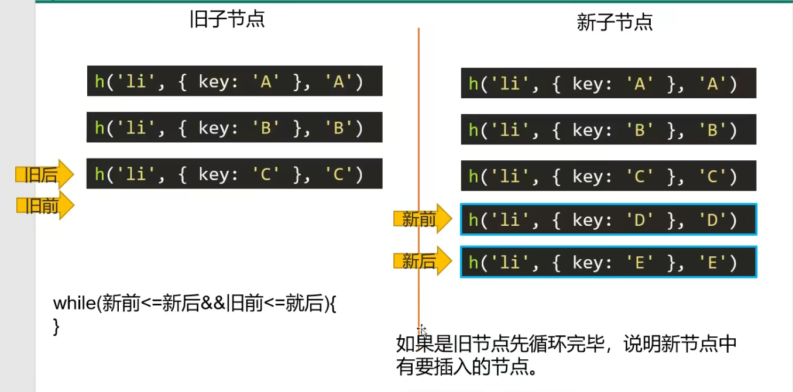

# 一、webpack（版本4）

## 1、webpack基本使用

### 1、webpack简介

#### 1.1、webpack 是什么

Webpack是一种前端资源构建工具，一个静态模块打包器。在webpack看来，前端的所有资源文件（js/json/css/img/less/...)都会作为模块处理。它将根据模块的依赖关系进行静态分析，打包生成对应的静态资源（bundle）。

#### 1.2、五个核心概念

- **Entry**
  - 入口（entry）表示  webpack 以哪个文件为入口起点开始打包，分析构建内部依赖图。
- **Output**
  - 输出（output） 表示 webpack 打包后的资源 bundles 输出到哪里去，以及如何命名。
- **Loader**
  - Loader 让 webpack 能够去处理那些非 javaScript 文件（webpack 自身只理解javaScript）
- **Plugins**
  - 插件（plugins） 可以用于执行范围更广的任务。插件的范围包括，从打包优化和压缩，一直到重新定义环境的变量等。
- **Mode**
  - 模式（mode）表示 webpack 使用相应模式的配置
  - 

### 2、初体验

目录：


#### 2.1、添加依赖

```
npm init

npm i webpack webpack-cli -g

npm i webpack webpack-cli -D
```

#### 2.2、创建入口文件

```js
/**
 * index.js: webpack 入口起点文件
 * 
 * 1、运行指令：
 *     开发环境： webpack ./src/index.js -o ./build/built.js --mode=development
 *        webpack会以   ./src/index.js 为入口文件开始打包，打包后输出到 ./build/built.js
 *        整体打包环境，是开发环境
 * 
 *     生产环境: webpack ./src/index.js -o ./build/built.js --mode=production
 *        webpack会以  ./src/index.js  为入口文件开始打包， 打包后输出到  ./build/built.js
 *        整体打包环境， 是生产环境
 * 
 * 2.结论：
 *   1. webpack能处理js/json资源，不能处理css/img等其他资源
 *   2. 生成环境和开发环境将ES6模块化编译成浏览器能识别的模块化~
 *   3. 生成环境比开发环境多一个压缩js代码
 */

// import './index.css'

import data from './data.json';

console.log(data)

function add(x, y) {
  return x + y;
}

console.log(add(1, 2));

```

#### 2.3、在html文件中引入打包后资源

```html
<!DOCTYPE html>
<html lang="en">
<head>
  <meta charset="UTF-8">
  <meta http-equiv="X-UA-Compatible" content="IE=edge">
  <meta name="viewport" content="width=device-width, initial-scale=1.0">
  <title>Document</title>
</head>
<body>
  <!-- 引入打包后资源 -->
  <script src="./built.js"></script>
</body>
</html>

```

## 2、webpack开发环境配置


### 1、打包样式资源

**目录：** （全局依赖包，统一管理，不用每次都去项目中安装，找不到就到外层查找）

​			  (index.js中引入样式资源)


#### 1、编写webpack配置文件

```js
/**
 * webpack.config.js  webpack的配置文件
 *    作用： 指示 webpack 干哪些活（当你运行 webpack 指令时，会加载里面的配置）
 * 
 *    所有构建工具都是基于nodejs平台运行的~ 模块化默认采用commonjs。
 */

// resolve 用来拼接绝对路径的方法
const { resolve } = require('path')

module.exports = {
  // webpack 配置
  //入口起点
  entry: './src/index.js',
  //输出
  output: {
    // 输出文件名
    filename: 'built.js',
    //输出路径
    // __dirname nodejs的变量，代表当前文件的目录绝对路径
    path: resolve(__dirname, 'build')
  },
  //loader 的配置
  module: {
    rules: [
      //详细loader配置
      // 不同文件必须配置不同loader 处理
      {
        // 匹配哪些文件
        test: /\.css$/,
        //使用哪些loader进行处理
        use: [
          // use 数组中loader执行顺序： 从右到左，从下到上 依次执行
          // 创建style标签，将js中的样式资源插入进去，添加到head中生效
          'style-loader',
          // 将css文件变成commonjs模块加载js中，里面内容是样式字符串
          'css-loader'
        ]
      },
      {
        test: /\.less$/,
        use: [
          'style-loader',
          'css-loader',
          //将less文件编译成css文件
          // 需要下载 less-loader 和 less
          'less-loader'
        ]
      }
    ]
  },
  // plugins 的配置
  plugins: [
    // 详细plugins的配置
  ],
  //模式
  mode: 'development',
  // mode: 'production'
}

```

#### 2、 导入依赖（版本不同，配置方式不同）

```
cnpm i webpack@4.41.6 webpack-cli@3.3.11 -g

cnpm i css-loader@3.4.2 style-loader@1.1.3 

cnpm i less less-loader@5.0.0
```

### 2、打包html资源

**目录：** 

#### 1、下载插件

```
cnpm i html-webpack-plugin@3.2.0 -D
```

#### 2、添加webpack配置文件

```js
/**
 * loader： 1.下载     2.使用（配置loader）
 * plugins：1.下载     2.引入     3.使用
 */

const {resolve} = require('path')
const HtmlWebpackPlugin = require('html-webpack-plugin')

module.exports = {
  entry: './src/index.js',
  output: {
    filename: 'built.js',
    path: resolve(__dirname, 'build')
  },
  module: {
    rules: [
      // loader 的配置
    ]
  },
  plugins: [
    // plugins 配置
    // thml-webpack-plugin
    // 功能： 默认会创建一个空的HTML,自动引入打包输出的所有资源(JS/CSS)
    // 需求： 需要有结构的THML 文件
    new HtmlWebpackPlugin({
      // 复制：'./src/index.html' 文件, 并自动引入打包输出的所有资源（JS/CSS)
      template: './src/index.html'
    })
  ],
  mode: 'development'
}

```

### 3、打包图片资源

目录： 


#### 1、导入依赖   (版本问题需注意)

```
npm i url-loader

npm html-loader 
```

#### 2、添加webpack配置文件

```js
const {resolve} = require('path');
const HtmlWebpackPlugin = require('html-webpack-plugin');

module.exports = {
  entry: './src/index.js',
  output: {
    filename: 'built.js',
    path: resolve(__dirname, 'build')
  },
  module: {
    rules: [
      {
        test: /\.less$/,
        // 要使用多个loader 处理用use
        use: [
          'style-loader',
          'css-loader',
          'less-loader'
        ]
      },
      {
        // 问题： 默认处理不了html中img图片
        //处理图片资源
        test: /\.(jpg|png|gif)$/,
        // 使用一个loader 
        // 下载 rul-loader file-loader
        loader: 'url-loader',
        options: {
          // 图片大小小于8kb， 就会别base64处理
          // 优点： 减少请求数量(减轻服务器压力)
          // 缺点： 图片体积会更大(文件请求速度更慢)
          limit: 8 * 1024,
          // 问题： 因为url-loader默认使用es6模块化解析，而html-lader引入图片是commonjs
          // 解析时会出问题： [object Module]
          // 解决： 关闭 url-loader的es6模块化，使用commonjs解析
          esModule: false,
          // 给图片进行重命名
          // [hash: 10] 取图片的hash的前10位
          // [ext]取文件原来扩展名
          name: '[hash:10].[ext]'
        }
      },
      {
        test: /\.html$/,
        // 处理htm 文件的img图片（负责引入img, 从而能被url-loader进行处理)
        loader: 'html-loader'
      }
    ]
  },
  plugins: [
    new HtmlWebpackPlugin({
      template: './src/index.html'
    })
  ],
  mode: 'development'
}

```

### 4、打包其他资源

**目录：** 

#### 1、添加webpack配置文件

```js
const {resolve} = require('path');
const HtmlWebpackPlugin = require('html-webpack-plugin');

module.exports = {
  entry: './src/index.js',
  output: {
    filename: 'built.js',
    path: resolve(__dirname, 'build')
  },
  module: {
    rules: [
      {
        test: /\.css$/,
        use: [
          'style-loader',
          'css-loader'
        ]
      },
      {
        //排除css/js/html资源
        exclude: /\.(css|js|html|less)$/,
        loader: 'file-loader',
        options: {
          name: '[hash:10].[ext]'
        }
      }
    ]
  },
  plugins: [
    new HtmlWebpackPlugin({
      template: './src/index.html'
    })
  ],
  mode: 'development'
}

```

### 5、devServer

#### 1、安装依赖（不同webpack版本，需要的包版本也不同）

```
npm i webpack-dev-server -D
```

#### 2、添加webpack配置文件

```js
const {resolve} = require('path');
const HtmlWebpackPlugin = require('html-webpack-plugin');

module.exports = {
  entry: './src/index.js',
  output: {
    filename: 'built.js',
    path: resolve(__dirname, 'build')
  },
  module: {
    rules: [
      {
        test: /\.css$/,
        use: [
          'style-loader',
          'css-loader'
        ]
      },
      {
        //排除css/js/html资源
        exclude: /\.(css|js|html|less)$/,
        loader: 'file-loader',
        options: {
          name: '[hash:10].[ext]'
        }
      }
    ]
  },
  plugins: [
    new HtmlWebpackPlugin({
      template: './src/index.html'
    })
  ],
  mode: 'development',

  // 开发服务器 devServer： 用来自动化(自动编译，自动打开浏览器，自动刷新浏览器)
  // 特点： 只会在内存中编译打包，不会有任何输出
  // 启动 devServer 指令为：npx webpack-dev-server
  devServer: {
    // 项目构建后路径
    contentBase: resolve(__dirname, 'build'),
    // 启动gzip 压缩
    compress: true,
    //端口号
    port: 3000,
    // 自动打开浏览器
    open: true
  }
}

```


### 6、开发环境配置


#### 添加webpack配置文件

```js
const {resolve} = require('path');
const HtmlWebpackPlugin = require('html-webpack-plugin');

/**
 * 开发环境配置： 能让代码运行
 *    运行项目指令：
 *       webpack 会将打包结果输出
 *       npx webpack-dev-server 只会在内存中编译打包，没有输出
 */

module.exports = {
  entry: './src/js/index.js',
  output: {
    filename: 'js/built.js',
    path: resolve(__dirname, 'build')
  },
  module: {
    rules: [
      // loader 的配置
      {
        // 处理less资源
        test: /\.less$/,
        use: ['style-loader', 'css-loader', 'less-loader']
      },
      {
        // 处理css资源
        test: /\.css$/,
        use: ['style-loader', 'css-loader']
      },
      {
        // 处理图片资源
        test: /\.(jpg|png|gif)$/,
        loader: 'url-loader',
        options: {
          limit: 8 * 1024,
          name: '[hash:10].[ext]',
          // 关闭es6模块化
          esModule: false,
          // 使打包后的文件放在该位置
          outputPath: 'imgs'
        }
      },
      {
        // 处理html中img资源
        test: /\.html$/,
        loader: 'html-loader'
      },
      {
        // 处理其他资源
        exclude: /\.(html|js|css|less|jpg|png|gif)/,
        loader: 'file-loader',
        options: {
          name: '[hash:10].[ext]',
          outputPath: 'media'
        }
      }
    ]
  },
  plugins: [
    // plugins 的配置
    new HtmlWebpackPlugin({
      template: './src/index.html'
    })
  ],
  mode: 'development',
  devServer: {
    contentBase: resolve(__dirname, 'build'),
    compress: true,
    port: 3000,
    open: true
  }
}

```


## 3、webpack生产环境配置

### 1、提取css成单独文件

#### 1.1、下载插件

```
npm i mini-css-extract-plugin@0.9.0 -D
```

#### 1.2、webapck配置文件

```js
const HtmlWebpackPlugin = require('html-webpack-plugin');
const {resolve} = require('path');
const MiniCssExtractPlugin = require('mini-css-extract-plugin');


module.exports = {
  entry: './src/js/index.js',
  output: {
    filename: 'js/built.js',
    path: resolve(__dirname, 'build')
  },
  module: {
    rules: [
      {
        test: /\.css$/,
        use: [
          // 创建 style 标签，将样式放入
          // 'style-loader',
          // 这个loader取代style-loader。 作用:提取js中的css成单独文件
          MiniCssExtractPlugin.loader,
          // 将css文件整合到js文件中
          'css-loader'
        ]
      }
    ]
  },
  plugins: [
    new HtmlWebpackPlugin({
      template: './src/index.html'
    }),
    new MiniCssExtractPlugin({
      //对输出的css文件进行重命名
      filename: 'css/built.css'
    })
  ],
  mode: 'development'
}

```

### 2、css兼容性处理（存在问题，大概思路）

#### 2.1、导入依赖包

```
npm i postcss-loader postcss-preset-env -D
```

#### 2.2、webpack配置文件

```js
const HtmlWebpackPlugin = require('html-webpack-plugin');
const {resolve} = require('path');
const MiniCssExtractPlugin = require('mini-css-extract-plugin');

// 设置nodejs环境变量
// process.env.NODE_ENV = 'development';


module.exports = {
  entry: './src/js/index.js',
  output: {
    filename: 'js/built.js',
    path: resolve(__dirname, 'build')
  },
  module: {
    rules: [
      {
        test: /\.css$/,
        use: [
          MiniCssExtractPlugin.loader,
          'css-loader',
          /*
            css兼容性处理： postcss --> postcss-loader  postcss-preset-env
            
              帮postcss找到package.json中的browserslist里面的配置，通过配置加载指定的css兼容性样式
            
                "browserslist": {
                  // 开发环境 -> 设置node环境变量： process.env.NODE_ENV = development
                  "development": [
                    "last 1 chrome version",
                    "last 1 firefox version",
                    "last 1 safari version"
                  ],
                  // 生产环境： 默认是看生产环境
                  "production": [
                    ">0.2%",
                    "not dead",
                    "not op_mini all"
                  ]
                }
            
           */
          // 使用loader 的默认配置
          // 'postcss-loader'
          // 修改loader的配置
          {
            loader: 'postcss-loader',
            options: {
              postcssOptions: {
                ident: 'postcss',
                plugins: () => {
                  ruquire('postcss-preset-env')()
                }
              }
            }
          }
        ]
      }
    ]
  },
  plugins: [
    new HtmlWebpackPlugin({
      template: './src/index.html'
    }),
    new MiniCssExtractPlugin({
      filename: 'css/built.css'
    })
  ],
  mode: 'development'
}

```

### 3、压缩css

#### 3.1、导入插件

```
npm i optimize-css-assets-webpack-plugin -D
```

#### 3.2、webpack配置文件

```js
const HtmlWebpackPlugin = require('html-webpack-plugin');
const {resolve} = require('path');
const MiniCssExtractPlugin = require('mini-css-extract-plugin');
const OptimizeCssAssetsWebpackPlugin = require('optimize-css-assets-webpack-plugin')

// 设置nodejs环境变量
// process.env.NODE_ENV = 'development';


// optimize-css-assets-webpack-plugin


module.exports = {
  entry: './src/js/index.js',
  output: {
    filename: 'js/built.js',
    path: resolve(__dirname, 'build')
  },
  module: {
    rules: [
      {
        test: /\.css$/,
        use: [
          MiniCssExtractPlugin.loader,
          'css-loader',
          {
            loader: 'postcss-loader',
            options: {
              postcssOptions: {
                ident: 'postcss',
                plugins: () => [
                  ruquire('postcss-preset-env')()
                ]
              }
            }
            
          }
        ]
      }
    ]
  },
  plugins: [
    new HtmlWebpackPlugin({
      template: './src/index.html'
    }),
    new MiniCssExtractPlugin({
      filename: 'css/built.css'
    }),
    // 压缩css
    new OptimizeCssAssetsWebpackPlugin()
  ],
  mode: 'development'
}

```

### 4、js语法检查eslint

#### 4.1、导入依赖包

```
npm i eslint-config-airbnb-base  eslint-plugin-import  eslint  -D

npm i slint-loader -D
```

#### 4.2、webpack配置文件

```js
const HtmlWebpackPlugin = require('html-webpack-plugin')
const { resolve} = require('path')

module.exports = {
  entry: './src/js/index.js',
  output: {
    filename: 'js/built.js',
    path: resolve(__dirname, 'build')
  },
  module: {
    rules: [
      /**
       * 语法检查： eslint-loader  eslint
       *    注意： 只检查自己写的源代码，第三方的库是不用检查的
       *    设置检查规则： 
       *       package.json 中eslintConfig中设置
       *           "eslintConfig": {
                      "extends": "airbnb-base"
                    }
       *       airbnb  --> eslint-config-airbnb-base  eslint-plugin-import  eslint 
       * 
       */
      {
        test: /\.js$/,
        exclude: /node_modules/,
        loader: 'eslint-loader',
        options: {
          // 自动修改eslint的错误
          fix: true
        }
      }
    ]
  },
  plugins: [
    new HtmlWebpackPlugin({
      template: './src/index.html'
    })
  ],
  mode: 'development'
}

```

### 5、js兼容性处理eslint

#### 5.1、导入依赖包

```cmd
通用：
npm i  babel-loader @babel/core -D

使用 @babel/preset-env
npm i @babel/preset-env -D

使用 @babel/polyfill
npm i @babel/polyfill -D

使用 corejs
npm i corejs -D

```

#### 5.2、webpack配置文件

```js
const HtmlWebpackPlugin = require('html-webpack-plugin')
const { resolve} = require('path')

module.exports = {
  entry: './src/js/index.js',
  output: {
    filename: 'js/built.js',
    path: resolve(__dirname, 'build')
  },
  module: {
    rules: [
      /**
       * js兼容性处理： babel-loader @babel/core
       *  1.基于js兼容性处理  -->  @babel/preset-env
       *     问题： 只能转换基本语法，如promise 高级语法不能转换
       *  2.全部js兼容性处理  --> @babel/polyfill
       *     问题： 只要解决部分兼容性问题，但是将所有兼容性代码全部引入，体积太大了~
       *  3.需要做兼容性处理的就做： 按需加载  --> corejs
       * 
       */
      {
        test: /\.js$/,
        exclude: /node_modules/,
        loader: 'babel-loader',
        options: {
          // 预设： 指示babel做怎么样的兼容性处理
          presets: [
            [
              '@babel/preset-env',
              {
                //按需加载
                useBuiltIns: 'usage',
                // 指定core-js版本
                corejs: {
                  version: 3
                },
                // 指定兼容性做到哪个版本浏览器
                targets: {
                  chrome: '60',
                  firefox: '60',
                  ie: '9',
                  safari: '10',
                  edge: '17'
                }
              }
            ]
          ]
        }
      }
    ]
  },
  plugins: [
    new HtmlWebpackPlugin({
      template: './src/index.html'
    })
  ],
  mode: 'development'
}

```

### 6、js压缩和html压缩

#### 6.1、js压缩

**webpack.config.js文件中**

```js
const HtmlWebpackPlugin = require('html-webpack-plugin')
const { resolve} = require('path')

module.exports = {
  entry: './src/js/index.js',
  output: {
    filename: 'js/built.js',
    path: resolve(__dirname, 'build')
  },
  plugins: [
    new HtmlWebpackPlugin({
      template: './src/index.html'
    })
  ],
  // 生产环境下会自动压缩js代码
  mode: 'production'
}

```

#### 6.2、html压缩

**webpack.config.js文件中**

```js
const HtmlWebpackPlugin = require('html-webpack-plugin')
const { resolve} = require('path')

module.exports = {
  entry: './src/js/index.js',
  output: {
    filename: 'js/built.js',
    path: resolve(__dirname, 'build')
  },
  plugins: [
    new HtmlWebpackPlugin({
      template: './src/index.html',
      minify: {
        // 移除空格
        collapseWhitespace: true,
        // 移除注释
        removeComments: true
      }
    })
  ],
  mode: 'production'
}

```

### 7、生产环境基本配置

#### webpack配置文件

```js
const {resolve} = require('path');
const MiniCssExtractPlugin = require('mini-css-extract-plugin');
const optimizeCssAssetsWebpackPlugin = require('optimize-css-assets-webpack-plugin');
const htmlWebpackPlugin = require('html-webpack-plugin');

// 定义nodejs环境变量: 决定使用browserslist的哪个环境
process.env.NODE_ENV = 'production'


// 复用lader
const commonCssLoader = [
  MiniCssExtractPlugin.loader,
  'css-loader',
  {
    // 还需要在package.json 中定义browserslist
    loader: 'postcss-loader',
    options: {
      ident: 'postcss',
      plugins: () => [
        require('postcss-preset-env')()
      ]
    }
  }
];

module.exports= {
  entry: './src/js/index.js',
  output: {
    filename: 'js/built.js',
    path: resolve(__dirname, build)
  },
  module: {
    rules: [
      {
        test: /\.css$/,
        use: [...commonCssLoader]
      },
      {
        test: /\.less$/,
        use: [...commonCssLoader, 'less-loader']
      },
      /**
          正常来讲，一个文件只能被一个loader处理
          当一个文件要被多个loader处理，那么一定要指定loader执行的先后顺序
            先执行eslint 在执行babel
       */
      {
        // js语法检测
        // 在package.json中eslintConfig --> airbnb
        test: /\.js$/,
        exclude: /node_modules/,
        // 优先执行
        enforce: 'pre',
        loader: 'eslint-loader',
        options: {
          fix: true
        }
      },
      {
        // js兼容性处理
        test: /\.js$/,
        exclude: /node_modules/,
        loader: 'babel-loader',
        options: {
          presets: [
            [
              '@babel/preset-env',
              {
                useBuiltIns: 'usage',
                corejs: {version: 3},
                targets: {
                  chrome: '60',
                  firefox: '50'
                }
              }
            ]
          ]
        }
      },
      {
        test: /\.(jpg|png|gif)/,
        loader: 'url-loader',
        options: {
          limit: 8 * 1024,
          name: '[hash:10].[ext]',
          outputPath: 'imgs',
          esModule: false
        }
      },
      {
        test: /\.html$/,
        loader: 'html-loader'
      },
      {
        exclude: /\.(js|css|less|html|jpg|png|gif)/,
        loader: 'file-loader',
        options: {
          outputPath: 'media'
        }
      }
    ]
  },
  plugins: [
    new MiniCssExtractPlugin({
      filename: 'css/built.css'
    }),
    new optimizeCssAssetsWebpackPlugin(),
    new htmlWebpackPlugin({
      template: './src/index.html',
      minify: {
        collapseWhitespace: true,
        removeComments: true
      }
    })
  ],
  mode: 'production'
}

```

## 4、webpack优化环境配置

### 1、开发环境之 ----HMR

#### 1、webpack配置文件

```js
/**
 * HMR : hot module replacement 热模块替换 / 模块热替换
 *    作用： 一个模块发生变化，只会重新打包这一个模块（而不是打包所有模块)
 *        极大提升构建速度
 * 
 *        样式文件: 可以使用HMR功能： 因为style-loader内部实现了~
 *        js文件：默认不能使用HMR功能  -->  需要修改js代码，添加支持HMR功能的代码
 *            注意： HMR 功能对js的处理，只能处理非入口js文件的其他文件。
 *        html文件： 默认不能使用HMR功能，同时会导致问题： html文件不能热更新了~ (不用做HMR功能)
 *            解决： 修改entry入口，将html文件引入
 */


const {resolve} = require('path');
const HtmlWebpackPlugin = require('html-webpack-plugin');

module.exports = {
  entry: ['./src/js/index.js', './src/index.html'],
  output: {
    filename: 'js/built.js',
    path: resolve(__dirname, 'build')
  },
  module: {
    rules: [
      // loader 的配置
      {
        // 处理less资源
        test: /\.less$/,
        use: ['style-loader', 'css-loader', 'less-loader']
      },
      {
        // 处理css资源
        test: /\.css$/,
        use: ['style-loader', 'css-loader']
      },
      {
        // 处理图片资源
        test: /\.(jpg|png|gif)$/,
        loader: 'url-loader',
        options: {
          limit: 8 * 1024,
          name: '[hash:10].[ext]',
          // 关闭es6模块化
          esModule: false,
          // 使打包后的文件放在该位置
          outputPath: 'imgs'
        }
      },
      {
        // 处理html中img资源
        test: /\.html$/,
        loader: 'html-loader'
      },
      {
        // 处理其他资源
        exclude: /\.(html|js|css|less|jpg|png|gif)/,
        loader: 'file-loader',
        options: {
          name: '[hash:10].[ext]',
          outputPath: 'media'
        }
      }
    ]
  },
  plugins: [
    // plugins 的配置
    new HtmlWebpackPlugin({
      template: './src/index.html'
    })
  ],
  mode: 'development',
  devServer: {
    contentBase: resolve(__dirname, 'build'),
    compress: true,
    port: 3000,
    open: true,
    // 开启HMR功能
    // 当修改了webpack配置，新配置要想生效，必须重新webpack服务
    hot: true
  }
}

```

#### 2、index.js文件

```js
// 引入
import print from './print';
import '../css/iconfont.css';
import '../css/index.less';
console.log('index.js文件被加载了~');

function add(x, y) {
  return x + y;
}

console.log(add(1, 2));

if(module.hot) {
  // 一旦 module.hot 为true， 说明开启了HMR功能。 --> 让HMR功能代码生效
  module.hot.accept('./print.js', function() {
    // 方法会监听 print.js 文件的变化， 一旦发生变化，其他模块不会重新打包构建。
    // 会执行后面的回调函数
    print()
  })
}

```

### 2、开发环境之----source-map

#### webpack配置文件

```js

const {resolve} = require('path');
const HtmlWebpackPlugin = require('html-webpack-plugin');

module.exports = {
  entry: ['./src/js/index.js', './src/index.html'],
  output: {
    filename: 'js/built.js',
    path: resolve(__dirname, 'build')
  },
  module: {
    rules: [
      // loader 的配置
      {
        // 处理less资源
        test: /\.less$/,
        use: ['style-loader', 'css-loader', 'less-loader']
      },
      {
        // 处理css资源
        test: /\.css$/,
        use: ['style-loader', 'css-loader']
      },
      {
        // 处理图片资源
        test: /\.(jpg|png|gif)$/,
        loader: 'url-loader',
        options: {
          limit: 8 * 1024,
          name: '[hash:10].[ext]',
          // 关闭es6模块化
          esModule: false,
          // 使打包后的文件放在该位置
          outputPath: 'imgs'
        }
      },
      {
        // 处理html中img资源
        test: /\.html$/,
        loader: 'html-loader'
      },
      {
        // 处理其他资源
        exclude: /\.(html|js|css|less|jpg|png|gif)/,
        loader: 'file-loader',
        options: {
          name: '[hash:10].[ext]',
          outputPath: 'media'
        }
      }
    ]
  },
  plugins: [
    // plugins 的配置
    new HtmlWebpackPlugin({
      template: './src/index.html'
    })
  ],
  mode: 'development',
  devServer: {
    contentBase: resolve(__dirname, 'build'),
    compress: true,
    port: 3000,
    open: true,
    hot: true
  },
  devtool: 'source-map'
}

/**
 * source-map: 一种 提供源代码到构建后代码映射 技术 （如果构建后代码出错了，通过映射可以追踪源代码错误)
 * 
 * [inline- | hidden- | eval- ] [nosources- ][cheap- [module-]]source-map
 * 
 * source-map: 外部
 *    错误代码准确信息 和 源代码的错误位置
 * inline-source-map: 内联
 *    只生成一个内联source-map
 *    错误代码准确信息 和 源代码的错误位置
 * hidden-source-map: 外部
 *    错误代码错误原因， 但是没有错误位置
 *    不能追踪源代码错误，只能提示到构建后代码的错误位置
 * eval-source-map: 内联
 *    每一个文件都生成对应的source-map，都在eval
 *    错误代码准确信息 和 源代码的错误位置
 * nosources-source-map： 外部
 *    错误代码准确信息，但是没有任何源代码信息
 * cheap-source-map: 外部
 *    错误代码准确信息 和 源代码的错误位置
 *    只能精确到行
 * cheap-module-source-map: 外部
 *    错误代码准确信息 和 源代码的错误位置
 *    module会将loader的source map加入
 * 
 * 内联 和 外部的区别： 1.外部生成了文件,内联没有  2.内联构建速度更快
 * 
 * 开发环境： 速度快,调试更友好
 *    速度快(eval> inline> cheap> ...)
 *      eval-chea-souce-map
 *      eval-source-map
 *    调试更友好
 *      souce-map
 *      cheap-module-souce-map
 *      cheap-souce-map
 * 
 *    --> eval-source-map / eval-cheap-module-souce-map
 * 
 * 生成环境： 源代码要不要隐藏? 调试要不要更友好
 *    内联会让代码体积变大，所有在生产环境不用内联
 *    nosources-source-map  全部隐藏
 *    hidden-source-map   只隐藏源代码，会提示构建后代码错误信息
 * 
 *    --> source-map  /  cheap-module-souce-map
 * 
 */

```

### 3、生产环境之-----oneOf

**优化生产环境的打包构建速度**

#### webpack配置文件

```js
const {resolve} = require('path');
const MiniCssExtractPlugin = require('mini-css-extract-plugin');
const optimizeCssAssetsWebpackPlugin = require('optimize-css-assets-webpack-plugin');
const htmlWebpackPlugin = require('html-webpack-plugin');

// 定义nodejs环境变量: 决定使用browserslist的哪个环境
process.env.NODE_ENV = 'production'


// 复用lader
const commonCssLoader = [
  MiniCssExtractPlugin.loader,
  'css-loader',
  {
    // 还需要在package.json 中定义browserslist
    loader: 'postcss-loader',
    options: {
      ident: 'postcss',
      plugins: () => [
        require('postcss-preset-env')()
      ]
    }
  }
];

module.exports= {
  entry: './src/js/index.js',
  output: {
    filename: 'js/built.js',
    path: resolve(__dirname, build)
  },
  module: {
    rules: [
       /**
            正常来讲，一个文件只能被一个loader处理
            当一个文件要被多个loader处理，那么一定要指定loader执行的先后顺序
              先执行eslint 在执行babel
         */
      {
        // js语法检测
        // 在package.json中eslintConfig --> airbnb
        test: /\.js$/,
        exclude: /node_modules/,
        // 优先执行
        enforce: 'pre',
        loader: 'eslint-loader',
        options: {
          fix: true
        }
      },
     {
      // 以下loader只会匹配一个
      // 注意： 不能有两个配置处理同一种类型文件
      oneOf: [
        {
          test: /\.css$/,
          use: [...commonCssLoader]
        },
        {
          test: /\.less$/,
          use: [...commonCssLoader, 'less-loader']
        },
        {
          // js兼容性处理
          test: /\.js$/,
          exclude: /node_modules/,
          loader: 'babel-loader',
          options: {
            presets: [
              [
                '@babel/preset-env',
                {
                  useBuiltIns: 'usage',
                  corejs: {version: 3},
                  targets: {
                    chrome: '60',
                    firefox: '50'
                  }
                }
              ]
            ]
          }
        },
        {
          test: /\.(jpg|png|gif)/,
          loader: 'url-loader',
          options: {
            limit: 8 * 1024,
            name: '[hash:10].[ext]',
            outputPath: 'imgs',
            esModule: false
          }
        },
        {
          test: /\.html$/,
          loader: 'html-loader'
        },
        {
          exclude: /\.(js|css|less|html|jpg|png|gif)/,
          loader: 'file-loader',
          options: {
            outputPath: 'media'
          }
        }
      ]
     }
    ]
  },
  plugins: [
    new MiniCssExtractPlugin({
      filename: 'css/built.css'
    }),
    new optimizeCssAssetsWebpackPlugin(),
    new htmlWebpackPlugin({
      template: './src/index.html',
      minify: {
        collapseWhitespace: true,
        removeComments: true
      }
    })
  ],
  mode: 'production'
}

```

### 4、生产环境之----缓存

#### webpack配置文件

```js
const {resolve} = require('path');
const MiniCssExtractPlugin = require('mini-css-extract-plugin');
const optimizeCssAssetsWebpackPlugin = require('optimize-css-assets-webpack-plugin');
const htmlWebpackPlugin = require('html-webpack-plugin');

// 定义nodejs环境变量: 决定使用browserslist的哪个环境
process.env.NODE_ENV = 'production'

/**
 * 缓存：
 *   babel缓存
 *      cacheDirectory: true
 *      --> 让第二次打包构建速度更快
 *   文件资源缓存
 *      hash: 每次webpack构建时会生成一个唯一的hash值。
 *        问题: 因为js和css同时使用一个hash值。
 *            如果重新打包，会导致所有缓存失效。（可能我只改动一个文件）
 *      chunkhash: 根据chunk生成的hash值。如果打包来源于同一个chunk，那么hash值就一样
 *         问题:  js和css的hash值还是一样的
 *            因为css是在js中被引入的，所以同属于一个chunk
 *       contenthash: 根据文件的内容生成hash值。不同文件hash值一定不一样
 *       --> 让代码上线运行缓存更好使用
 */         


// 复用lader
const commonCssLoader = [
  MiniCssExtractPlugin.loader,
  'css-loader',
  {
    // 还需要在package.json 中定义browserslist
    loader: 'postcss-loader',
    options: {
      ident: 'postcss',
      plugins: () => [
        require('postcss-preset-env')()
      ]
    }
  }
];

module.exports= {
  entry: './src/js/index.js',
  output: {
    filename: 'js/built[contenthash:10].js',
    path: resolve(__dirname, 'build')
  },
  module: {
    rules: [
       /**
            正常来讲，一个文件只能被一个loader处理
            当一个文件要被多个loader处理，那么一定要指定loader执行的先后顺序
              先执行eslint 在执行babel
         */
      {
        // js语法检测
        // 在package.json中eslintConfig --> airbnb
        test: /\.js$/,
        exclude: /node_modules/,
        // 优先执行
        enforce: 'pre',
        loader: 'eslint-loader',
        options: {
          fix: true
        }
      },
     {
      // 以下loader只会匹配一个
      // 注意： 不能有两个配置处理同一种类型文件
      oneOf: [
        {
          test: /\.css$/,
          use: [...commonCssLoader]
        },
        {
          test: /\.less$/,
          use: [...commonCssLoader, 'less-loader']
        },
        {
          // js兼容性处理
          test: /\.js$/,
          exclude: /node_modules/,
          loader: 'babel-loader',
          options: {
            presets: [
              [
                '@babel/preset-env',
                {
                  useBuiltIns: 'usage',
                  corejs: {version: 3},
                  targets: {
                    chrome: '60',
                    firefox: '50'
                  }
                }
              ]
            ],
            // 开启babel缓存
            // 第二次构建时，会读取之前的缓存
            cacheDirectory: true
          }
        },
        {
          test: /\.(jpg|png|gif)/,
          loader: 'url-loader',
          options: {
            limit: 8 * 1024,
            name: '[hash:10].[ext]',
            outputPath: 'imgs',
            esModule: false
          }
        },
        {
          test: /\.html$/,
          loader: 'html-loader'
        },
        {
          exclude: /\.(js|css|less|html|jpg|png|gif)/,
          loader: 'file-loader',
          options: {
            outputPath: 'media'
          }
        }
      ]
     }
    ]
  },
  plugins: [
    new MiniCssExtractPlugin({
      filename: 'css/built[contenthash:10].css'
    }),
    new optimizeCssAssetsWebpackPlugin(),
    new htmlWebpackPlugin({
      template: './src/index.html',
      minify: {
        collapseWhitespace: true,
        removeComments: true
      }
    })
  ],
  mode: 'production',
  devtool: 'source-map'
}

```

### 5、生产环境之---tree shaking

#### webpack配置文件

```js
const {resolve} = require('path');
const MiniCssExtractPlugin = require('mini-css-extract-plugin');
const optimizeCssAssetsWebpackPlugin = require('optimize-css-assets-webpack-plugin');
const htmlWebpackPlugin = require('html-webpack-plugin');

// 定义nodejs环境变量: 决定使用browserslist的哪个环境
process.env.NODE_ENV = 'production'

/**
    tree shaking: 去除无用代码
      前提： 1.必须使用ES6模块化   2.开启production环境
      作用： 减少代码体积

      在package.josn 中配置
        "sideEffects": false 所有代码都没有副作用(都可以进行tree shaking)
          问题： 可能会把css / @babel/polyfill （副作用）文件干掉
        "sideEffects": ["*.css","*.less"]
 */         


// 复用lader
const commonCssLoader = [
  MiniCssExtractPlugin.loader,
  'css-loader',
  {
    // 还需要在package.json 中定义browserslist
    loader: 'postcss-loader',
    options: {
      ident: 'postcss',
      plugins: () => [
        require('postcss-preset-env')()
      ]
    }
  }
];

module.exports= {
  entry: './src/js/index.js',
  output: {
    filename: 'js/built[contenthash:10].js',
    path: resolve(__dirname, 'build')
  },
  module: {
    rules: [
       /**
            正常来讲，一个文件只能被一个loader处理
            当一个文件要被多个loader处理，那么一定要指定loader执行的先后顺序
              先执行eslint 在执行babel
         */
      {
        // js语法检测
        // 在package.json中eslintConfig --> airbnb
        test: /\.js$/,
        exclude: /node_modules/,
        // 优先执行
        enforce: 'pre',
        loader: 'eslint-loader',
        options: {
          fix: true
        }
      },
     {
      // 以下loader只会匹配一个
      // 注意： 不能有两个配置处理同一种类型文件
      oneOf: [
        {
          test: /\.css$/,
          use: [...commonCssLoader]
        },
        {
          test: /\.less$/,
          use: [...commonCssLoader, 'less-loader']
        },
        {
          // js兼容性处理
          test: /\.js$/,
          exclude: /node_modules/,
          loader: 'babel-loader',
          options: {
            presets: [
              [
                '@babel/preset-env',
                {
                  useBuiltIns: 'usage',
                  corejs: {version: 3},
                  targets: {
                    chrome: '60',
                    firefox: '50'
                  }
                }
              ]
            ],
            // 开启babel缓存
            // 第二次构建时，会读取之前的缓存
            cacheDirectory: true
          }
        },
        {
          test: /\.(jpg|png|gif)/,
          loader: 'url-loader',
          options: {
            limit: 8 * 1024,
            name: '[hash:10].[ext]',
            outputPath: 'imgs',
            esModule: false
          }
        },
        {
          test: /\.html$/,
          loader: 'html-loader'
        },
        {
          exclude: /\.(js|css|less|html|jpg|png|gif)/,
          loader: 'file-loader',
          options: {
            outputPath: 'media'
          }
        }
      ]
     }
    ]
  },
  plugins: [
    new MiniCssExtractPlugin({
      filename: 'css/built[contenthash:10].css'
    }),
    new optimizeCssAssetsWebpackPlugin(),
    new htmlWebpackPlugin({
      template: './src/index.html',
      minify: {
        collapseWhitespace: true,
        removeComments: true
      }
    })
  ],
  mode: 'production',
  devtool: 'source-map'
}

```

### 6、生产环境之----code split

- 分割文件

#### 情况一

**使用多入口: 写几个入口，就会打包出来几个js文件**

```js
const {resolve} = require('path');
const htmlWebpackPlugin = require('html-webpack-plugin');


module.exports= {
  // 单入口
  // entry: './src/js/index.js',
  entry: {
    // 多入口： 有一个入口，最终输出就有一个bundle
    index: './src/js/index.js',
    test: './src/js/test.js'
  },
  output: {
    // [name]: 取文件名
    filename: 'js/[name].[contenthash:10].js',
    path: resolve(__dirname, 'build')
  },
  plugins: [
    new htmlWebpackPlugin({
      template: './src/index.html',
      minify: {
        collapseWhitespace: true,
        removeComments: true
      }
    })
  ],
  mode: 'production'
}

```

#### 情况二

**取打包后的别名**

```js
const {resolve} = require('path');
const htmlWebpackPlugin = require('html-webpack-plugin');


module.exports= {
  // 单入口
  // entry: './src/js/index.js',
  entry: {
    index: './src/js/index.js',
    test: './src/js/test.js'
  },
  output: {
    // [name]: 取文件名
    filename: 'js/[name].[contenthash:10].js',
    path: resolve(__dirname, 'build')
  },
  plugins: [
    new htmlWebpackPlugin({
      template: './src/index.html',
      minify: {
        collapseWhitespace: true,
        removeComments: true
      }
    })
  ],
  /**
   * 1. 可以将node_modules中代码单独打包一个chunk最终输出
   * 2. 自动分析多入口的chunk中，有没有公共的文件。如果有会打包成单独一个chunk
   *  
   */ 
  optimization: {
    splitChunks: {
      chunks: 'all'
    }
  },
  mode: 'production'
}

```

#### 情况三

```js
const {resolve} = require('path');
const htmlWebpackPlugin = require('html-webpack-plugin');


module.exports= {
  // 单入口
  entry: './src/js/index.js',
  // entry: {
  //   index: './src/js/index.js',
  //   test: './src/js/test.js'
  // },
  output: {
    // [name]: 取文件名
    filename: 'js/[name].[contenthash:10].js',
    path: resolve(__dirname, 'build')
  },
  plugins: [
    new htmlWebpackPlugin({
      template: './src/index.html',
      minify: {
        collapseWhitespace: true,
        removeComments: true
      }
    })
  ],
  /**
   * 1. 可以将node_modules中代码单独打包一个chunk最终输出
   * 2. 自动分析多入口的chunk中，有没有公共的文件。如果有会打包成单独一个chunk
   *  
   */ 
  optimization: {
    splitChunks: {
      chunks: 'all'
    }
  },
  mode: 'production'
}

```

**index.js文件**

```js

function sum(...args) {
  return args.reduce((p, c) => p + c, 0);
}


/**
 * 通过js代码，让某个文件被单独打包成一个chunk
 * import 动态导入语法： 能将某个文件单独打包
 */
import(/* webpackChunkName: 'test' */'./test')
  .then((result) => {
    // 文件加载成功
    // eslint-disable-next-line
    console.log(result);
  })
  .catch(() => {
     // eslint-disable-next-line
     console.log('文件加载失败~');
  })

// eslint-disable-next-line
console.log(mul(2, 3));
// eslint-disable-next-line
console.log(sum(1, 2, 3, 4, 5));

```

### 7、懒加载和预加载

**webpack配置文件同上**

#### index.js文件

```js
console.log('index.js文件被加载了')

document.getElementById('btn').onclick = function() {
  // 懒加载~: 当文件需要使用时才加载
  // 预加载 prefetch: 会在使用之前，提前加载js文件
  // 正常加载可以认为是并行加载（同一时间加载多个文件） 
  // 预加载 prefetch: 等其他资源加载完毕，浏览器空闲了，再偷偷加载资源
  import(/* webpackChunkName: 'test', webpackPrefetch: true */'./test').then(({mul}) => {
    console.log(mul(4, 5));
  })
}

```

### 8、多进程打包

#### 1、下载依赖包

```
npm i thread-loader -D
```

#### 2、webpack配置文件

```js
 {
          // js兼容性处理
          test: /\.js$/,
          exclude: /node_modules/,
          use: [
            /**
             * 开启多进程打包。
             * 进程启动大概为600ms,进程通信也有开销。
             * 只有工作消耗时间比较长，才需要多进程打包
             */
            'thread-loader',
            {
              loader: 'babel-loader',
              options: {
                presets: [
                  [
                    '@babel/preset-env',
                    {
                      useBuiltIns: 'usage',
                      corejs: {version: 3},
                      targets: {
                        chrome: '60',
                        firefox: '50'
                      }
                    }
                  ]
                ],
                // 开启babel缓存
                // 第二次构建时，会读取之前的缓存
                cacheDirectory: true
              }
            }
          ]
        },
```

### 9、dll

**根目录下新建webpack.dll.js文件**

#### 导入插件

```
npm i add-asset-html-webpack-plugin -D
```

#### webpack.dll.js文件

```js
/**
 * 使用dll技术，对某些库（第三方库： jquery、react、vue...）进行单独打包
 *    当你运行 webpack 时，默认查找 webpack。config.js 配置文件
 *    需求： 需要运行 webpack.dll.js 文件
 *      -->  webpack --config webpack.dll.js
 *
 */

const {resolve} = require('path');
const webpack = require('webpack');

module.exports = {
  entry: {
    // 最终打包生成的[name] --> jquery
    // ['jquery'] --> 要打包的库是jquery
    jquery: ['jquery']
  },
  output: {
    filename: '[name].js',
    path: resolve(__dirname, 'dll'),
    library: '[name]_[hash]', // 打包的库里面向外暴露出去的内容叫什么名字 
  },
  plugins: [
    // 打包生成一个 manifest.json  --> 提供jquery映射
    new webpack.DllPlugin({
      name: '[name]_[hash]', // 映射库的暴露的内容名称
      path: resolve(__dirname, 'dll/manifest.json') // 输出文件路径
    })
  ],
  mode: 'production'
}

```

#### wepack.config.js文件

```js
const {resolve} = require('path');
const HtmlWebpackPlugin = require('html-webpack-plugin');
const webpack = require('webpack');
const AddAssetHtmlWebpackPlugin = require('add-asset-html-webpack-plugin');

module.exports = {
  entry: './src/index.js',
  output: {
    filename: 'built.js',
    path: resolve(__dirname, 'build')
  },
  module: {
    rules: [
      // loader 的配置
    ]
  },
  plugins: [
    new HtmlWebpackPlugin({
      template: './src/index.html'
    }),
    // 告诉webpack哪些库不参与打包，同时使用时的名称也得变~
    new webpack.DllReferencePlugin({
      manifest: resolve(__dirname, 'dll/manifest.json')
    }),
    // 将某个文件打包输出去，并在html中自动引入该资源
    new AddAssetHtmlWebpackPlugin({
      filepath: resolve(__dirname, 'dll/jquery.js')
    })
  ],
  mode: 'development'
}

```

## 5、总结

### 1、entry

```js
const {resolve}  = require('path');
const HtmlWebpackPlugin = require('html-webpack-plugin');

/**
 * entry: 入口起点
 * 1、string --> './src/index.js'
 *   单入口
 *    打包形成一个chunk。输出一个bundle文件。
 *    此时chunk的名称默认是main
 * 2、array  --> ['./src/index.js','./src/add.js']
 *   多入口
 *   所有入口文件最终只会形成一个chunk，输出出去只有一个bundle文件。
 * 3、object
 *   多入口
 *   有几个入口文件就形成几个chunk，输出几个bundle文件
 *   此时chunk的名称是 key
 * 
 *    -->  特殊用法
 *      {
 *         // 所有入口文件最终只会形成一个chunk，输出出去只有一个bundle文件
 *          index: ['./src/index.js', './src/count.js'],
 *         // 形成一个chunk， 输出一个bundle文件。
 *          add: './src/add.js'
 *      }
 */


module.exports = {
  // entry: './src/index.js',
  // entry: ['./src/index.js', './src/2.js'],
  entry: {
    index: './src/index.js',
    add: './src/add.js'
  },
  output: {
    filename: '[name].js',
    path: resolve(__dirname,'build')
  },
  plugins: [
    new HtmlWebpackPlugin()
  ],
  mode: 'development'
}

```

### 2、output

```js
const {resolve}  = require('path');
const HtmlWebpackPlugin = require('html-webpack-plugin');


module.exports = {
  entry: {
    index: './src/index.js',
    add: './src/add.js'
  },
  output: {
    // 文件名称 （指定名称 + 目录）
    filename: '[name].js',
    // 输出文件目录（将来所有资源输出的公共目录）
    path: resolve(__dirname,'build'),
    // 所有资源引入公共路径前缀  -->  'imgs/a.jpg'  -->  '/imgs/a.jpg'
    publicPath: '/',
    chunkFilename: 'js/[name]_chunk.js', // 非入口chunk的名称
    // library: '[name]', // 整个库向外暴露的变量名
    // libraryTarget: 'window'  // 变量名添加到哪个上 browser
    // libraryTarget: 'global',  // 变量名添加到哪个上 node
    libraryTarget: 'commonjs'
  },
  plugins: [
    new HtmlWebpackPlugin()
  ],
  mode: 'development'
}

```

### 3、resolve

```js
const {resolve}  = require('path');
const HtmlWebpackPlugin = require('html-webpack-plugin');


module.exports = {
  entry: './src/js/index.js',
  output: {
    // 文件名称 （指定名称 + 目录）
    filename: '[name].js',
    // 输出文件目录（将来所有资源输出的公共目录）
    path: resolve(__dirname,'build'),
  },
  plugins: [
    new HtmlWebpackPlugin()
  ],
  mode: 'development',
  // 解析模块的规则
  resolve: {
    // 配置解析模块路径别名: 优点简写路径，缺点路径没有提示
    alias: {
      $css: resolve(__dirname, 'src/css')
    },
    // 配置省略文件路径的后缀名
    extensions: ['js', '.json', '.css'],
    // 告诉 webpack 解析模块是去找哪个目录
    modules: [resolve(__dirname, '../../node_modules'), 'node_modules']
  }
}

```

### 4、dev  Server

```js
const {resolve}  = require('path');
const HtmlWebpackPlugin = require('html-webpack-plugin');


module.exports = {
  entry: './src/js/index.js',
  output: {
    // 文件名称 （指定名称 + 目录）
    filename: '[name].js',
    // 输出文件目录（将来所有资源输出的公共目录）
    path: resolve(__dirname,'build'),
  },
  plugins: [
    new HtmlWebpackPlugin()
  ],
  mode: 'development',
  // 解析模块的规则
  resolve: {
    // 配置解析模块路径别名: 优点简写路径，缺点路径没有提示
    alias: {
      $css: resolve(__dirname, 'src/css')
    },
    // 配置省略文件路径的后缀名
    extensions: ['js', '.json', '.css'],
    // 告诉 webpack 解析模块是去找哪个目录
    modules: [resolve(__dirname, '../../node_modules'), 'node_modules']
  },
  devServer: {
    // 运行代码的目录
    contentBase: resolve(__dirname, 'build'),
    // 监视 contentBase 目录下的所有文件，一旦文件变化就会reload
    watchContentBase: true,
    watchOptions: {
      //忽略文件
      ignored: /node_modules/
    },
    // 启动gzip压缩
    compress: true,
    //端口号
    port: 5000,
    // 域名
    host: 'localhost',
    // 自动打开浏览器
    open: true,
    // 开启HMR 功能
    hot: true,
    // 不要显示启动服务器日志信息
    clientLogLevel: 'none',
    // 除了一些基本启动信息以外，其他内容都不要显示
    quiet: true,
    // 如果出错了，不要全屏提示~
    overlay: false,
    // 服务器代理  --> 解决开发环境跨域问题
    proxy: {
      // 一旦devServer(5000) 服务器接收到 /api/xxx 的请求，就会把请求转发到另一个服务器（3000）
      '/api': {
        target: 'http://localhost:3000',
        // 发送请求时，请求路径重写： 将 /api/xxx  -->  /xxx (去掉/api)
        pathRewrite: {
          '^/api': ''
        }
      }
    }
  }
}

```

### 5、optimization

```js
const {resolve}  = require('path');
const HtmlWebpackPlugin = require('html-webpack-plugin');
const TerserWebpackPlugin = require('terser-webpack-plugin');


module.exports = {
  entry: './src/js/index.js',
  output: {
    // 文件名称 （指定名称 + 目录）
    filename: 'js/[name].[contenthash:10].js',
    // 输出文件目录（将来所有资源输出的公共目录）
    path: resolve(__dirname,'build'),
  },
  plugins: [
    new HtmlWebpackPlugin()
  ],
  mode: 'production',
  optimization: {
    splitChunks: {
      chunks: 'all',
      minSize: 30 * 1024, // 分割的chunk最小为30kb
      maxSize: 0, // 最大没有限制
      minChunks: 1, // 要提取的chunk最少被引用1次
      maxAsyncRequests: 5,  // 按需加载时并行加载的文件的最大数量
      maxInitialRequests: 3, // 入口js文件最大并行请求数量
      automaticNameDelimiter: '~', // 名称连接符
      name: true, // 可以使用命名规则
      cacheGroups: {
        // 分割chunk的组
        // node_modules文件会被打包到 vendors 组的chunk中。  -->  venders~xxx.js
        // 满足上面的公共规则，如： 大小超过30kb，至少被引用一次。
        vendors: {
          test: /[\\/]node_modules[\\/]/,
          // 优先级
          priority: -10
        },
        default: {
          // 要提取的chunk最少被引用2次
          minChunks: 2,
          // 优先级
          priority: -20,
          // 如果当前要打包的模块，和之前已经被提取的模块是同一个，就会复用，而不是重新打包模块
          reuseExistingChunk: true
        }
      }
    },
    // 将当前模块记录的其他模块的hash单独打包为一个文件 runtime
    // 解决： 修改a文件导致b文件的contenthash变化
    runtimeChunk: {
      name: entrypoint => `runtime-${entrypoint.name}`
    },
    minimizer: [
      // 配置生产环境的压缩方案： js和css
      new TerserWebpackPlugin({
        // 开启缓存
        cache: true,
        // 开启多进程打包
        parallel: true,
        // 启动source-map
        sourceMap: true
      })
    ]
  }
}

```


# 二、创建Vue项目

### **1、vue create 项目名**

​		**要求**: `vue-cli3.x`

### 2、vue init webpack 项目名

​		**要求**： `vue-cli2.x`

# 三、安装使用 vue-router

**第一步：**安装 vue-router

```js
 npm install vue-router
```

### 1、Vue2版本

**第二步：**在src目录下新建 router/index.js 文件

```js
import Vue from 'vue'
import VueRouter from 'vue-router' 

//1.通过vue.use(插件)，安装插件
Vue.use(VueRouter)

//2.创建VueRouter对象
const routes = [
    
]

const router = new VueRouter({
    //配置路由和组件之间的应用关系
    routes,
    mode: 'history'
})

//3.将router对象传入到vue实例
export default router
```

**第三步：**main中导入

```js
import Vue from 'vue'
import App from './App.vue'
import router from './router'

Vue.config.productionTip = false

new Vue({
  render: h => h(App),
	router,
	store
}).$mount('#app')
```

**第四步：**使用

```js
// 当前激活的路由的信息对象，每个对象是局部的，可以获取到当前路由的path,name,params,query等属性。
this.$route

// 全局的router实例。全局，任何页面都可以调用其push(),replace(),go()等方法。
this.$router
```


### 2、Vue3版本

**第二步：**在src目录下新建 router/index.js 文件

```js
import { createRouter,createWebHistory } from "vue-router";

const routes = [
    
]

const router = createRouter({
    routes,
    history: createWebHistory()
})

export default router
```

**第三步：**main中引入

```js
import { createApp } from 'vue'
import App from './App.vue'
import router from './router/index'

const app = createApp(App)
app.use(router)
app.mount('#app')
```

**第四步：**使用

```js
import { useRouter,useRoute } from 'vue-router'
export default {
    setup() {
        //获取全局路由实例对象
        const router = useRouter()
        
        // 获取当前活跃的路由信息对象，局部对象
        const route = useRoute()
    }
}
```


# 四、安装使用vuex

**第一步：**安装vuex

```js
npm install vuex
```

### 1、Vue2版本

**第二步：**在src目录下新建 store/index.js 文件

```js
import Vue from 'vue'
import Vuex from 'vuex'

Vue.use(Vuex)

const store = new Vuex.Store({
    state: {    
    },
    getters: {   
    },
    mutations: {      
    },
    actions: {  
    }
})

export default store;
```

**第三步：**main.js中引入

```js
import Vue from 'vue'
import App from './App.vue'
import store from './store/index'
const vm = new Vue({
	store: store,
	render: h => h(App)
}).$mount('#app')
```

**第四步：** 使用

```vue
<template>
  <div>
    {{$store.state.token}}
  </div>
</template>
<script>
 
export default={
 name: 'Home',
  data() {
    return {
      tel: '',
    }
  },
  created(){
    //调用acionts中的方法
    this.$store.dispatch('set_token',12345);
    //调用mutations中的方法
    this.$store.commit('to_token',123456)
  }
}
```


### 2、Vue3版本

**第二步：** 在src目录下新建 store/index.js 文件

```js
import { createStore } from 'vuex'

// 创建vuex实例对象
const store = createStore({
  state: {},
  // 修改变量（state不能直接赋值修改，只能通过mutations）
  mutations: {},
  getters: {},
  actions: {}
})

export default store;
```

**第三步：**main.js中引入

```js
import { createApp } from 'vue'
import App from './App.vue'
import store from '@/store/index'

const app = createApp(App)
app.mount('#app')
app.use(store)

```

**第四步：**使用

```js
import {useStore} from 'vuex'

//vuex实例对象
const store = useStore()

//保存用户信息到vuex中
store.commit('saveUserNexs',data.user)
//把token提交到后端
store.commit('changeToken',token)
```


# 五、安装使用sass

**第一步：**安装sass依赖

```json
npm install --save-dev sass-loader
// sass-loader 依赖于 node-sass
npm install --save-dev node-sass
```

**第二步：**使用

```scss
<style lang="scss">
  $title-color: red;
  .aaa {
    width: 100px;
    height: 100px;
    background-color: aqua;
    .bbb {
      width: 50px;
      height: 50px;
      background-color: $title-color;
    }
  }
</style>
```


# 六、安装使用axios

**第一步：安装axios**

```js
npm install axios
```

**第二步：封装axios请求**

**（1）在src目录下新建utils文件，新建request.js文件**

```js
import axios from 'axios'


const service = axios.create({
  baseURL: '',
  timeout: 10000
})

// 请求拦截器
service.interceptors.request.use(
  config => {

  },
  error => {

  }
)

// 响应拦截器
service.interceptors.response.use(
  response => {

  },
  error => {

  }
)

export default service

```

**(2)在src目录下新建api文件夹，建立对应的接口js文件，例如：**UserController.js

```js
import request from '@/utils/request'

export default class UserController{

  // 获取用户列表
  static get_list(data) {
    return request({
      url: '/admin/user/list',
      method: 'post',
      data
    })
  }

  // 修改用户状态
  static update_status(data) {
    return request({
      url: '/admin/user/status',
      method: 'post',
      data
    })
  }

  // 编辑用户
  static edit_user(data) {
    return request({
      url: '/admin/user/update',
      method: 'post',
      data
    })
  }

  // 添加用户
  static add_user(data) {
    return request({
      url: '/admin/user/add',
      method: 'post',
      data
    })
  }

  // 删除用户
  static del_user(data) {
    return request({
      url: '/admin/user/del',
      method: 'post',
      data
    })
  }

  // 获取简历
  static get_resume(data) {
    return request({
      url: '/admin/resume_info/get',
      method: 'post',
      data
    })
  }
}

```

**(3) 统一导出对应的接口文件，在src/api下新建index.js文件**

```js
import ArticleController from "./cms/ArticleController";
import UserController from "./cms/UserController";
import PictureController from "./cms/PictureController";

export {
  ArticleController,
  UserController,
  PictureController
}

```


**(4) 在页面中使用**

```js
import {UserController} from '@/api'

UserController.get_list(data).then( res => {
    
})
```


# 七、使用 js-cookie

**1、安装**

```js
npm i js-cookie
```

**2、使用**

​	在src目录下新建utils/auth.js

```js
/**
 * 本地存储采用cookie方式
 */
import Cookies from "js-cookie";

export function getCookies(Key) {
  return Cookies.get(Key)
}

export function setCookies(Key, Value) {
  return Cookies.set(Key, Value)
}

export function removeCookies(Key) {
  return Cookies.remove(Key)
}
```


# 八、使用@路径引入

**第一步：**先确定node_modules项目中是否有path模块， 如果没有path模块需要先安装

```js
npm install path --save
```

**第二步：**配置

### 1、webpack.base.conf.js配置

```js
resolve: {
    extensions: ['.js', '.vue', '.json'],
    alias: {
      'vue$': 'vue/dist/vue.esm.js',
      '@': resolve('src'),
      // add assets路径   给src/assets设置引用路径 assets  使用就是  "~assets"
      'assets': resolve('src/assets'),      
     //  add static路径  给static设置引用路径 static  使用就是 "~static"
      'static': path.resolve(__dirname, '../static'), 
  },
```

### 2、vue.config.js配置

```js
const path = require("path");
const resolve = dir => path.join(__dirname, dir);

module.exports = {
 chainWebpack: config => {
    config.resolve.alias
      .set("@", resolve("src"))
      .set("assets", resolve("src/assets"))
      .set("components", resolve("src/components"))
      .set("base", resolve("baseConfig"))
      .set("public", resolve("public"));
  },

```


# 九、在vue中使用svg

**第一步：**在src目录下的component中新建SvgIcon/index.vue

```vue
<template>
  <svg :class="svgClass" aria-hidden="true" v-on="$listeners">
    <use :xlink:href="iconName" />
  </svg>
</template>

<script>
export default {
  name: 'SvgIcon',
  props: {
    iconClass: {
      type: String,
      required: true
    },
    className: {
      type: String,
      default: ''
    }
  },
  computed: {
    iconName() {
      return `#icon-${this.iconClass}`
    },
    svgClass() {
      if(this.className) {
        return 'svg-icon' + this.className
      } else {
        return 'svg-icon'
      }
    }
  }
}
</script>

<style scoped>
 .svg-icon {
  width: 1em;
  height: 1em;
  vertical-align: -0.15em;
  fill: currentColor;
  overflow: hidden;
}
</style>

```

**第二步：**在src目录下新建icons文件，在icons目录下新建index.js文件和svg文件夹（存放svg文件）

```js
import Vue from 'vue'
import SvgIcon from '@/components/SvgIcon'

Vue.component('svg-icon', SvgIcon)

const req = require.context('./svg', false, /\.svg$/)
const requireAll = requireContext => requireContext.keys().map(requireContext)
requireAll(req)

```

**第三步：**在vue.config.js中配置

```js
chainWebpack: config => {
    config.module
      .rule('svg')
      .exclude.add(resolve('src/icons'))
      .end()
    config.module
      .rule('icon')
      .test(/\.svg$/)
      .include.add(resolve('src/icons'))
      .end()
      .use('svg-sprite-loader')
      .loader('svg-sprite-loader')
      .options({
        symbolId: 'icon-[name]'
      })
      .end()
  }
```

**第四步：**在main中引入

```js
import '@/icons'
```

**第五步:** 使用

```vue
<svg-icon icon-class="header2" />
```

**注：**header2为svg文件的名字


# 十、前后端API交互如何保证数据安全性

1. 通信使用https
2. 请求签名，防止参数被篡改
3. 身份确认机制，每次请求都要验证是否合法
4. APP中使用ssl pinning防止抓包操作
5. 对所有请求和响应都进行加解密操作


## 1、MD5加密

**安装**

```js
npm install js-md5 --save
```

**组件内引入**

需要的组件内引用

```js
import md5 from 'js-md5'
```

使用

```js
console.log(md5("12344333"))
// 1f8181598ae127ff29d7aa97fe21fd14
```

**全局引入**

在main.js中将md5注入到vue原型上

```js
import md5 from 'js-md5';
Vue.prototype.$md5 = md5;
```

使用：

```js
console.log(this.$md5(this.id))
// 65ad58132b29d8b2aa4c7c618ffb76d9
```


## 2、AES对称加密

- **安装crypto-js**

```js
npm install crypto-js
```

- **新建`secret.js`文件，编写以下代码**

```js
const CryptoJS = require('crypto-js'); //引用AES源码js
const key = CryptoJS.enc.Utf8.parse("xRH8EVswh6WdG5IC"); //设置十六位十六进制数作为密钥 加密
const iv = CryptoJS.enc.Utf8.parse('xRH8EVswh6WdG5IC'); //设置十六位十六进制数作为密钥偏移量 解密
const key1 = CryptoJS.enc.Utf8.parse("LAxl9zHb4kBvzEDa"); //设置十六位十六进制数作为密钥 加密
const iv1 = CryptoJS.enc.Utf8.parse('LAxl9zHb4kBvzEDa'); //设置十六位十六进制数作为密钥偏移量 解密

//为了确保更安全解密、加密各一个密钥(也可以只有 key 和 iv两个)
//加密方法
export function Encrypt(word) {
  let srcs = CryptoJS.enc.Utf8.parse(word);
  let encrypted = CryptoJS.AES.encrypt(srcs, key, {
    iv: iv,
    mode: CryptoJS.mode.CBC,
    padding: CryptoJS.pad.Pkcs7
  });
  return encrypted.ciphertext.toString().toUpperCase();
}
//解密方法
export function Decrypt(word) {
  // let encryptedHexStr = CryptoJS.enc.Hex.parse(word);
  // let srcs = CryptoJS.enc.Base64.stringify(encryptedHexStr);
  let decrypt = CryptoJS.AES.decrypt(word, key1, {
    iv: iv1,
    mode: CryptoJS.mode.CBC,
    padding: CryptoJS.pad.Pkcs7
  });
  let decryptedStr = decrypt.toString(CryptoJS.enc.Utf8);
  return decryptedStr.toString();
}

```

- **使用**

在需要使用的页面 `import { Encrypt, Decrypt } from '@/util/secret.js'`

Encrypt为加密，Decrypt为解密

```js
let a = Encrypt(123)
console.log("加密后的结果:", a)  
// 加密后的结果: DA5F34B5D9518A867555DAF67A421677
console.log("解密后的结果:", Decrypt(a))  // 解密后的结果: 123
```


# 十一、vue权限控制


## 1.前端权限控制思路

### 	1.1、菜单的控制

​			在登录请求中，会得到权限数据，当然，这个需要后端返回数据的支持。前端根据权限数据，展示对应的菜单，点击菜单，才能查看相关的界面。

### 	1.2、界面的控制

​			如果用户没有登录，手动在地址栏敲入管理界面的地址，则需要跳转到登录界面

​			如果用户已经登录，可是手动敲入非权限的地址，则需要跳转404界面

### 	1.3、按钮的控制

​			在某个菜单的界面中，还得根据权限数据，展示出可进行操作的按钮，比如删除，修改，增加

### 	1.4、请求和响应的控制

​			如果用户通过非常规操作，比如通过浏览器调试工具将某些禁用的按钮变成启用状态，此时发的请求，也应该被前端所拦截


## 2、Vue的权限控制实现

### 	2.1、菜单的控制

​	

### 	2.2、界面的控制

​			**1、正常的逻辑是通过登录界面，登录成功之后跳转到管理平台界面，但是如果用户直接敲入管理平台的地址，也是可以跳过登录的步骤，所以应该在某个时机判断用户是否登录**

- ​	如何判断是否登录

  ```js
  sessionStorage.setItem('token', res.data.token)
  ```

- 什么时机
  - 路由导航守卫

```js
router.beforeEach((to, from, next) => {
	if(to.path === '/login') {
        next()
    } else {
        const token = sessionStorage.getItem('token')
        if(!token) {
            next('/login')
        } else {
            next()
        }
    }
})
```

**2、虽然菜单项已经被控制住了，但是路由信息还是完整的存在于浏览器，比如一个用户登录成功了，但是他没有某个页面的权限，但是在地址栏中敲入地址，仍然可以访问**

- 路由导航守卫

  路由导航守卫固然可以在每次路由地址发生变化的时候，从vuex中取出rightList判断用户将要访问的界面，这个用户到底有没有权限。不过从另一个角度来说，这个用户不具备权限的路由，是否页应该压根就不存在呢？

- 动态路由
  - 登录成功之后动态添加
  
  - App.vue中添加
  
  - 代码如下：
    
    - router.js
    
      ```js
      import Vue from 'vue'
      import Router from 'vue-router'
      import store from '@/store'
      // 此处省略组件的导入
      
      Vue.use(Router)
      
      // 需要动态添加的路由
      const userRule = {path: '/users', component: Users}
      const roleRule = {path: '/roles', component: Roles}
      const goodsRule = {paht: '/goods', component: GoodsList}
      const categoryRule = {path: '/categories', component: GoodsCate}
      
      const ruleMapping = {
          'users': userRule,
          'roles': roleRule,
          'goods': goodsRule,
          'categories': categoryRule
      }
      
      const router = new Router({
          routes: [
              {
                  path: '/',
                  redirect: '/home'
              },
              {
                  path: '/login',
                  component: Login
              },
              {
                  path: '/home',
                  component: Home,
                  redirect: '/welcome',
                  children: [
                      {path: '/welcome', component: Welcome}
                  ]
              },
              {
                  path: '*',
                  component: NotFound
              }
          ]
      })
      
      router.beforeEach((to, from, next) => {
      	if(to.path === '/login') {
              next()
          } else {
              const token = sessionStorage.getItem('token')
              if(!token) {
                  next('/login')
              } else {
                  next()
              }
          }
      })
      
      export function initDynamicRoutes() {
          const currentRoutes = router.options.routes
      	// 获取vuex中保存的路由表    
          const rightList = stoe.state.rightList
          rightList.forEach(item => {
              item.children.forEach(item => {
                 	// item 二级权限
                  const temp = ruleMapping[item.path]
                  // 二级路由中的权限
                  temp.meta = item.rights
                  currentRoutes[2].children.push(temp)
              })
          })
          router.addRoutes(currentRoutes)
      }
      
      export default router
      
      ```
      
    - Login.vue
    
      ```js
      import { initDynamicRoutes } from '@/router.js'
      login() {
      	this.$refs.loginFormRef.validate(async valid => {
              if(!valid) return
              const {data:res} = await this.$http.post('login', this.loginForm)
              if(res.meta.status !== 200) return this.$message.error("登录失败！")
        		// 保存路由表到vuex中      
              this.$store.commit('setRightList', res.rights)
              this.$store.commit('setUsername', res.data.username)
              sessionStorage.setItem('token', res.data.token)
              // 根据用户的权限，动态加载路由
              initDynamicRoutes()
              this.$message.success('登录成功')
              this.$router.push('/home')
          })
      }
      ```
    
    - App.vue
    
      ```js
      import { initDynamicRoutes } from '@/router.js'
      export default {
          name: 'app',
          created() {
        		// 在App.vue 中重新调用动态加载路由方法是为了实现在登录成功后刷新页面不会出现路由加载丢失      
              initDynamicRoutes()
          }
      }
      ```

### 2.3、按钮的控制

虽然用户可以看到某些界面了，但是这个界面的一些按钮，该用户可能是没有权限的，因此，我们需要对组件中的一些按钮进行控制，用户不具备权限的按钮就隐藏或者禁用，而在这块中，可以把该逻辑放在自定义指令中

- **permission.js**

  ```js
  import Vue from 'vue'
  import router form '@/router.js'
  Vue.directive('permission', {
      inserted(el, binding) {
          const action = binding.value.action
          const effect = binding.value.effect
         	// 判断当前的路由所对应的组件中，如何判断用户是否具备action的权限
          if(router.currentRoute.meta.indexOf(action) == -1) {
              if(effect === 'disabled') {
                  el.disabled = true
                  el.classList.add('is-disabled')
              } else {
                  el.parentNode.removeChild(el)
              }
          }
      }
  })
  ```

- main.js

  ```js
  import './utils/permission.js'
  ```

- router.js

  ```js
  export function initDynamicRoutes() {
      const currentRoutes = router.options.routes
  	// 获取vuex中保存的路由表    
      const rightList = stoe.state.rightList
      rightList.forEach(item => {
          item.children.forEach(item => {
             	// item 二级权限
              const temp = ruleMapping[item.path]
              // 二级路由中的权限
              temp.meta = item.rights
              currentRoutes[2].children.push(temp)
          })
      })
      router.addRoutes(currentRoutes)
  }
  
  ```

- 使用指令

  ```js
  v-permission="{action: 'ad'}"
  v-permission="{action: 'delete', effect: 'disabled'}"
  ```

### 2.4、请求控制和响应的控制

- **请求控制**

  - 出了登录请求到得要带上token，这样的服务器才可以鉴别身份

    ```js
    axios.interceptors.request.use(req => {
    	const currentUrl = req.url
    	if(currentUrl === 'login') {
    		req.headers.Authorization = sessionStorage.getItem('token')
    	}
    	return req
    })
    ```

  - 如果发出了非权限内的请求，应该直接在前端范围内阻止，虽然这个请求发到服务器页会被拒绝

    ```js
    import axios from 'axios'
    import Vue from 'vue'
    import router from '../router'
    
    // 配置请求的根路径
    // axios.defaults.baseURL = 'http://127.0.0.1:8888/'
    
    const actionMapping = {
        get: 'view',
        post: 'add',
        put: 'edit',
        delete: 'delete'
    }
    axsio.interceptors.request.use((req) => {
        const currentUrl = req.url
        if(currentUrl !== 'login') {
        	req.headers.Authorization = sessionStorage.getItem('token')
            // 当前模块中具备的权限
            // 查看   get请求
            // 增加	post请求
            // 修改	put请求
            // 删除	delete请求
            const method = req.method
            // 根据请求，得到是哪种操作
            const action = actionMapping[method]
            // 判断action是否存在当前路由的权限中
            const rights = router.currentRoute.meta
            if(rights && rights.indexOf(action) == -1) {
                // 没有权限
                alert('没有权限')
                return Promist.reject(new Error('没有权限'))
            }
        }
        return req
    })
    ```

  - 得到了服务器返回的状态码401，代表token超时或者被篡改了，此时应该强制跳转到登录页

    ```js
    axios.interceptors.response.use((res) => {
    	if(res.data.meta.status === 401) {
    		router.push('/login')
    		sessionStorage.clear()
    		window.location.reload()
    	}
    	return res
    })
    ```

    


# 十二、pinia的使用

**Pinia特点：**

- 完整的ts支持
- 足够轻量，压缩后的体积只有1kb左右
- 去除mutations，只有state，getters，actions
- actins支持同步和异步
- 代码扁平化，没有模块嵌套，只有store的概念，store之间可以自由使用，每一个store都是独立的
- 无需手动添加store，store一旦创建便会自动添加
- 支持vue3和vue2

## 1、Vue2版本

**（1）安装**

```js
npm install pinia

yarn add pinia

Vue2 需要额外安装 cnpm i pinia @vue/composition-api --save
```

**（2）在main.js中引入**（不一定对）

```js
import Vue from 'vue'
import App from './App.vue'
import {createPinia, PiniaVuePlugin} from 'pinia'

Vue.use(PiniaVuePlugin)
const pinia = createPinia()


Vue.config.productionTip = false

new Vue({
  render: h => h(App),
  pinia
}).$mount('#app')

```

**注：** 因为是vue2，所以还需要安装**@vue/composition-api**

**（3）使用**

- 在src下新建store文件夹，在里面建index.js文件（与vue3的一样）

- 在页面中使用

  ```vue
  <script>
  import { mainStore } from '../store/index'
  export default {
      data() {
          return {
              name: '小李'，
              info: {
              	hobby: '网站'
          	}，
              // 把这个引用的函数赋值给data里的值
              mainstore: mainStore()
          }
      }
  }
  </script>
  ```

  

## 2、Vue3 版本

**（1）安装**（同上）

**（2）在main.js中导入**

```js
import {createApp} from 'vue'
import App from './App.vue'
import {createPinia} from 'pinia'

const store = createPinia()
let app = createApp(App)

// 挂载pinia
app.use(store)

app.mount('#app')
```

**（3）使用**

- 在src下新建store文件夹，在里面建index.js文件

```ts
import { defineStore } from 'pinia'

//1.定义并导出容器
// 参数1： 容器的 ID, 必须唯一， 将来 Pinia 会把所有的容器挂载到根容器
// 参数2： 选项对象
// 返回值： 一个函数，调用得到容器实例
export const useMainStore = defineStore('main', {
    /**
    * 类似于组件的 data， 用来存储全局状态的
    * 1. 必须是函数： 这样是为了在服务端渲染的时候避免交叉请求导致的数据状态污染
    * 2. 必须是箭头函数，这是为了更好的 TS 类型推导
    */
    state: () => {
        return {
            count: 100，
            foo: 'bar',
            arr: [1,2,3]
        }
    },
    /**
     * 类似于组件的 computed， 用来封装计算属性，有缓存的功能
     */
    getters: {
      // 函数接受一个可选参数： state 状态对象
      count10(state) {
    	return statecount + 10	
	  }
	  // 如果在 getters 中使用了 this 则必须手动指定返回值的类型，否则类型推导不出来
	  // count10(): number {
	  // 	return this.count + 10
	  // }
    },
    /**
     * 封装业务逻辑，修改业务逻辑， 修改 state
     */
    actions: {
        // 注意： 不能使用箭头函数定义 actin， 因为箭头函数绑定外部 this
        changeState(num: number) {
            this.count += num
            this.foo = 'hello'
            this.arr.push(4)
            
            // this.$patch({})
            // this.$patch(state => {})
        }
    }
})
```

- 页面中使用(简单使用 + 解构访问容器数据+ 状态更新和Actions)

```vue
<template>
	<p>{{ mainStore.count }}</p>
	<p>{{ mainStore.foo }}</p>
	<p>{{ mainStore.arr }}</p>
	<p>{{ mainStore.count10 }}</p>
	<p>{{ mainStore.count10 }}</p>
	<hr>
	
	<p>{{ count }}</p>
	<p>{{ count }}</p>
	<p>
        <button @click="handleChangeState"> 修改数据</button>
    </p>
</template>

<script lang="ts" setup>
import { useMainStore } from '../store'
// 要使解构做到响应式
import { storeToRefs } from 'pinia'
    
const mainStore = useMainStore()

console.log(mainStore.count)

    			/*  解构容器中的数据  */
// 这是有问题的，因为这样拿到的数据不是响应式的，是一次性的
// Pinia 其实就是把 state 数据都做了 reactive 处理了
// const { count, foo } = mainStore

// 解决办法就是
// 把解构出来的数据做 ref 响应式代理
const { count, foo } = storeToRefs(mainStore)

console.log(count.value)
    
                    /* 状态更新（修改数据）*/
const handleChangeState = () => {
    // 方式一： 最简单的方式就是这样
    // mainStore.count++
    // mainStore.foo = 'hello'
    
    // 方式二： 如果需要修改多个数据，建议使用 &patch 批量更新
    // mainStore.&patch({
    //	count: mainStore.count + 1,
    //      foo: 'hello',
    //   	arr: [ ...mainStore.arr, 4]
    // })
    
    // 方式三： 更好的批量更新的方式： $patch 一个函数
    // mainStore.$patch(state => {
    //	 state.count++
    //	 state.foo = 'hello'
    //	 state.arr.push(4)
	// })
    
    // 方式四： 逻辑比较多的时候可以封装到 actins 做处理
    mainStore.changeState(10)
}

</script>
```

## 3、pinia数据持久化实现

**注：** 通过插件**pinia-plugin-persist**插件进行pinia的数据持久化操作者

**1、安装**

```js
npm i pinia-plugin-persist --save
```

**2、在main.js/main.ts中引入**

```js
import { createApp } from 'vue'
import APP from '/App.vue'
import { createPinia } from 'pinia'

// 数据持久化插件
import piniaPersist from 'pinia-plugin-persist'
const pinia = createPinia()
pinia.use(piniaPersist)
const app = createApp(App)
app.use(pinia)
app.mount('#app')
```

**3、具体模块中的使用**（在src下的store中的具体模块配置）

```js
import { defineStore } from 'pinia'
export cons useHome = defineStore('home', {
    state: () => {
        return {
            studyCourse: 0,
            mun: 1,
            msg: '测试'
        }
    }，
    persist: {
    	enabled: true, // 开启存储
    	// strategies： 指定存储位置一级存储的变量都有哪些，该属性可以不写，不写的话默认是存储到							sessionStorege里边，默认存储state里边的所有数据
    	strategies: [
    		{
    			storage: localStorage,
    			paths: ['studyCourse', 'num']
			}
			// storage 存储到哪里 sessionStorage/localStorage
			// paths 是一个数组，要存储缓存的变量，当然也可以写多个
			// paths 如果不写就默认存储state 里边的所有的数据，如果写了就存储指定的变量
    	]
	}
})
```


# 十三、TypeScript

## 1、TypeScript开发环境搭建

- **下载Node.js**
- **安装Node.js**
- **使用npm全局安装typescript**
  - **进入命令行**
  - **输入： npm i -g typescript**

- **创建一个ts文件**
- **使用tsc对ts文件进行编译**
  - **进入命令行**
  - **进入ts文件所在目录**
  - **执行命令： tsc xxx.ts**

## 2、基本类型

- 类型声明

  - 通过类型声明可以指定TS中变量（参数、形参）的类型

  - 指定类型后，当变量赋值时，TS编译器会自动检查值是否符合类型声明，符合则赋值，否则报错

  - 语法：

    ```typescript
    let 变量： 类型；
    
    let 变量： 类型 = 值；
    
    function fn(参数： 类型， 参数： 类型)： 类型 {
    
    }
    ```

- ​	自动类型判断

  - TS拥有自动的类型判断机制
  - 当对变量的声明和赋值同时进行的，TS编译器会自动判断变量的类型
  - 所以如果变量的声明和赋值是同时进行的，可以省略掉类型声明

- ​	类型


**字面量：**

```tsx
// 可以直接使用字面量进行类型声明
let a: 10;
a = 10;

// 可以使用 | 来连接多个类型(联合类型)
let b: 'male' | 'female'
b = 'male';
b = 'female';

let c: boolean | string;
c = true;
c = 'hello';
```


**obect：**

```tsx
// {} 用来指定对象中可以包含哪些属性
// 语法： {属性名： 属性值， 属性名： 属性值}
// 在属性名后边加上？， 表示属性是可选的
let b: {name: string, age?: number};
b = {name: '孙悟空', age: 18};

//[propName: string]: any 表示任意类型的属性
let c: {name: string, [propName: string]: any};
c = {name: '猪八戒', age: 8, gender: '男'}

/**
*	设置函数结构的类型声明：
*		语法： (形参：类型， 形参：类型 ...) => 返回值
**/
let d: (a: number, b: number) => number;
// d = function (n1: string, n2: string): number {
//		return 10;
// }
```

**array:**

```tsx
/**
*	数组的类型声明：
*		类型[]
*		Array<类型>
**/

// string[] 表示字符串数组
let e: string[];
e = ['a', 'b', 'c']

// number[] 表示数值数组
let f: number[];

let g: Array<number>;
g = [1,2,3];
```

**tuple(元组)：**

```tsx
/**
*	元组，元组就是固定长度的数组
*		语法： [类型， 类型， 类型]
**/
let h: [string, number];
h = ['hello', 123];
```

**enum(枚举):**

```tsx
/**
*	enum 枚举
**/
enum Gender {
    Male = 0,
    Female = 1
}

let i: {name: string, gender: 0 | 1};
i = {
    name: '孙悟空',
    gender: Gender.Male  // 'male'
}

console.log(i.gender === Gender.Male);
```

**&和类型别名：**

```
// &表示同时
let j: {name: string} & {age: number};
// j = {name: '孙悟空', age: 19};


// 类型的别名
type myType = 1 |2 | 3 |4 |5；
let k: myType;
let l: myType;
let m: myType;
```

## 3、编译选项

- 自动编译文件

  - 编译文件时，使用-w 指令后，TS编译器会自动监视文件的变化，并在文件发生变化时对文件进行重新编译。

  - 实例：

    ```tsx
    tsc xx.ts -w
    ```

- 自动编译整个项目

  - 如果直接使用tsc指令，则可以自动将当前项目下的所有ts文件编译为js文件

  - 但是能直接使用tsc命令的前提是，要现在项目根目录下创建一个ts的配置文件tsconfig.json

  - tsconfig.json是一个JSON文件，添加配置文件后，只需运行tsc命令即可完成对整个项目的编译

  - 配置选项：

    - incluede

      - 定义希望被编译文件所在的目录

      - 默认值： ["***/*"]

      - 实例：

        - ```json
          "include": ["src/**/*","tests/**/*"]
          ```

        - 上述示例中，所有src目录和tests目录下的文件都会别编译

          ​			

    - exclude

      - 定义需要排除在外的目录

      - 默认值： ["node_modules", "bower_components", "jspm_packages"]

      - 示例：

        - ```json
          "exclude": ["./src/hello/**/*"]
          ```

        - 上述示例中，src下hello目录下的文件都不会被编译

    - extends

      - 定义被继承的配置文件

      - 示例：

        - ```json
          "extends": "./configs/base"
          ```

        - 上述示例中，当前配置文件中会自动包含config目录下base.json中的所有配置信息

    - files

      - 指定别编译文件的列表，只有需要编译的文件少时才会用到

      - 示例：

        - ```
          "files": [
          	"core.ts",
          	"sys.ts",
          	"types.ts",
          	"scanner.ts",
          	"parser.ts",
          	"utilities.ts",
          	"binder.ts",
          	"checker.ts",
          	"tsc.ts"
          ]
          ```

        - 列表中的文件都会别TS编译器所编译

    - compilerOptions

      - 编译选项是配置文件中非常重要页比较复杂的配置选项

      - 在compilerOptions中包含多个子选项，用来完成对编译的配置

        项目选项

        - target

          - 设置ts代码编译的目标es版本

          - 可选值：

            - ES3（默认）、ES5、ES6/ES2015 、ES7/ES2016、ES2017、 ES2018、ES2019、ES2020、 ESNxt

            - 示例：

              - ```json
                "compilerOptions": {
                	"targer": "ES6"
                }
                ```

              - 如上设置，我们所编写的ts代码将会被编译为ES6版本的js代码

        - lib

          - 指定代码运行时所包含的库（宿主环境）（指定要使用的模块化的规范）

          - 可选值：

            - ES5、ES6/ES2015、ES7/ES2016、ES2017、ES2018、ES2019、ES2020、ESNext、DOM、WebWorker、ScriptHost.....

            - 示例：

              - ```json
                "compilerOptions": {
                	"target": 'ES6',
                	"lib": ["ES6", "DOM"],
                	"outDir": "dist",
                	"outFile": "dist/aa.js"
                }
                ```

        - module

          - 设置编译后代码使用的模块化系统

          - 可选项

            - CommonJS、 UMD、AMD、System、ES2020、ESNext、 None

            - 示例：

              - ```json
                "module": "amd"
                ```

        - outDir

          - 用来指定编译后文件所在的目录

          - 示例：

            - ```json
              "outDir": "./dist"
              ```

        - outFile

          - 将代码合并为一个文件

          - 设置outFile后，所有的全局作用域中的代码后合并到同一个文件中

          - 示例：

            - ```json
              "outFile": "./dist/app.js"
              ```

        - allowJs

          - 是否对js文件进行编译，默认是false

          - 示例：

            - ```json
              "allowJs": true
              ```

        - checkJs

          - 是否检查js代码是否符合语法规范，默认是false

          - 示例： 

            - ```json
              "checkJs": true
              ```

        - removeComments

          - 是否移除注释

          - 示例

            - ```json
              "removeComments": true
              ```

        - noEmit

          - 不生成编译后的文件

          - 示例：

            - ```json
              "noEmit": true
              ```

        - noEmitOnError

          - 当有错误时不生成编译后的文件

          - 示例：

            - ```json
              "noEmitOnError": true
              ```

        - strict (设置为true，下面的就全部都自动开了，可以不用写)

          - 所有严格检查的总开关

          - 示例：

            - ```json
              "strict": true
              ```

        - alwaysStrict

          - 用来设置编译后的文件是否使用严格模式，默认false

          - 示例：

            - ```json
              "alwaysStrict": true
              ```

        - noImplicitAny

          - 不允许隐式的any类型

          - ```json
            "noImplicitAny": true
            ```

        - noImplicitThis

          - 不允许不明确类型的this

          - 示例：

            - ```json
              "noImplicitThis": true
              ```

        - strictNullChecks

          - 严格的检查空值

          - 示例：

            - ```json
              "strictNullChecks": true
              ```

          

# 十四、ES6

## 1、let变量声明以及声明特性

```js
// 1、变量不能重复声明(报错)
let star = 'dddkd';
let star = 'kjlkk'

// 2、块级作用域   全局， 函数， eval
// if  else   while   for
{
    let girl = 'jdksjfk'
}
console.log(girl); // 访问不到，报错


// 3、不存在变量提升
console.log(song);  // 报错，如果用 var 定义的变量，则不会报错，会显示undefine
let song = '看电视剧'

// 4、不影响作用域链  (可以正常输出，在函数中找不到就去上一级找)
{
    let school = '审计的';
    function fun() {
        console.log(school);
    }
    fun();
}
```

## 2、const声明常量以及数组

```js
const SCHOOL = 'DJKD'

// 1、一定要初始值
const A;  // 未付初始值，报错

// 2、 一般常量使用大写（潜规则）
const a = 100

// 3、 常量的值不能修改
SCHOOL = 'SDJK';  // 报错

// 4、块级作用域（具有块级作用域）
{
    const PLAYER = 'uds'
}
console.log(PLAYER) // 报错

// 5、 对于数组和对象的元素修改，不算做对常量的修改，不会报错
const TEAM = ['UZI', 'mxlg', 'dkjd', 'eke'];

```

# 十五、vue原理

## 一、虚拟DOM和diff算法

- diff是发生在虚拟DOM 上的。新的虚拟dom和老虚拟dom进行diff（精细化比较），算出应该如何最小量更新，最后反映到真正的dom上。

### 1、虚拟dom和h函数

- 虚拟DOM：在javascript对象描述dom的层次结构。DOM中的一切属性都在虚拟DOM 中有对应的属性。

- h函数： 用来产生虚拟节点（vnode）

  ```js
  // 调用
  var myVnode = h('a', props: {href: 'http://baidu.com', target: '_blank'}, '百度')；
  
  // 得到虚拟节点：
  {"sel": "a", "data": { props: { href: 'http://baidu.com' }}, "text": "尚硅谷" }
  
  // 表示的真正的DOM节点：
  <a href="http://www.baidu.com">尚硅谷</a>
  ```

  **h函数的多种用法**

  ```js
  const myVnode3 = h('ul', [
    h('li', {}, '苹果'),
    h('li', '西瓜'),
    h('li', [
      h('p', '哈哈'),
      h('p', '嘻嘻')
    ]),
    h('li', h('p', '火龙果'))
  ]);
  ```


### 2、手写h函数

**h.js文件**

```js
import vnode from './vnode';

//编写一个低配版本的h函数，这个函数必须接受3个参数，缺一不可
// 相当于它的重载功能较弱。
// 也就是说，调用的时候形态必须是下面的三种之一:
// 形态① h('div', {}, '文字')
// 形态② h('div', {}, [])
// 形态③ h('div', {}, h())

export default function(sel, data, c) {
  // 检查参数的个数
  if(arguments.length != 3) {
    throw new Error('对不起,h函数必须传入3个参数,我们是低配版hhanshu');
  }
  // 检查参数c的类型
  if(typeof c == 'string' || typeof c == 'number') {
    // 说明现在调用h函数是形态①
    return vnode(sel, data, undefined, c, undefined);
  } else if(Array.isArray(c)) {
    // 说明现在在调用h函数是形态②
    let children = [];
    // 遍历c, 收集children
    for(let i = 0; i < c.length; i++) {
      // 检查c[i]必须是一个对象，如果不满足
      if(!(typeof c[i] == 'object' && c[i].hasOwnProperty('sel'))) {
        throw new Error('传入的数组参数有项不是h函数');
      }
      // 这里不用执行c[i], 因为你的测试语句中已经有了执行
      // 此时只需要收集好久可以了
      children.push(c[i]);
    }
    // 循环结束了，就说明children收集完毕了，此时可以返回虚拟节点了，它有children属性的
    return vnode(sel, data, children, undefined, undefined);
  } else if(typeof c == 'object' && c.hasOwnProperty('sel')) {
    // 说明现在调用h函数是形态③
    let children = [c];
    return vnode(sel, data, children, undefined, undefined);
  } else {
    throw new Error('传入的第三个参数类型不对');
  }
}

```

**vnode.js文件**

```js
export default function(sel, data, children, text, elm) {
  return {
    sel, data, children, text, elm
  }
}
```

**index.js文件（调用）**

```js
import h from './mysnabbdom/h'

var myVnode1 = h('div', {}, [
  h('p', {}, '哈哈'),
  h('p', {}, '嘻嘻'),
  h('p', {}, '呵呵')
]);

console.log(myVnode1)

```

### 3、diff算法

- key是这个节点唯一标识，告诉diff算法，在更改前后它们是同一个DOM节点。
- 只有是同一个虚拟节点，才进行精细化比较，否则ius暴力删除旧的，插入新的。如果定义同一个虚拟节点？答：选择器相同且key相同。
- 只进行同层比较，不会进行跨层比较。

#### 3.1、diff处理新旧节点是不是同一个节点


#### 3.2、diff算法优化策略

**四种命中查找：**

- **新前与旧前**
- **新后与旧后**
- **新后与旧前**：(此种情况发生了，涉及移动节点，那么新后指向的节点，移动到旧后之后)
- **新前与旧后**：(此种情况发生了，涉及移动节点，那么新前指向的节点，移动到旧前之前)

##### 1、新增的情况



##### 2、删除情况


##### 3、多删除情况


##### 4、复杂情况


### 4、手写diff算法总结

**index.js文件**

```js
import h from './mysnabbdom/h'
import patch from './mysnabbdom/patch'

const myVnode1 = h('ul', {}, [
  h('li', {key: 'A'}, 'A'),
  h('li', {key: 'B'}, 'B'),
  h('li', {key: 'C'}, 'C'),
  h('li', {key: 'E'}, 'E')
]);

// 得到盒子和按钮
const container = document.getElementById('container');
const btn = document.getElementById('btn');

//第一次上树
patch(container, myVnode1);

// 新节点
const myVnode2 = h('ul', {}, [
  h('li', {key: 'A'}, 'A'),
  h('li', {key: 'B'}, 'B'),
  h('li', {key: 'C'}, 'C')
]);

btn.onclick = function() {
  patch(myVnode1, myVnode2);
}

```

**createElement.js文件**

```js
// 真正创建节点。将vnode创建为DOM，是孤儿节点，不进行插入
export default function createElement(vnode) {
  //创建一个DOM 节点，这个节点现在还是孤儿节点
  let domNode = document.createElement(vnode.sel);
  // 有子节点还是文本？
  if(vnode.text != '' && (vnode.children == undefined || vnode.children.length == 0)) {
    // 它内部是文字
    domNode.innerText = vnode.text;
  } else if(Array.isArray(vnode.children) && vnode.children.length > 0) {
    // 它内部是子节点，就要递归创建节点
    for(let i = 0; i < vnode.children.length; i++) {
      let ch = vnode.children[i];
      let chDOM = createElement(ch);
      domNode.appendChild(chDOM);
    }
  }

  // 补充elm属性
  vnode.elm = domNode;

  //返回elm，elm属性是一个纯DOM对象
  return vnode.elm;
}

```

**h.js文件**

```js
import vnode from './vnode';

//编写一个低配版本的h函数，这个函数必须接受3个参数，缺一不可
// 相当于它的重载功能较弱。
// 也就是说，调用的时候形态必须是下面的三种之一:
// 形态① h('div', {}, '文字')
// 形态② h('div', {}, [])
// 形态③ h('div', {}, h())

export default function(sel, data, c) {
  // 检查参数的个数
  if(arguments.length != 3) {
    throw new Error('对不起,h函数必须传入3个参数,我们是低配版hhanshu');
  }
  // 检查参数c的类型
  if(typeof c == 'string' || typeof c == 'number') {
    // 说明现在调用h函数是形态①
    return vnode(sel, data, undefined, c, undefined);
  } else if(Array.isArray(c)) {
    // 说明现在在调用h函数是形态②
    let children = [];
    // 遍历c, 收集children
    for(let i = 0; i < c.length; i++) {
      // 检查c[i]必须是一个对象，如果不满足
      if(!(typeof c[i] == 'object' && c[i].hasOwnProperty('sel'))) {
        throw new Error('传入的数组参数有项不是h函数');
      }
      // 这里不用执行c[i], 因为你的测试语句中已经有了执行
      // 此时只需要收集好久可以了
      children.push(c[i]);
    }
    // 循环结束了，就说明children收集完毕了，此时可以返回虚拟节点了，它有children属性的
    return vnode(sel, data, children, undefined, undefined);
  } else if(typeof c == 'object' && c.hasOwnProperty('sel')) {
    // 说明现在调用h函数是形态③
    let children = [c];
    return vnode(sel, data, children, undefined, undefined);
  } else {
    throw new Error('传入的第三个参数类型不对');
  }
}

```

**patch.js文件**

```js
import vnode from './vnode';
import createElement from './createElement';
import patchVnode from './patchVnode';

export default function(oldVnode, newVnode) {
  // 判断传入的第一个参数，是DOM节点还是虚拟节点？
  if(oldVnode.sel == '' || oldVnode.sel == undefined) {
    // 传入的第一个参数是DOM节点，此时要包装为虚拟节点
    oldVnode = vnode(oldVnode.tagName.toLowerCase(), {}, [], undefined, oldVnode);
  }

  // 判断oldVnode和newVnode是不是同一个节点
  if(oldVnode.key == newVnode.key && oldVnode.sel == newVnode.sel) {
    console.log('是同一个节点')
    patchVnode(oldVnode, newVnode);
  } else {
    // console.log('不是同一个节点，暴力插入新的，删除旧的')
    // 返回真实dom节点
    let newVnodeElm = createElement(newVnode);
    // console.log('返回真实dom', newVnodeElm)
    //插入到老节点之前
    if(oldVnode.elm.parentNode && newVnodeElm) {
      oldVnode.elm.parentNode.insertBefore(newVnodeElm, oldVnode.elm);
    }
    // 删除老节点
    oldVnode.elm.parentNode.removeChild(oldVnode.elm);
  }
}

```

**patchVnode.js文件**

```js
import createElement from "./createElement";
import updateChildren from './updateChildren';


// 对比同一个虚拟节点
export default function patchVnode(oldVnode,newVnode) {
  // 判断新旧vnode是否是同一个对象
  if(oldVnode === newVnode) return;
  // 判断新vnode有没有text属性
  if(newVnode.text != undefined && (newVnode.children == undefined || newVnode.children.length == 0)) {
    //新vnode有text属性
    console.log('新vnode有text属性')
    if(newVnode.text != oldVnode.text) {
      // 如果新虚拟节点中的text和老的虚拟节点的text不同，那么直接让新的text写入老的elm中即可。
      // 如果老的elm中是children，那么也回立即消失掉
      oldVnode.elm.innerText = newVnode.text;
    }
  }else {
    // 新vnode没有text属性，有children
    // console.log('新vnode没有text属性')
    // 判断老的有没有children
    if(oldVnode.children != undefined && oldVnode.children.length> 0) {
     // 老的有childre， 新的也有children，此时就是最复杂的情况。
     updateChildren(oldVnode.elm, oldVnode.children, newVnode.children);
    } else {
      // 老的没有children，新的有children
      // 清空老的节点的内容
      oldVnode.elm.innerHTML = '';
      // 遍历新的vnode的子节点,创建DOM,上树
      for(let i = 0; i < newVnode.children.length; i++) {
        let dom = createElement(newVnode.children[i]);
        oldVnode.elm.appendChild(dom);
      }
    }
  }
}

```

**updateChildren.js文件**

```js
import patchVnode from './patchVnode';
import createElement from './createElement';

// 判断是否是同一个虚拟节点
function checkSameVnode(a, b) {
  return a.sel == b.sel && a.key == b.key;
}

export default function updateChildren(parentElm, oldCh, newCh) {
  console.log('我是updateChildren')
  console.log(oldCh, newCh)

  // 旧前
  let oldStartIdx = 0;
  // 新前
  let newStartIdx = 0;
  // 旧后
  let oldEndIdx = oldCh.length - 1;
  // 新后
  let newEndIdx = newCh.length - 1;
  // 旧前节点
  let oldStartVnode = oldCh[0];
  // 旧后节点
  let oldEndVnode = oldCh[oldEndIdx];
  // 新前节点
  let newStartVnode = newCh[0];
  // 新后节点
  let newEndVnode = newCh[oldEndIdx];

  let keyMap = null;

  while(oldStartIdx <= oldEndIdx && newStartIdx <= newEndIdx) {
    console.log('13A805C1.png')
    // 首先不是判断①②③④命中，而是要略过已经加undefined标记的东西
    if(oldStartVnode == null || oldCh[oldStartIdx] == undefined) {
      oldStartVnode = oldCh[++oldStartIdx];
    } else if(oldEndVnode == null || oldCh[oldEndIdx] == undefined) {
      oldEndVnode = oldCh[--oldEndIdx];
    } else if(newStartVnode == null || newCh[newStartIdx] == undefined) {
      newStartVnode = newCh[++newStartIdx];
    } else if(newEndVnode == null || newCh[newEndIdx] == undefined) {
      newEndVnode = newCh[--newEndIdx];
    }else if(checkSameVnode(oldStartVnode, newStartVnode)) {
       // 新前和旧前
      console.log('①新前和旧前命中');
      patchVnode(oldStartVnode, newStartVnode);
      oldStartVnode = oldCh[++oldStartIdx];
      newStartVnode = newCh[++newStartIdx];
    } else if(checkSameVnode(oldEndVnode, newEndVnode)) {
      // 新后和旧后
      console.log('②新后和旧后命中');
      patchVnode(oldEndVnode, newEndVnode);
      oldEndVnode = oldCh[--oldEndIdx];
      newEndVnode = newCh[--newEndIdx];
    } else if(checkSameVnode(oldStartVnode, newEndVnode)) {
      // 新后与旧前
      console.log('③新后与旧前命中');
      patchVnode(oldStartVnode, newEndVnode);
      // 当③新后与旧前命中的时候，此时要移动节点。移动旧前指向的这个节点到老节点的旧后的后面
      // 如何移动节点？ 主要插入一个已经在DOM树上的节点，它就会被移动
      parentElm.insertBefore(oldStartVnode.elm, oldEndVnode.elm.nextSibling);
      oldStartVnode = oldCh[++oldStartIdx];
      newEndVnode = newCh[--newEndIdx];
    } else if(checkSameVnode(oldEndVnode, newStartVnode)) {
      // 新前和旧后
      console.log('④新前和旧后命中');
      patchVnode(oldEndVnode, newStartVnode);
      // 当④新前和旧后命中的时候，此时要移动节点，移动旧后指向的这个节点到老节点的旧前的前面
      parentElm.insertBefore(oldEndVnode.elm, oldStartVnode.elm);
      oldEndVnode = oldCh[--oldEndIdx];
      newStartVnode = newCh[++newStartIdx];
    } else {
      // 四种命中都没有命中
      // 制作keyMap一个映射对象，这样就不用每次都遍历老对象了
      if(!keyMap) {
        keyMap = {};
        // 从oldStartIdx开始，到oldEndIdx结束，创建keyMap映射对象
        for(let i = oldStartIdx; i <= oldEndIdx; i++) {
          const key = oldCh[i].key;
          if(key != undefined) {
            keyMap[key] = i;
          }
        }
      }
      console.log(keyMap)
      // 寻找当前这项（newStartIdx) 在keyMap中的映射的位置序号
      const idxInOld = keyMap[newStartVnode.key];
      if(idxInOld == undefined) {
        // 判断，如果idxInOld是undefined表示它是全新的项
        // 被加入的项（就是newStartVnode这项）不是真正的DOM节点
        parentElm.insertBefore(createElement(newStartVnode), oldStartVnode.elm);
      } else {
        // 如果不是undefined，不是全新的项，而是要移动
        const elmToMove = oldCh[idxInOld];
        patchVnode(elmToMove, newStartVnode);
        // 把这项设置为undefined，表示我已经处理完这项了
        oldCh[idxInOld] = undefined;
        // 移动，调用insertBefore也可以实现移动
        parentElm.insertBefore(elmToMove.elm, oldStartVnode.elm);
       
      }
      // 指针下移，只移动新的头
      newStartVnode = newCh[++newStartIdx];
    }
  }
  
  // 继续看看有没有剩余的。循环结束了start还是比old小
  if(newStartIdx <= newEndIdx) {
    console.log('new还有剩余节点没有处理,要加项。要把所有剩余的节点，都要插入到oldStartIdx之前')
    for(let i = newStartIdx; i <= newEndIdx; i++) {
      // insertBefore 方法可以自动识别null，如果是null就会自动排到队尾去。和appendChild是一致了。
      // newCh[i]现在还没有真正的DOM，所以要调用createElement()函数变为DOM
      parentElm.insertBefore(createElement(newCh[i]), oldCh[oldStartIdx].elm);
    }
  } else if(oldStartIdx <= oldEndIdx) {
    console.log('old还有剩余节点没有处理,要删除项')
    // 批量删除oldStart和oldEnd指针之间的项
    for(let i = oldStartIdx; i <= oldEndIdx; i++) {
      if(oldCh[i]) {
        parentElm.removeChild(oldCh[i].elm);
      }
    }
  }

}

```

**vnode.js文件**

```js
export default function(sel, data, children, text, elm) {
  const key = data.key;
  return {
    sel, data, children, text, elm, key
  }
}

```


## 二、vue响应式原理

`Object.defineProperty()`  方法会直接在一个对象上定义一个新属性，或者修改一个对象的现有属性，并返回此对象。

用`getter`和`setter`方法可以对数据进行监听，访问和设置都会被监听捕获，读取数据的时候会触发getter，而修改数据的时候会触发setter。

### 1、定义 `defineReactive` 函数

如果我们直接通过`object.defineProperty()` 给属性添加`getter`和`setter`方法，这样的话需要有一个临时的全局变量周转`getter`和`setter`

```js
let obj = {};
// 临时全局变量
let temp;

Object.defineProperty(obj, "a", {
  get() {
    console.log("getter试图访问obj的a属性");
    return temp;
  },
  set(newValue) {
    console.log("setter试图改变obj的a属性", newValue);
    temp = newValue;
  },
});

console.log(obj.a); 
obj.a = 5
console.log(obj.a);
```

针对上面的问题，我们提出了**闭包**（即我们定义一个函数，对`defineProperty`进行封装，来实现数据劫持）

使用`defineReactive`函数不需要设置临时变量，而是用**闭包**

```js
function defineReactive(data, key, value) {
  Object.defineProperty(data, key, {
    // 可枚举 可以for-in
    enumerable: true,
    // 可被配置，比如可以被delete
    configurable: true,
    // getter
    get() {
      console.log(`getter试图访问obj的${key}属性`);
      return value;
    },
    // setter
    set(newValue) {
      console.log(`setter试图改变obj的${key}属性`, newValue);
      if (value === newValue) return;
      value = newValue;
    },
  });
}

let obj = {};
// 初始化
defineReactive(obj, "a", 10);
console.log(obj.a);

obj.a = 5;
console.log(obj.a);
```


### 2、对象的响应式处理——递归侦测对象全部属性 object

#### 2.1、问题

上面定义的`defineProperty()` 函数，**不能**监听到对象嵌套的形式，也就是**对象嵌套对象**

```js
function defineReactive(data, key, value) {
  if (arguments.length === 2) {
    value = data[key];
  }
  Object.defineProperty(data, key, {
    // 可枚举 可以for-in
    enumerable: true,
    // 可被配置，比如可以被delete
    configurable: true,
    // getter
    get() {
      console.log(`getter试图访问obj的${key}属性`);
      return value;
    },
    // setter
    set(newValue) {
      console.log(`setter试图改变obj的${key}属性`, newValue);
      if (value === newValue) return;
      value = newValue;
    },
  });
}

let obj = {
  b: {
    c: {
      d: 4,
    },
  },
};
// 初始化
defineReactive(obj, "b");
console.log(obj.b.c.d);
```


#### 2.2、递归(解决)

创建一个`observer`类——> 将一个正常的object转换为每个层级的属性都是响应式（可以被侦测）的object


**observe.js**

> 监听 value
>
> 尝试创建Observer实例，如果value已经是响应式数据，就不需要再创建Observer实例，直接返回已经创建的Observer实例即可，避免重复侦测value的变化的问题。

```js
import Observer from "./Observer";
/**
 * 监听 value
 * @param {*} value 
 * @returns 
 */
export default function observe(value) {
  // 如果value不是对象，就什么都不做
  if (typeof value != "object") return;
  let ob;
  if (typeof value.__ob__ !== "undefined") {
    ob = value.__ob__;
  } else {
    ob = new Observer(value);
  }
  return ob;
}
```


**Observer.js**

> 将一个正常的object转换为每个层级的属性都是响应式（可以被侦测）的object

> Observer 类会附加到每一个被侦测的object上，一旦被附加，Observer会将object所有属性转换为getter/setter的形式

> `__ob__`的作用 可以用来标记当前value是否已经被Observer转换成了响应式数据了；而且可以通`value.__ob__`来访问Observer的实例

```js
import def from "./def";
import defineReactive from "./defineReactive";
/**
 * 将一个正常的object转换为每个层级的属性都是响应式（可以被侦测）的object
 */
export default class Observer {
  // 构造器
  constructor(value) {
    // 给实例添加__ob__属性，值是当前Observer的实例，不可枚举
    def(value, "__ob__", this, false);
    
    console.log("Observer构造器", value);
    
    // 将一个正常的object转换为每个层级的属性都是响应式（可以被侦测）的object
    this.walk(value);
  }
  // 遍历value的每一个key
  walk(value) {
    for (let key in value) {
      defineReactive(value, key);
    }
  }
}

```

**def.js**

> 工具方法 定义一个对象属性

```js
/**
 * 定义一个对象属性
 * @param {*} obj 
 * @param {*} key 
 * @param {*} value 
 * @param {*} enumerable 
 */
export default function def(obj, key, value, enumerable) {
  Object.defineProperty(obj, key, {
    value,
    enumerable,
    writable: true,
    configurable: true,
  });
}
```

**defineReactive.js**

> 给对象data的属性key定义监听

```js
import observe from "./observe";

/**
 * 给对象data的属性key定义监听
 * @param {*} data 传入的数据
 * @param {*} key 监听的属性
 * @param {*} value 闭包环境提供的周转变量
 */
export default function defineReactive(data, key, value) {
  console.log('defineReactive()', data,key,value)
  if (arguments.length === 2) {
    value = data[key];
  }
  
  // 子元素要进行observe，形成递归
  let childOb = observe(value)
  
  Object.defineProperty(data, key, {
    // 可枚举 可以for-in
    enumerable: true,
    // 可被配置，比如可以被delete
    configurable: true,
    // getter
    get() {
      console.log(`getter试图访问${key}属性`);
      return value;
    },
    // setter
    set(newValue) {
      console.log(`setter试图改变${key}属性`, newValue);
      if (value === newValue) return;
      value = newValue;
      
      // 当设置了新值，新值也要被observe
      childOb = observe(newValue)
    },
  });
}
```

**index.js**

```js
import observe from './observe';

var obj = {
  a: {
    m: {
      n: 5
    }
  },
  b: 4,
  g: [22, 33, 44, 55]
};


observe(obj);
obj.g.push(66)
console.log(obj.g)
```

**文件之间的依赖结构**


### 3、数组的响应式处理

通过Array原型上的方法来改变数组的内容，所以object那种通过getter/setter的实现方式就不通了。

我们可以通过自定义的方法去覆盖原生的原型方法。

Vue是通过改写数组的七个方法（可以改变数组自身的内容）来实现对数组的响应式处理


这七个方法都是定义在Array.prototype上，要保留方法的功能，同时增加数据劫持的代码

**思路**：

- 以`Array.prototype`为原型，创建一个新对象 `arrayMethods` ， 然后在新对象 `arrayMethods`上定义（改写）这些方法。
- 定义 数组 的原型指向 `arrayMethods`

相当于用一个拦截器覆盖`Array.prototype`，每当使用`Array`原型上的方法操作数组时，其实执行的是拦截器中提供的方法。在拦截器中使用原生`Array`的原型方法去操作数组。

##### 3.1、前置知识

`Object.setPrototypeOf()` 修改对象原型

> Object.setPrototypeOf() 方法设置一个指定的对象的原型（即，内部[[Prototype]]属性）到另一个对象或null

```js
Object.setPrototypeOf(obj, prototype)
```

1. `obj` :要设置其原型的对象
2. `prototype`： 该对象的新原型（一个对象 或 null）

`Object.create()`创建一个新对象

> Object.create() 方法创建一个新对象，使用现有的对象来提供新创建的对象的` __proto__`

```js
Object.create(proto, [propertiesObject])
```

1. proto 新创建对象的原型对象
2. propertiesObject 可选。 需要传入一个对象

##### 3.2、实现

**array.js**

```js
import { def } from './utils';

// 得到Array.prototype
const arrayPrototype = Array.prototype;

// 以Array.prototype为原型创建arrayMethods对象,并暴露
export const arrayMethods = Object.create(arrayPrototype);


// 要被改写的7个数组方法
const methodsNeedChange = [
  'push',
  'pop',
  'shift',
  'unshift',
  'splice',
  'sort',
  'reverse'
];

methodsNeedChange.forEach(methodName => {
  // 备份原来的方法,因为push、pop等7个函数的功能不能被剥夺
  const original = arrayPrototype[methodName];
  
  // 定义新的方法
  def(arrayMethods, methodName, function() {
     // 恢复原来的功能
     const result = original.apply(this, arguments);
     const args = [...arguments]
    // 把这个数组身上的__ob__取出来，__ob__已经被添加了，为什么已经别添加了？因为数组肯定
    // 不是最高层，比如obj.g属性是数组，obj不能是数组，第一次遍历obj这个对象的第一层的时候，
    // 已经给g属性(就是这个数组)添加了 __ob__属性。
    const ob = this.__ob__;
    // 有三种方法push\unshift\splice能够插入新项，现在要把插入的新项也要变成observe的
    let inserted = [];

    switch(methodName) {
      case 'push':
      case 'unshift':
        inserted = arguments;
        break;
      case 'splice':
        // splice格式是splice(下标, 数量, 插入的新项)
        inserted = arguments.slice(2);
        break;
    }

    // 判断有没有要插入的新项
    if(inserted) {
      ob.observeArray(inserted);
    }

    console.log('啦啦啦');

    return result;

  }, false)
})

```

**Observer.js**

> `__ob__`的作用可以用来标记当前value是否已经被Observer转换成了响应式数据了，而且可以通过`value.__ob__`来访问Observer的实例

```js
import def from "./def";
import defineReactive from "./defineReactive";
import observe from "./observe";
import {arrayMethods} from './array'
/**
 * 将一个正常的object转换为每个层级的属性都是响应式（可以被侦测）的object
 * Observer 类会附加到每一个被侦测的object上
 * 一旦被附加，Observer会将object所有属性转换成getter/setter的形式
 * 来收集属性的依赖，并且当属性发生变化时会通知这些依赖
 */
export default class Observer {
  // 构造器
  constructor(value) {
  
    // 给实例添加__ob__属性，值是当前Observer的实例，不可枚举
    def(value, "__ob__", this, false);
    // __ob__的作用可以用来标记当前value是否已经被Observer转换成了响应式数据了；而且可以通过value.__ob__来访问Observer的实例
    
    // console.log("Observer构造器", value);
    // 判断是数组还是对象
    if (Array.isArray(value)) {
      // 是数组，就将这个数组的原型指向arrayMethods
      Object.setPrototypeOf(value, arrayMethods);
      // 早期实现是这样
      // value.__proto__ = arrayMethods;
      
      // observe数组
      this.observeArray(value);
    } else {
      this.walk(value);
    }
  }
  // 对象的遍历方式 遍历value的每一个key
  walk(value) {
    for (let key in value) {
      defineReactive(value, key);
    }
  }
  // 数组的遍历方式
  observeArray(arr) {
    for (let i = 0, l = arr.length; i < l; i++) {
      // 逐项进行observe
      observe(arr[i]);
    }
  }
}
```


### 4、依赖收集

#### 4.1、为什么要收集依赖

先收集依赖，把用到数据的地方收集起来，等属性改变，在之前收集好的依赖中循环触发一遍就好

**总结:**

- 对象是：  在getter中收集依赖，在setter中触发依赖
- 数组是： 在getter中收集依赖，在拦截器中触发依赖

#### 4.2、怎么收集依赖

**收集到哪里？**  **Dep**

- 将依赖收集封装成一个`Dep` 这个类帮我们管理依赖。可以收集依赖、删除依赖、向依赖发送通知

**依赖是什么？**  **Watcher**

- 需要用到数据的地方，称为依赖， 就是`Watcher`
- 只有`Watcher`触发的`getter`才会收集依赖，哪个`Watcher`触发了`getter`，就把哪个`Watcher`收集到`Dep`中。
- `Dep` 使用发布订阅模式，当数据发送变化时，会循环依赖列表，把所有的`Watcher` 都通知一遍
- `Watcher` 是一个中介的角色，数据发生变化时通知它，然后它在通知其他地方


#### 4.3、实现

`Watcher` 把自己设置到全局的一个指定位置，然后读取数据。

因为读取了数据，所以会触发这个数据的`getter`。 在`getter` 中就能得到当前正在被读取数据的`Watcher` ，并把这个`Watcher` 收集到	`Dep` 中

**Dep.js**

`Dep` 使用发布订阅者模式，当数据发生变化时，会循环依赖列表，把所有的Watcher 都通知一遍。

```
Depl类专门帮助我们管理依赖，可以收集依赖，删除依赖， 向依赖发送通知等。
```

```js
let uid = 0;
/**
 * Dep类专门帮助我们管理依赖，可以收集依赖，删除依赖，向依赖发送通知等
 */
export default class Dep {
  constructor() {
    console.log("Dep");
    this.id = uid++;
    // 用数组存储自己的订阅者，放的是Watcher的实例
    this.subs = [];
  }

  // 添加订阅
  addSub(sub) {
    this.subs.push(sub);
  }

  // 删除订阅
  removeSub(sub) {
    remove(this.subs, sub);
  }

  // 添加依赖
  depend() {
    // Dep.target 是一个我们指定的全局的位置，用window.target也行，只要是全局唯一，没有歧义就行
    if (Dep.target) {
      this.addSub(Dep.target);
    }
  }

  // 通知更新
  notify() {
    console.log("notify");
    // 浅拷贝一份
    const subs = this.subs.slice();
    // 遍历
    for (let i = 0, l = subs.length; i < l; i++) {
      subs[i].update();
    }
  }
}

/**
 * 从arr数组中删除元素item
 * @param {*} arr 
 * @param {*} item
 * @returns 
 */
function remove(arr, item) {
  if (arr.length) {
    const index = arr.indexOf(item);
    if (index > -1) {
      return arr.splice(index, 1);
    }
  }
}
```

**Watcher.js**

```js
import Dep from "./Dep";

let uid = 0;
/**
 * Watcher是一个中介的角色，数据发生变化时通知它，然后它再通知其他地方
 */
export default class Watcher {
  constructor(target, expression, callback) {
    console.log("Watcher");
    this.id = uid++;
    this.target = target;
    // 按点拆分  执行this.getter()就可以读取data.a.b.c的内容
    this.getter = parsePath(expression);
    this.callback = callback;
    this.value = this.get();
  }

  get() {
    // 进入依赖收集阶段。
    // 让全局的Dep.target设置为Watcher本身
    Dep.target = this;
    const obj = this.target;
    var value;
    // 只要能找就一直找
    try {
      value = this.getter(obj);
    } finally {
      Dep.target = null;
    }
    return value;
  }

  update() {
    this.run();
  } 

  run() {
    this.getAndInvoke(this.callback);
  }
  getAndInvoke(callback) {
    const value = this.get();
    if (value !== this.value || typeof value === "object") {
      const oldValue = this.value;
      this.value = value;
      callback.call(this.target, value, oldValue);
    }
  }
}

/**
 * 将str用.分割成数组segments，然后循环数组，一层一层去读取数据，最后拿到的obj就是str中想要读的数据
 * @param {*} str
 * @returns
 */
function parsePath(str) {
  let segments = str.split(".");
  return function (obj) {
    for (let key of segments) {
      if (!obj) return;
      obj = obj[key];
    }
    return obj;
  };
}
```

**defineReactive.js**

- 对象在getter中收集依赖，在setter中触发依赖
- 数组在getter中收集依赖，在拦截器中触发依赖

```js
import Dep from "./Dep";
import observe from "./observe";

/**
 * 给对象data的属性key定义监听
 * @param {*} data 传入的数据
 * @param {*} key 监听的属性
 * @param {*} value 闭包环境提供的周转变量
 */
export default function defineReactive(data, key, value) {
  
  // 每个数据都要维护一个属于自己的数组，用来存放依赖自己的watcher
  const dep = new Dep();

  // console.log('defineReactive()', data,key,value)
  if (arguments.length === 2) {
    value = data[key];
  }

  // 子元素要进行observe，形成递归
  let childOb = observe(value);

  Object.defineProperty(data, key, {
    // 可枚举 可以for-in
    enumerable: true,
    // 可被配置，比如可以被delete
    configurable: true,
    // getter  收集依赖
    get() {
      console.log(`getter试图访问${key}属性`);

      // 收集依赖
      if (Dep.target) {
        dep.depend();
        // 判断有没有子元素
        if (childOb) {
          // 数组收集依赖
          childOb.dep.depend();
        }
      }

      return value;
    },
    // setter 触发依赖
    set(newValue) {
      console.log(`setter试图改变${key}属性`, newValue);

      if (value === newValue) return;
      value = newValue;

      // 当设置了新值，新值也要被observe
      childOb = observe(newValue);

      // 触发依赖
      // 发布订阅模式，通知dep
      dep.notify();
    },
  });
}

```

**array.js**

数组在getter中收集依赖，在拦截器中触发依赖

```js
import def from "./def";

const arrayPrototype = Array.prototype;

// 以Array.prototype为原型创建arrayMethod
export const arrayMethods = Object.create(arrayPrototype);

// 要被改写的7个数组方法
const methodsNeedChange = [
  "push",
  "pop",
  "shift",
  "unshift",
  "splice",
  "sort",
  "reverse",
];

// 批量操作这些方法
methodsNeedChange.forEach((methodName) => {
  // 备份原来的方法
  const original = arrayPrototype[methodName];

  // 定义新的方法
  def(
    arrayMethods,
    methodName,
    function () {
      console.log("array数据已经被劫持");

      // 恢复原来的功能(数组方法)
      const result = original.apply(this, arguments);
      // 把类数组对象变成数组
      const args = [...arguments];

      // 把这个数组身上的__ob__取出来
      // 在拦截器中获取Observer的实例
      const ob = this.__ob__;

      // 有三种方法 push、unshift、splice能插入新项，要劫持（侦测）这些数据（插入新项）
      let inserted = [];
      switch (methodName) {
        case "push":
        case "unshift":
          inserted = args;
          break;
        case "splice":
          inserted = args.slice(2);
          break;
      }

      // 查看有没有新插入的项inserted，有的话就劫持
      if (inserted) {
        ob.observeArray(inserted);
      }

      // 发布订阅模式，通知dep
      // 向依赖发送消息
      ob.dep.notify();

      return result;
    },
    false
  );
});
```

