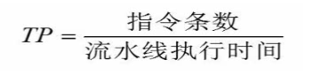
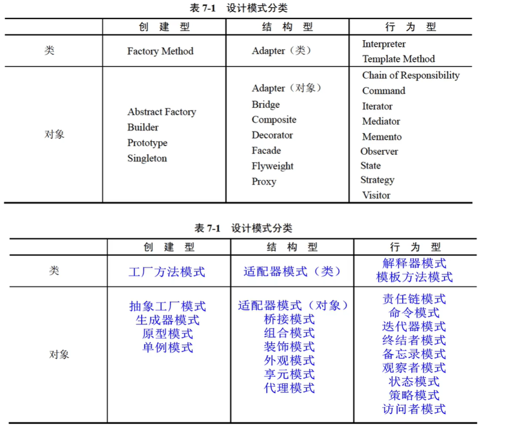
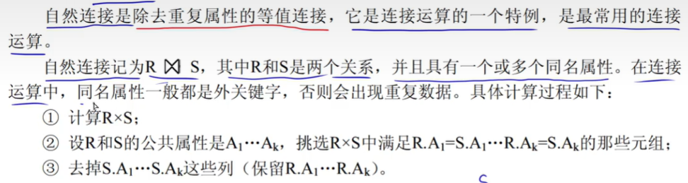

# 

# 1、面向对象

## 1、类

类分为三种： **实体类**、**接口类（边界类）**和 **控制类**

- 实体类： 表示现实世界中真实的实体（核心类，一般用于保存系统中的信息以及提供针对这些信息的相关处理行为）
- 接口类（边界类）：为用户提供一种与系统合作交互的方式，分为人和系统两大类。如：显示屏、二维码等。
- 控制类： 用来控制活动流，充当协调者

## 2、对象

- 一个对象通常可由  **对象名**、**属性（状态，成员变量）**和 **方法（函数，行为，操作）**。
- 封装是一种信息隐蔽技术，它的目的是使对象的使用者和生产者分离。

## 3、继承

- **继承**是父类和子类之间**共享数据**和**方法**的机制。这是类之间的一种关系。
- B只从一个父类A得到继承，叫作"单重继承"。 如果一个子类有两个或更多个父类，则称为 "多重继承"

## 4、多态

- 不同的对象收到同一消息可以产生完全不同的结果，这一现象称为多态。

- 多态的不同形式：**参数多态**和**包含多态**称为**通用的多态**，**过载多态**和**强制多态**称为**特定的多态**。
  - 参数多态：最纯的多态
  - 包含多态：子类型化，及一个类型是另一个类型的子类型。
  - 过载多态：同一名字在不同的**上下文**中所代表的含义不同。

## 5、静、动态绑定

- **静态绑定**： 编译时进行
- **动态绑定**： 运行时进行

## 6、面向对象设计的原则

- 单一责任原则： 就一个类而言，应该仅有一个引起它变化的原因。
- 开放-封闭原则： 对扩展开发，对修改封闭
- 李氏替换原则： 子类型必须能够替换掉他们的基类型（基类出现的地方，子类一定可以出现）
- 依赖倒置原则：依赖于抽象，而不依赖于细节（实现）
- 接口分析原则： 依赖于抽象，不要依赖于具体
- 共同重用原则： 重用了包中的一个类，那么就要重用包中的所有类
- 共同封闭原则： 一个变化若对一个包产生影响，则将对该包中的所有类产生影响，而对于其他的包不造成任何影响。

## 7、面向对象分析 （OOA）

**面向对象分析5个活动：** 

- 认定对象 （确定问题域）
- 组织对象
- 描述对象间的相互作用
- 确定对象的操作
- 定义对象的内部信息

## 8、面向对象设计 （OOD）

**应遵循：** 以下设计原则

- 抽象
- 信息隐蔽
- 功能独立
- 模块化

**五个活动：**

- 识别类及对象
- 定义属性
- 定义服务
- 识别关系
- 识别包

# 2、计算机系统

## 1、运算器

**组成：** 

- 算术逻辑单元（ALU）： 负责处理数据，实现对数据的 **算法运算 **和 **逻辑运算** 
- 累加寄存器（AC）：为ALU提供一个工作区
- 数据缓冲寄存器（DR）： 作为CPU 和 内存、外部设备之间的数据传送的中转站
- 状态条件寄存器（PSW）

## 2、控制器

**注：**不仅要保证程序的正确执行，而且要能够处理**异常事件**

- 指令寄存器（IR）：
- 程序计数器（PC）：PC 内容是程序的第一条指令的地址（程序起始地址）
- 地址寄存器（AR）：
- 指令编译器（ID）：

## 3、数据表示

### 1、原码

-  最高位是 **符号位**， **0**  表示 **正号**， **1** 表示 **负号**；其余的 **n - 1 位**表示数值的**绝对值**

### 2、反码

- 最高位是 **符号位**，**0** 表示 **正号**，**1** 表示 **负号**， **正数的反码与原码相同，负数的反码则是其绝对值按位求反**

### 3、补码

- 最高位是 **符号位**， **0** 表示 **正号**， **1** 表示 **负号**， **正数**的**补码**与其**原码和反码相同**；**负数**的**补码**则等于其**反码的末位加1**

### 4、移码

- **在补码的基础上把符号位取反**

### 5、表示范围

## 4、寻址（图中数字表示速度）

## 5、奇偶校验码（只能检错，不能纠错）

## 6、海明码（纠错检错）

## 7、循环冗余校验码（可以检错，不能纠错）

## 8、RISC 和 CISC

## 9、流水线公式

**流水线执行时间 =  单条指令执行所需时间 + （指令条数 - 1）x 指令中最长时间段**

**n条指令 吞吐率：**

 

​	**TP = 指令条数  /  （单条指令执行所需时间 + （指令条数 - 1）x 指令中最长时间段）**

**1条指令的 吞吐率：** 指令最长时间段的倒数

## 10、存储器	

## 11、Cache

**高速缓存（Cache） 与 主存间的地址映射由  硬件自动完成**

**冲突（由小到大）：**

- 全相联 （主存任意一块装入 Cache 中任意位置， 只有装满才需要替换）
- 组相联
- 直接相联

## 12、中断

- 中断向量： 提供中断服务程序的入口地址
- 中断响应时间： 发出中断请求开始，到进入中断服务程序
- 保存现场：返回继续执行原程序

## 13、程序查询方式

- **CPU 和  I/O(外设) 只能串行工作**

  CPU 需要一直轮询检查，长期处于忙等状态。CPU 利用率低

- 一次只能读取/写一个字

- 由CPU 将数放入内存

## 14、中断驱动方式

- I / O 设备通过中断信号主动向CPU报告I/O操作已完成
- **CPU和 I/O （外设） 可并行工作**
- CPU 利用率得到提升
- 一次只能读/写一个字
- 由CPU将数据放入内存

## 15、直接存储器存取方式（DMA方式）

- **CPU和 I/O(外设)可并行工作**
- **仅在传送数据块的开始和结束时才需要CPU的干预**
- **有外设直接将数据放入到内存**
- 一次读写的单位为“块”而不是字

## 16、总线

- 数据总线
- 地址总线
- 控制总线

## 17、对称加密与非对称加密 （加密技术）

### 1、对称加密（私有密钥加密）

- 加密和解密是同一把密钥， 只有一把密钥
- 缺点：
  - 密钥分发有缺陷
- 优点：
  - 加密解密速度很快
  - 适合大量明文数据
- 具体算法
  - **DES**
  - **3DES**
  - **RC-5**
  - **IDEA**
  - **AES**
  - **RC4**

### 2、非对称加密（公开密钥加密）

- 加密和解密不是同一把密钥，一共有 **两把密钥**，分别是**公钥**和**私钥**
- 用公钥加密只能用私钥解密；用私钥加密只能用公钥解密。
- 用接收方的公钥加密明文，可以实现防止窃听的效果
- 优点：
  - 密钥分发没有缺陷
- 缺点：
  - 加密解密速度很慢
- 具体算法：
  - **RSA**
  - **ECC**
  - **DSA**

## 18、摘要与数字签名（认证技术）

### 1、摘要

将发送的明文进行Hash算法后得到摘要放在密文后一起发送过去，与接收方解密后的明文进行相同的Hash算法得到的摘要进行对比，如果一致，则没有篡改，否则有篡改

### 2、数字签名 

**发送方** 用自己的私钥对摘要进行签名（加密），得到数字签名放在密文一起发送过去

**接收方** 用发送方的公钥对数字签名进行验证（解密），如果验证成功则该消息没有被冒充且不能否认；否则该消息的真实性为假冒发送

**注：**即在摘要的基础上用  **发送者 **的 **私钥** 对 **摘要** 进行 **签名** 得到**数字签名**；**接受者 ** 通过 **发送者** 的 **公钥** 进行 **解密** 判断是否是对应的发送者

- **Hash 函数**
- **MD5 摘要算法**
- **SHA-1 安全散列算法**

## 19、数字证书

- 用户向CA机构申请数字证书
- 将个人信息和公钥发给CA机构
- CA机构颁发给用户数字证书
- 数字证书用CA的私钥进行签名（加密）
- 用CA 的公钥验证（解密） 数字证书
- 得到用户的公钥

## 20、可靠性公式

### 1、串联系统

### 2、并联系统

# 3、操作系统

## 1、操作系统地位

## 2、进程管理

### 1、程序与进程

程序执行时的特征： **顺序性**、**封闭性 **和 **可再现性**

### 2、前趋图 （顺序执行）

### 3、前驱图（并行）

### 4、进程的三态模型

## 3、信号量机制和PV操作

- 信号量机制是一种有效的进程同步与互斥工具
  - 信号量S的物理意义： **S >= 0** 表示某资源的**可用数**，若**S < 0**,则其绝对值表示阻塞队列中**等待资源的进程数**。
- PV操作
  - P 操作： 表示申请一个资源
    - P操作的定义： S := S -1 ,若 S >= 0，则执行 P 操作的进程继续执行；若 S < 0 ，则置该进程为阻塞状态（因为无可用资源）,并将其插入阻塞队列
  - V 操作：表示释放一个资源
    - V操作定义： S := S + 1， 若 S > 0, 则执行V操作的进程继续执行；若 S <= 0,则从阻塞队列唤醒一个进程，并将其插入就绪队列，然后执行V操作的进程继续。

**PV 操作实现进程互斥：**

**PV操作实现进程的同步（单缓冲区）：**

**PV操作实现进程同步（n个缓冲区的同步举例）：**

## 4、死锁

## 5、局部性原理

## 6、分页存储管理

如果页面大小为**4K**，那么直接拿 逻辑地址 **1C20H** 中的 **1** 当**页号**找对应**物理块号**，然后 拿到**物理块号** 拼接上 **1** 后面的 **C20** 即为**物理地址**

## 7、段页式存储管理

## 8、单缓存区

## 9、双缓冲区

## 10、磁盘调度算法

### 1、先来先服务（FCFS）

### 2、最短寻道时间优先（SSTF）

### 3、扫描算法（SCAN）或 电梯调度算法

### 4、循环扫描算法（CSCAN） 单向扫描算法

## 11、旋转调度算法

**计算读取时间：** （块与块之间的磁道数 x 一个磁道到另一个磁道所需时间 + 每块的延迟时间+每块的传输时间）x 块数

**最长时间计算：**

 从读取R1 到处理完 R1 时，共需要 3ms，此时磁头指向 R4 的起点； 接下来要处理 R2 需要让磁头指向 R2 的起点，所以磁头需要从 R4 起点转到 R2 起点，共需要 8ms 。

**即除了读取 R1 = 1ms + 2ms = 3ms ，读取其他的都需要： （8ms + 1ms + 2ms）x 9 = 99ms。 所以最长时间为: 3ms + 99ms = 102ms**

**最少时间计算：** 即按图中所示处理

## 12、多级索引结构

**链式存储：**

## 13、目录结构

## 14、位示图

**简要算法：**

**验证：**

## 15、SRAM 和 DRAM

|        | SRAM     | DRAM       |
| ------ | -------- | ---------- |
| 原理   | 触发器   | 电容       |
| 读出   | 非破坏性 | 破坏性     |
| 刷新   | 不用     | 用         |
| 送地址 | 一起送   | 行列分开送 |
| 速度   | 快       | 慢         |
| 集成度 | 低       | 高         |
| 功耗   | 高       | 低         |
| 成本   | 高       | 低         |
| 用途   | Cache    | 内存       |

# 4、程序设计语言

## 1、编译程序和解释程序

## 2、程序设计语言的基本成分

### 1、控制成分（控制结构）

- **顺序结构**
- **选择结构**
- **循环结构**（重复）

### 2、数据必须具有类型

- 便于为数据合理分配存储单元
- 便于对参与表达式计算的数据对象进行检查
- 便于规定数据对象的取值范围及能够进行的运算

## 3、编译、解释程序翻译阶段

### 1、词法分析 （字符）

### 2、语法分析（结构）

### 3、语义分析（类型）

### 4、目标代码生成

### 5、中间代码生成

## 4、正规式

## 5、有限自动机

## 6、上下文无关文法

## 7、语法树中、后序遍历

**注：** 

- 通过 **中序遍历** 可以 ——>  **中缀式**
- 通过 **后序遍历** 可以 ——>  **后缀式**  

# 5、UML

## 1、关系

- **依赖** ： 一个事物发生变化会影响另一个事物（依赖事物）

  

- **关联：**一组链，链是对象之间的连接。结构关系 （关联上可以标注  **重复度**  和  **角色**  ）

  

- **聚合：** 部分和整体的生命周期不一致，整体消失了，部分仍然存在，部分可以脱离整体存在。

  

- **组合：** 部分和整体的生命周期一致，整体消失了，部分也消失了，部分不可以脱离整体而存在。

  

- **泛化：** 一种特殊 / 一般关系

  

- **实现：** ① 接口和实现它们的类或构建之间  ② 用例和实现它们的协作之间

  

## 2、类图

**展现一组对象、接口、协作和它们之间的关系**

## 3、对象图

**注：** 展现了某一时刻**一组对象**以及它们之间的**关系**（描述了在类图中所建立的事物的**实例**的**静态快照**）

## 4、用例图

**可用下列两种方式来使用用例图：**

- 对系统的语境建模
- 对系统的需求建模

## 5、序列图（时序图、顺序图）

**序列图：**

- 是强调消息时间顺序的交互图
- 

## 6、通信图（协作图）

- 是强调接收和发送消息的对象的结构组织的交互图
- 

## 7、状态图

由**状态**、**转换**、**事件**和**活动**组成。 对**反应型**对象建模

- **状态：** 初态（即初始状态）、终态（即最终状态）和 中间状态

  - 初态用黑圆点表示， 终态用黑圆点外加一个圆表示

  - 

- **转换和事件**
  - 

## 8、活动图

## 9、构件图（组件图）

## 10、部署图（软件与硬件）

## 11、总结

- **静态建模：** 类图、对象图、用例图
- **动态建模：** 序列图（顺序图、时序图）、通信图（协作图）、状态图、活动图
- **物理建模：** 构件图（组件图）、部署图
- **交互图：** 序列图（顺序图、时序图）、通信图（协作图）

# 6、设计模式（看另一个文件）

## 1、设计模式分类

**注：**  

- 创建型模式与对象的创建有关
- 结构型模式处理类或对象的组合
- 行为型模式对类或对象怎样交互和怎样分配职责进行描述

## 2、工厂方法模式

**意图：** 定义一个用于创建对象的接口，让子类决定实例化哪一个类。 Factory Method 使一个类的实例化延迟到其子类。

## 3、抽象工厂模式

**意图：** 提供一个创建一系列相关或相互依赖对象的接口，而无需指定他们具体的的类。

## 4、生成器模式

**意图：** 将一个复杂对象的构建与它的表示分离，使得同样的构建过程可以创建不同的表示。

## 5、原型模式

**意图：** 用原型实例指定创建对象的种类，并且通过复杂这些原型创建新的对象

## 6、单例模式（Singleton）

## 7、适配器模式（Adapter）

**意图：** 将一个类的接口转换成客户希望的另一个接口。 Adapter 模式使得原本由于接口不兼容而不能一起工作的那些类可以一起工作。

# 7、结构化开发

## 1、耦合

**注：** 耦合是模块之间的**相对独立性**的度量。耦合取决于各个模块之间**接口的复杂度**、**调用模块的方式**以及**通过接口的信息类型**等。

- **无直接耦合：** 两模块之间**没有直接的关系**，属于**不同模块**，**不传递任何信息**。
- **数据耦合：** 传递简单的 **数据值**
- **标记耦合：** 值两个模块之间传递的是 **数据结构**
- **控制耦合：** 一个模块调用另一个模块，传递的是 **控制变量** 
- **外部耦合：** 模块间通过**软件之外**的**环境联结**
- **公共耦合：** 通过一个**公共数据环境**相互作用的那些模块间的耦合
- **内容耦合：** 当一个模块直接使用另一个模块的  **内部数据**，或通过非正常入口转入另一个模块内部时。

## 2、内聚

**注：** 内聚是对一个模块内部各个元素彼此结合的紧密程度的度量

- **偶然内部（巧合内聚）：**  指一个模块内的各种处理元素之间 **没有任何联系**
- **逻辑内部：** 指模块内执行若干个**逻辑上相似的功能**，通过参数确定该模块完成哪一个功能。
- **时间内聚：**  把需要 **同时执行的动作** 组合在一起形成的模块称为时间内聚模块
- **过程内聚：** 指一个模块完成多个任务，这些任务必须按 **指定的过程执行**。
- **通信内聚：**指模块内的所有处理元素都在同一个**数据结构**上操作，或者各处理使用**相同的输入数据**或者产生**相同的输出数据**。
- **顺序内聚：**  指一个模块中的各个处理元素都密切相关于同一功能且 **必须顺序执行**
- **功能内聚：**指模块内的所有元素 **共同作用完成一个功能，缺一不可**。

## 3、设计原则

- 分解-协调原则
- 自顶向下原则
- 信息隐蔽、抽象的原则
- 一致性原则
- 明确性原则： 每个模块必须功能明确、接口明确，消除多重功能和无用接口。
- 模块之间的耦合尽可能小，模块的内聚度尽可能搞。（**高内聚低耦合**）
- 模块的扇入系数和扇出系数要合理。
- 模块的规模适当
- **模块的作用范围应该在其控制范围之内**

## 4、系统文档

- **用户** 与 **系统分析人员** 通过 **可行性研究报告**、**总体规划报告**、**系统开发合同**和系**统方案说明书** 文档进行沟通
- **系统开发人员** 与 **项目管理人员** 通过 **系统开发计划**（工作任务分解表、PERT图、甘特图和预算分配表）、**系统开发月报** 以及 **系统开发总结报** 等文档在**项目期内**进行沟通
- **系统测试人员** 与 **系统开发人员** 通过 **系统方案说明书**、 **系统开发合同**、 **系统设计说明书**和**测试计划**等文档进行沟通
- **系统开发人员** 与 **用户** 再运行期间沟通。用户通过 **用户手册** 和 **操作指南**。
- **系统开发人员** 与 **系统维护人员** 通过**系统设计说明书** 和 **系统开发总结报告** 进行沟通。
- **用户** 与 **维修人员** 在运行维护期间机芯沟通。用户形成 **系统运行报告** 和 **维护修改建议**

## 5、数据流图

### 1、图形元素

### 2、外部实体

### 3、数据存储

### 4、加工

### 5、下午题步骤

### 6、数据字典

分为4类条目： **数据流**、**数据项**、**数据存储 **和 **基本加工**

加工逻辑描述方法有： **结构化语言**、**判定表（决策表） **和 **判定树**

### 7、其他

**1、结构化分析模型包括**： 

- 数据流图
- 实体联系图
- 状态迁移图
- 数据字典

**2、结构化设计主要包括:**

- **体系结构设计：** 定义软件的主要结构元素及其关系
- **数据设计：** 基于实体联系图确定软件涉及的文**件系统的结构**及**数据库的表结构**
- **接口设计：** 描述用户界面，软件和其他硬件设备、其他软件系统及使用人员的外部接口，以及各种构件之间的内部接口
- **过程设计：**确定软件各个组成部分内的算法及内部数据结构，并选定某种过程的表达形式来描述各种算法。

**3、数据流图建模时应遵循：**  自顶向下、从抽象到具体

4、**用户界面设计的黄金原则：** 用户操作控制、减少用户的记忆负担、保持界面一致

5、**构造分层DFD 时需要注意的问题：**

- 适当命名
- 画数据流而不是控制流
- 避免一个加工有过多的数据流
- 分解尽可能均匀
- 先考虑确定状态
- 随时准备重画

# 8、计算机网络

## 1、网络设备

- **物理层**
  - 中继器 （Repeater）
  - 集线器 (Hub) （多端口中继器）
- **数据链路层**
  - 网桥 （Bridge）
  - 交换机 （Switch）（多端口网桥）
- **网络层**
  - 路由器（Router）
- **应用层**
  - 网关

|                | 广播域 | 冲突域 |
| :------------: | :----: | :----: |
|   **物理层**   |   X    |   X    |
| **数据链路层** |   X    |   √    |
|   **网络层**   |   √    |   √    |

## 2、协议簇

**注：**

**3、IP**

-  **IP** 所提供的服务通常被认为是 **无连接**  和  **不可靠的**。
- 由于IP只提供**无连接**、**不可靠**的服务，所以把 **差错检测**、**浏览控制**、**拥塞控制**、**重发**、连**接管理 **和 **可靠传输 **等服务授权给了其他的各层协议。

**4、传输层协议——TCP** **（3次握手）**

- 它在 **IP** 提供的不可靠数据服务的基础上为应用程序提供了一个 **可靠的**、**面向连接的**、**全双工的数据传输**服务。
- 可靠传输、连接管理、差错校验和重传、流量控制、拥塞控制、端口寻址
  - 其中流量控制采用的是： 可变大小的滑动窗口协议

**5、传输层协议——UDP**

- **用户数据报协议（UDP）**是一种**不可靠的**、**无连接的**协议

## 3、SMTP 和 POP3

### 1、SMTP （端口号： 25）

- **E-mail 系统 **基于 **客户端 / 服务器模式**
- **E-mail** 服务器主要采用 **SMTP（简单邮箱传输协议）**
- **SMTP 缺点：**
  - 不能用来传送  **非 ASCII**  码文本和  **非文字性附件**
- **后来的协议：**
  - MIME： 邮件附件扩张类型
  - PEM： 私密邮件

### **2、POP3（端口号： 110）**

- **POP 协议：** **POP2** 和 **POP3**； POP3 既能与 STMP 共同使用，也可以单独使用，一传送和接收电子邮件
- **POP** 每次传输以**整个 E-mail为单位**，**不能提供部分传输**

### 3、总结

**简单邮件传送协议（SMTP）** 和 **用于接收邮件**的 **POP3** 均是利用 **TCP 端口**。**SMTP** 所用的端口号是**25**，**POP3**所用的端口号是 **110**

## 4、ARP 和 RARP

- **ARP** 和 **RARP**  ————  **网络层**
- **ARP  的作用：** 将 **IP地址** 转换为 **物理地址**
- **RARP 的作用：** 将 **物理地址** 转换为 **IP 地址**

## 5、DHCP

## 6、URL

## 7、浏览器

**DNS 域名查询的次序是：**  本地的 hosts 文件 ——> 本地 DNS 缓存 ——> 本地 DNS 服务器 ——> 根域名服务器

**主域名服务器在接收到域名请求后，查询顺序是：** 本地缓存、本地 hosts 文件 、本地数据库、转发域名服务器

## 8、IP 地址和子网掩码

## 9、IPv6

**IPv6** 具有长达 **128** 为的地址空间，可以彻底解决 **IPv4 地址不足**的问题。 IPv4 地址是 32 位二进制。

## 10、无线网络

**注：** **无线通信技术中，通信距离最短的是：  蓝牙**

## 11、Windows 命令

## 12、路由

# 9、信息安全

## 1、防火墙

**注：** **防火墙**是建立在**内外网络边界上**的**过滤封锁机制**，认为**内部网络**是**安全和可信赖的**，而**外部网络**是**不安全和不可信赖的**。

-  对通信行为进行： **控制**、**审计**、**报警** 和 **反应**等处理

### 1.1、包过滤防火墙

- **包过滤器**处于**网络层**和**数据链路层**（即TCP 和 IP 层）；**包过滤防火墙**对**网络层**的数据报文进行检查
- 直接转发报文，对**用户完全透明，速度较快**
- 优点：
  - 对传入和传出网络的包实行**低水平控制**
  - 检查每个IP包的字段：**源地址**、**目的地址**、**协议**和**端口号**
- 缺点：
  - 不能防范黑客攻击
  - 不支持应用层协议——不识别数据包中的应用层协议，访问控制粒度太粗糙
  - 不能处理新的安全威胁

### 1.2、应用代理网关防火墙

- **彻底隔断内网与外网的直接通信**，内网用户对外网的访问变成防火墙对外网的访问，然后再由防火墙转发给内网用户。
- 优点： 
  - 可以检测应用层、传输层和网络层的协议特征
- 缺点：
  - 难以配置
  - 处理速度非常慢

### 1.3、状态检测技术防火墙

结合了**代理防火墙**的**安全性**和**包过滤防火墙**的**高速度**等优点，在不损失安全性的基础上，提高了代理防火墙的性能。

## 2、病毒

## 3、网络攻击

## 4、网络安全

### 1、SSL 

- **传输层安全协议**
- **端口号： 443**

### 2、TLS

- **传输层安全协议**
- SSL 的后续版本

### 3、SSH

- 终端设备与远程站点之间建立 **安全连接的协议**
- 建立在**应用层**和**传输层**基础上的 **安全协议**
- 专为**远程登录会话**和其他**网络服务**提供安全的协议

### 4、HTTPS

- 以**安全**为目标的 **HTTP 通道**，即使用 **SSL** **加密算法 的 HTTP**

### 5、MIME  （电子邮件相关）

### 6、PGP （电子邮件相关）

- **基于RSA 公钥加密体系的邮件加密软件**

# 10、软件工程

## 1、CMM（5个成熟度级别）

- **初始级**
  - 软件过程的特点是杂乱无章；项目完成依赖于个人和**英雄式核心人物的作用**
- **可重复级**
  - 建立了基本的 **项目管理过程**和**实践**来**跟踪项目费用、进度和功能**特性，有必要的过程准则来重复以前在同类项目中的成功。
- **已定义级**
  - 管理和工程量方面的软件过程已经**文档化**、**标准化**。并综合成整个软件开发组织的**标准软件过程**
- **已管理级**
  - 指定了软件过程和产品质量的详细度量标准。**软件过程的产品质量**都被开发组织的成员所**理解**和**控制**。
- **优化级**
  - 加强了**定量分析**，通过来自**过程质量反馈**和来自**新观念**、**新技术**的反馈使过程能不断持续地改进

## 2、CMMI

### 1、阶段式模型

- **初始的：** 过程不可预测且缺乏控制
- **已管理的：**  过程为项目服务
- **已定义的：** 过程为组织服务
- **定量管理的：** 过程已度量和控制
- **优化的：** 集中于过程改进

### 2、连续式模型

- **CL0（未完成）:** 过程域**未执行**或**未得到** CL1中定义的所有目标。
- **CL1（已执行的）:** 其**共性目标**是 过程将**可标识的输入工作产品**转换成**可标识的输出工作产品。**
- **CL2（已管理的）:** 其**共性目标**集中于**已管理的过程的制度化**。
- **CL3（已定义级的）:** 其**共性目标**集中于**已定义的过程的制度化**。
- **CL4（定量管理的）:** 其**共性目标**集中于**可定量管理的过程的制度化。**
- **CL5（优化的）:** **使用量化（统计学）手段改变和优化过程域**，以满足客户要求的改变和持续改进计划中的过程域的功效。

## 3、软件过程模型

### 1、瀑布模型

- 以文档作为驱动、适合于**软件需求很明确**的软件项目的模型
- 优点
  - 容易理解，管理成本低
  - 强调开发的阶段性早期计划及需求调查和产品测试。

### 2、V模型

- V模型描述了**质量保证活动和沟通**、建模相关活动
- 基本问题需求逐步细化

### 3、增量模型

- 具有瀑布模型的所有优点
- 优点
  - **第一个**可交付版本所需要的**成本和时间很少**
  - 开发由增量表示的小系统所承担的**风险不大**
  - 由于很快发布第一个版本，因此可以**减少用户需求的变更**
  - 运行增量投资，即在项目开始时，可以仅对一个或两个增量投资
- 缺点
  - 如果**没有**对用户的**变更要求进行规划**，那么产生的**初始增量**可能会造成**后来增量的不稳定。**
  - 需求不和早期思考的那样稳定和完整，那么一些增量就可能会造成后来增量需要**重新开发，重新发布**
  - 管理发生的**成本、进度和配置**的**复杂性**可能会**超出**组织的能力

### 4、演化模型

- 演化模型是**迭代的**过程模型，使得软件开发人员能够**逐步开发**出更完整的软件版本。
- 演化模型特别适用于对**软件需求缺乏准确认识的情况**
- 典型的演化模型有 **原型模型** 和 **螺旋模型**

#### 4.1、原型模型

- 适用于用户**需求不清**、**需求经常变化**的情况
- 当系统**规模不是很大**，也**不太复杂**时，采用该模型比较好

#### 4.2、螺旋模式

- 该模型特别适用于**庞大**、**复杂**并且**具有高风险**的系统
- 支持用户需求的动态变化
- 需要开发人员具有相当丰富的风险评估经验和专门知识
- 但是，过多的迭代次数会增加开发成本，延迟提交时间

### 5、喷泉模型

- 以**用户需求为动力**，以**对象**作为**驱动的模型**，**适用**于**面向对象的开发方法**
- 使开发过程具有**迭代性（即开发活动需要重复多次）**和**无间隙性（开发活动之间不存在明显的边界）**
- 优点
  - 可以提高软件项目的开发效率，节省开发时间
- 缺点
  - 各个开发阶段重叠，开发过程需要大量的开发人员，不利于项目的管理
  - 要求严格管理问文档，是的审核的难度加大

## 4、统一过程（UP）模型

- 初始阶段： 生命周期目标
- 精华阶段： 生命周期架构
- 构建阶段： 初始运作功能
- 移交阶段： 产品发布

## 5、敏捷方法

### 1、极限编程（XP）

- 4大价值观：
  - 沟通、 简单性、反馈和勇气
- 5个原则： 
  - 快速反馈、简单性假设、逐步修改、提倡更改和优质工作
- 12个最佳实践：
  - 计划游戏
  - 小型发布 （系统的设计要能够尽可能早地交付）
  - 隐喻 （找到合适的比喻传达信息）
  - 简单设计 （只处理当前的需求，使设计保持简单）
  - 测试先行 （先写测试代码，然后再编写程序）
  - 重构 （重新审视需求和设计）
  - 结对编程
  - 集体代码所有制
  - 持续集成 （可以按日甚至按小时为客户提供可运行的版本）
  - 每周工作40个小时
  - 现场客户和编程标准

### 2、水晶法（Crystal）

- 水晶法认为每一个不同的项目都需要一套不同的策略、约定和方法论

### 3、并列争求法（Scrum）

- 并列争求法使用迭代的方法，其中，把每30天一次的迭代称为一个“冲刺”

### 4、自适应软件开发（ASD）

- 6个基本原则
  - 有一个使命作为指导
  - 特征被视为客户价值的关键点
  - 过程中的等待是很重要的，因此“重做” 与 “做” 同样关键
  - 变化不被视为改正，而是被视为对软件开发实际情况的调整
  - 确定的交付时间迫使开发人员认真考虑每一个生产2的版本的关键需求
  - 风险也包含其中

### 5、敏捷统一过程（AUP）

- 采用“**在大型上连续**”以及在“**小型上迭代**”的原理来构建软件系统
- 迭代执行以下活动：
  - 建模
  - 实现
  - 测试
  - 部署
  - 配置及项目管理
  - 环境管理

## 6、软件需求

- **功能需求：**考虑系统需要做什么，在何时做，在何时以及如何修改或升级
- **性能需求：** 考虑软件开发的技术性指标。例如，存储容量限制、执行速度、响应时间及吞吐量
- **数据需求：** 考虑输入、输出数据的格式，接收、发送数据的频率，数据的准确性和精度，数据流量，数据需保持的时间
- 用户或人的因素
- 环境需求
- 界面需求
- 文档需求
- 资源使用需求
- 安全保密要求
- 可靠性要求
- 软件成本消耗与开发进度需求
- 其他非功能性要求

## 7、系统设计

### 1、概要设计

1. **设计软件系统总体结构**： 将一个复杂的系统按功能划分成模块
   - 确定每个模块的功能
   - 确定模块之间的调用关系
   - 确定模块之间的接口
   - 评价模块结构的质量
2. **数据结构及数据库设计**
   - 数据结构的设计
   - 数据库的设计
     - 概念设计
     - 逻辑设计
     - 物理设计
3. **编写概要设计文档**
   - 概要设计说明书
   - 数据库设计说明书
   - 用户手册
   - 修订测试计划
4. **评审**

### 2、详细设计

1. 对每个模块进行详细的**算法设计**
2. 对模块内的**数据结构**进行设计
3. 对**数据库**进行**物理设计**，即确定数据库的物理结构
4. 其他设计
5. 编写详细设计说明书
6. 评审

## 8、系统测试

**意义：** 为了发现错误而执行程序的过程，**成功的测试**是**发现了至今尚未发现的错误**的测试

**原则：**

1. 应尽早并不断地进行测试。**测试应贯穿在开发的各个阶段**，应尽早纠正错误，消除隐患
2. 测试工作应该避免由原开发软件的人或小组承担
3. 在**设计测试方案**时，不仅**要确定输入数据**，而且要根据系统功能**确定预期输出结果**。
4. 在**设计测试用例**时，不仅要设计**有效**、**合理的**输入条件，也要包含**不合理**、**失效的**输入条件
5. 在测试程序时，不仅要检验程序是否做了该做的事，还要检验程序是否做了不该做的事
6. 严格按照测试计划来进行，避免测试的随意性
7. 妥善保存测试计划、测试用例，作为软件文档的组成部分，为维护提供方便
8. 测试例子都是精心设计出来的，可以为重新测试或追加测试提供方便
9. **系统测试阶段的测试目标来自于需求分析阶段**

## 9、单元测试

**单元测试主要检查模块的5个特征：**

- 模块接口
- 局部数据结构
- 重要的执行路径
- 出错处理
- 边界条件

## 10、集成测试

- **自顶向下**： **不用**编写**驱动模块**； **需要**编写**桩模块**
- **自底向上**：**不需要**编写**桩模块**，**需要**编写**驱动模块**
- **回归测试：**软件**功能变更**，可能使原来可以正常工作的功能产生问题
- **冒烟测试**

## 11、黑盒测试

- **黑盒测试**也称为**功能测试**，在**完全不考虑软件的内部结构和特性**的情况下，**测试软件**的**外部特性**
- **常见的黑盒测试技术：**
  -  **等价类划分**
    - **有效等价类** 和 **无效等价类**。在设计测试用例时，要**同时考虑这两种等价类**
  - **边界值分析**
    - 如果输入的条件**规定了值的范围**，则应取**刚到这个范围的边界的值**，以及刚刚**超越这个范围边界的值**作为测试输入数据
    - 如果输入条件**规定了值的个数**，则用**最大个数**、**最小个数**、**比最小个数少1**、**比最大个数多1**的数据作为测试数据
  - **错误推测**
  - **因果图**

## 12、MaCabe度量法

- 计算有向图G 的**环路复杂性**的公式为： **V（G） = m - n + 2**， 其中 V (G) 是有向图 G 中的环路个数，**m 是 G 中的有向弧数**， **n 是 G 中的节点数**。
- 方法二： **V (G) = 闭合区域 + 1**

## 13、白盒测试

- **白盒测试**也称为**结构测试**，根据**程序的内部结构**和**逻辑**来设计测试用例，对程序的路径过程进行测试，检查是否满足设计的需要。
- 白盒测试常用的技术是： **逻辑覆盖**、**循环覆盖**和**基本路径测试**

### 1、逻辑覆盖

主要的逻辑覆盖标准有**语句覆盖**、**判定覆盖**、**条件覆盖**、**判定/条件覆盖**、**条件组合覆盖**和路**径覆盖**

1. **语句覆盖**

   选择足够的测试数据，使被测试程序中的**每条语句至少执行一次**。

2. **判定覆盖（分支覆盖）**

   指设计足够的测试用例，使得被测试程序中的**每个判定表达式至少获得一次”真“值 和 ”假“值**，或者说是程序中的每一个取”真“分支和取”假“分支至少都通过一次。

3. **条件覆盖**

   指构造一组测试用例，使得**每一判定语句**中**每个逻辑条件的各种可能的值至少满足一次**。

   注： 如条件中 `A > 0 AND B > 0`  此时我们需要测试用例能够实现 `A > 0 和 A < 0` 和 `B > 0 和 B < 0`

4. **判定/ 条件覆盖**

   指设计足够的测试用例，使得判定中每个条件的所有可能取值（真/假）至少出现一次，并使每个判定本身的判定结果（真/假）也至少出现一次。

5. **条件组合覆盖**

   设计足够测试用例，使得**每个判定中条件的各种可能的组合**都**至少出现一次**。

​		

6. **路径覆盖**

   指覆盖被测试程序中**所有可能的路径**

​	

## 14、运行和维护知识

### 1、系统可维护性的评价指标

- **可理解性**
- **可测试行**
- **可修改性**

### 2、软件维护与软件文档

- **文档**是软件可维护性的**决定因素**
- 文档分为**用户文档**和**系统文档**
  - **用户文档：** 描述系统功能和使用方法
  - **系统文档：** 描述系统设计、实现和测试等方面的内容
- 必须在**开发阶段**保证软件**具有可维护的特点**

### 3、系统维护的内容及类型

- 系统维护主要包括**硬件维护**、**软件维护**和**数据维护**
- **软件维护：**
  - **正确性维护：** 指改正在**系统开发阶段已发生**而系统**测试阶段尚未发现的错误**
  - **适应性维护：**指使应用软件**适应信息技术变化**和**管理需求变化**而进行的**修改**
  - **完善性维护：**为**扩充功能**和**改善性能**而进行的修改，主要是指对已有的软件系统增加一些在系统分析和设计阶段中没有规定的功能与性能特征
  - **预防性维护：** 为了**改进**应用软件的**可靠性**和**可维护性**，为了**适应**未来的**软/硬件环境的变化**，应主动增加预防性的新的功能。

## 15、软件可靠性、可用性和可维护性

## 16、沟通路径

**最多沟通路径：** **(n - 1) x n / 2**

## 17、软件项目估算

### 1、COCOMO模型

- **基本COCOMO模型：** 是一个**静态单变量模型**
- **中级COCOMO模型：** 是一个**静态多变量模型**
- **详细COCOMO模型**

### 2、COCOMOII 模型

- **3个阶段性模型：**
  - 应用组装模型  —— 对象点
  - 早期设计阶段模型 —— 功能点
  - 体系结构阶段模型 —— 代码行
- **3钟不同的规模估算选择：** 
  - 对象点
  - 功能点
  - 代码行

## 18、甘特图 （Gantt图）

**能**清晰地**描述**每个任务从何时开始，到何时结束，任务的进展情况以及各个任务之间的**并行性,**但**不能**清晰地**反映**出各任务之间的**依赖关系。**

## 19、PERT图

**能**清晰的**反映**出任务之间的**依赖关系**，但是**不能反映**任务之间的**并行关系**

## 20、项目活动图

## 21、软件配置管理

## 22、风险管理

- **软件风险**包括两个特性： **不确定性**和**损失**
- **项目风险**威胁到项目计划： 指预算、进度、人员、资源、利益相关者、需求等潜在问题的影响。项目**复杂度**、**规模**及**结构不确定性**也属于项目风险因素
- **技术风险**威胁到要开发软件的质量及交付时间： 指**设计**、**实现**、**接口**、**验证**和**维护**等方面的潜在问题。**规格说明的歧义行**、**技术的不确定性**、**技术陈旧**以及**“前沿”技术**也是技术风险因素。
- **商业风险**威胁到要开发软件的生存能力
  - 市场风险
  - 策略风险
  - 销售风险
  - 管理风险
  - 预算风险

### 1.风险识别

- 风险因素
  - 性能风险
  - 成本风险
  - 支持风险
  - 进度风险

### 2、风险预测（风险估计）

- 3个因素可能影响风险产生的后果： **风险的本质**、**范围**和**时间**

### 3、风险评估

- 对风险苹果很有用技术：**定义风险参照水准**
- **成本**、**进度**和**性能**是3中典型的风险参照水准。

### 4、风险控制

- 风险控制的目的是辅助项目组建立处理风险的策略。
- 有效策略考虑以下3问题：
  - **风险避免** （应对风险的最好办法是主动地避免风险）
  - **风险监控**
  - **RMMM计划**

## 23、ISO/IEC 9126

## 24、容错技术

- **软错技术定义：**
  - 在一定程度上对自身错误的作用（软件错误）具有屏蔽能力
  - 在一定程度上能从错误状态自动恢复到正常状态
  - 在因错误发送错误时仍然能在一定程度上完成预期的功能
  - 在一定程度上具有容错能力
- **容错的一般方法**（冗余技术）
  - 结构冗余
    - 静态冗余
    - 动态冗余
    - 混合冗余
  - 信息冗余： **为检测或纠正信息**在运算或传输中的错误需外加一部分信息
  - 时间冗余： **以重复执行指令或程序来消除瞬时错误地阿里啊的影响**
  - 冗余附加技术
    - 在**屏蔽硬件错误**的容错技术中：
      - 关键程序和数据的冗余存储及调用
      - 检测、表决、切换、重构、纠错和复算的实现
    - 在**屏蔽软件错误**的容错系统中：
      - 冗余备份程序的存储及调用
      - 实现错误检测和错误恢复的程序
      - 实现容错软件所需的固化程序

## 25、软件工具

### 1、软件开发工具

- 需求分析工具
- 设计工具
- 编码与排错工具
- 测试工具

### 2、软件维护工具

- 版本控制工具
- 文档分析工具
- 开发信息库工具
- 逆向工程工具
- 再工程工具

## 26、其他

### 1、调试方法

- 试探法
- 回溯法
- 对分查找法
- 归纳法
- 演绎法

# 11、数据库

## 1、三级模式结构

## 2、两级映射

- **模式 / 内模式映像：** 实现了**概念模式**和**内模式**之间的相互转换
- **外模式 / 模式映像：** 实现了**外模式**和**概念模式**之间的相互装换

- 数据的**物理独立性**： 需要修改**概念模式**和**内模式**之间的映像
- 数据的逻辑独立性： 需要修改**外模式**和**概念模式**之间的映像

## 3、数据定义语言

- **SQL语言的分类：**
  - DDL （数据定义语言）
  - DML（数据操纵语言）
  - DQL（数据查询语言）
  - DCL（数据控制语言）

## 4、关系模式基本术语

### 1、并、差、交、笛卡尔积

### 2、投影、选择

### 3、什么连接和等值连接

### 4、自然连接

### 5、左外连接、右外连接、全外连接

## 5、函数依赖

### 1、完全函数依赖

**注：**

- 一般**多个属性组合在一起** 推出**另一个属性**才会出现不是完全函数依赖问题，如果**单属性**推出，**必定是完全函数依赖** 。
  - **即组合只能整体 推出 其他属性，组合中的属性不能单独推出其他属性**

### 2、部分函数依赖

**注：** 

- **组合属性**才可能**出现部分函数依赖问题**

### 3、传递依赖

## 6、关系模式

### 1、码和推理规则

**注：** 即 当 **A 可以推出 U中的所有属性**， **AC 也可以推出U 中的所有属性**，但是因为**AC 中的 A** 已经**可以推出 U了**，则**AC 不能作为候选码**

### 2、第一范式（1NF）

### 3、第二范式（2NF）

**注：** 

- 上图中 候选码为 **（学号，课程号）**；**非主属性**如： 姓名、学院、课程号都是**部分依赖于候选码**（即不止 **(学号，课程号)** 这个主体可以**推出姓名**，**学号**也可以推出**姓名**）
- 通过**分解后**，每一个**UF关系**中**都是完全函数依赖**
- 想由 **第一范式** 变为 **第二范式**， 需要**消除非主属性对候选码的部分函数依赖**

### 4、第三范式（3NF）

- 想由 **第二范式** 变为 **第三范式**， **需要消除非主属性对候选码的传递函数依赖**
- **上面例子属于 第三范式**
  - 存在问题：
    -  **书店 **部分依赖于候选码 **（店长，图书）**
    - **店长**  部分依赖于候选码 **（书店，图书）**

### 5、BC范式（BCNF）

- 想要由 **第三范式** 到 **BCNF范式**，需要解决 **主属性** 对**候选码**的**部分依赖和传递依赖**

### 6、第四范式（4NF）

### 7、总结

